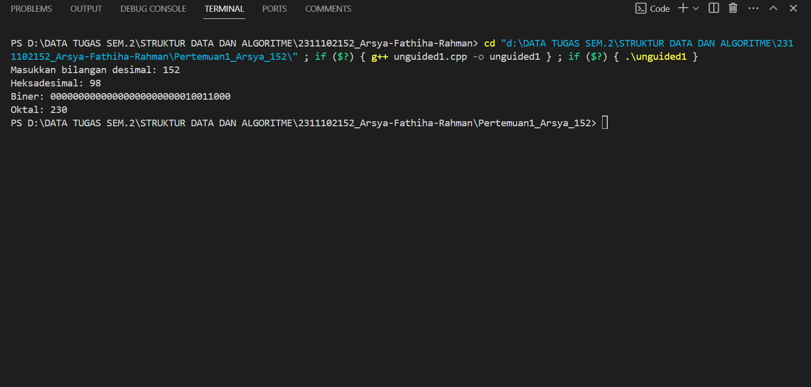
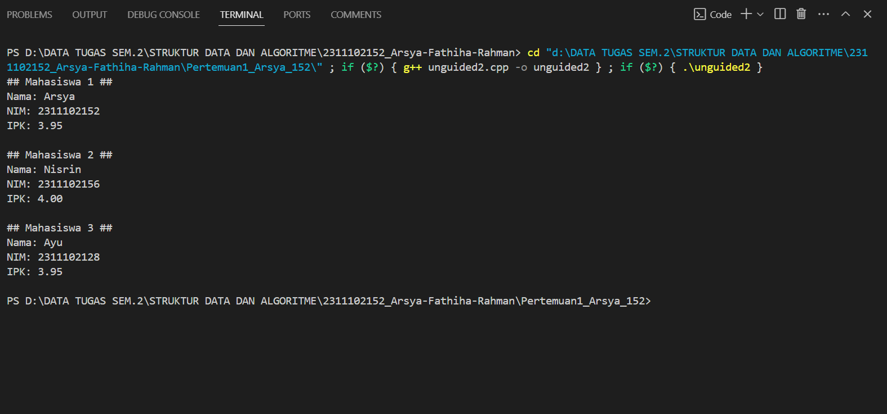
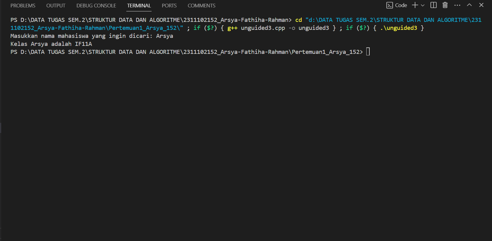
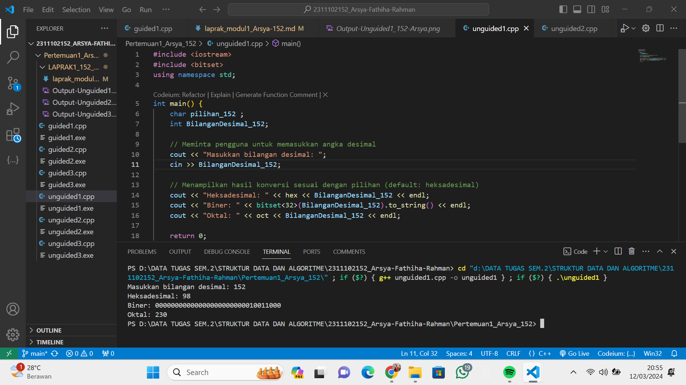

# <h1 align="center">Laporan Praktikum Modul 1 - Tipe Data</h1>
<p align="center">Arsya Fathiha Rahman - 2311102152</p>

## Dasar Teori

Tipe data itu adalah  cara kita mengelompokkan dan memberi label ke data agar komputer paham cara mengolahnya. Tipe data yang berhubungan dengan bilangan bulat adalah char, int, short dan longAda beberapa jenis tipe data yang umumnya dipelajari yaitu:

1. Tipe Data Primitif<br/>
Tipe data yang simpel, Seperti buat menyimpan angka (misalnya, bilangan bulat atau desimal) atau informasi yang berisi benar atau salah (true atau false). Tipe data ini berupa struktur atau larik

2. Tipe Data Abstrak<br/>
Tipe data yang bisa menyimpan lebih dari satu hal, contohnya buat nyimpen kata-kata atau teks (string). Juga bisa buat susun-susun data yang lebih rumit.

3. Tipe Data Koleksi<br/>
Tipe data buat mengumpulkan banyak informasi sekaligus. Misalnya, buat menyimpan banyak angka dalam satu paket (array), atau buat daftar yang bisa nambah atau kurangin isinya.

Intinya, tipe data ini penting agar dapat mengatur dan menggunakan data dengan mudah saat kita membuat program. Jadi, seperti label buat data yang kita punya supaya komputer tahu cara menanganinya.

## Guided1

### 1. [Tipe Data Primitif]

```C++
#include <iostream>
using namespace std;

char op;
    float num1, num2;
    // It allows user to enter operator i.e. +, -, *, /
    cout << "Enter operator (+, -, *, /): ";
    cin >> op;
    // It allows user to enter the operands
    cout << "Enter two operands: ";
    cin >> num1 >> num2;
    // Switch statement begins
    switch (op)
    {
    // If user enters +
    case '+':
        cout << "Result: " << num1 + num2;
        break;
    // If user enters -
    case '-':
        cout << "Result: " << num1 - num2;
        break;
    // If user enters *
    case '*':
        cout << "Result: " << num1 * num2;
        break;
    // If user enters /
    case '/':
        if (num2 != 0)
        {
            cout << "Result: " << fixed << setprecision(2) << num1 / num2;
        }
        else
        {
            cout << "Error! Division by zero is not allowed.";
        }
        break;
    // If the operator is other than +, -, * or /,
    // error message will display
    default:
        cout << "Error! Operator is not correct";
    } // switch statement ends
    return 0;

```
Penjelasan Guided1
Program ini menggunakan tipe data primitif dan kontrol alur (switch) untuk membuat kalkulator sederhana. Pengguna diminta memasukkan dua bilangan dan operator, lalu program akan menghitung dan menampilkan hasilnya. Kesimpulannya, program ini menggambarkan penggunaan tipe data primitif untuk operasi matematika dasar.

## Guided2
### 2. [Tipe Data Abstrak]

```C++
#include <stdio.h>
#include <string.h>
// Struct
struct Mahasiswa
{
    char name[50];
    char address[100];
    int age;
};
int main()
{
    // menggunakan struct
    struct Mahasiswa mhs1, mhs2;
    // mengisi nilai ke struct
    strcpy(mhs1.name, "Dian");
    strcpy(mhs1.address, "Mataram");
    mhs1.age = 22;
    strcpy(mhs2.name, "Bambang");
    strcpy(mhs2.address, "Surabaya");
    mhs2.age = 23;

    // mencetak isi struct
    printf("## Mahasiswa 1 ##\n");
    printf("Nama: %s\n", mhs1.name);
    printf("Alamat: %s\n", mhs1.address);
    printf("Umur: %d\n", mhs1.age);
    printf("\n");
    printf("## Mahasiswa 2 ##\n");
    printf("Nama: %s\n", mhs2.name);
    printf("Alamat: %s\n", mhs2.address);
    printf("Umur: %d\n", mhs2.age);
    return 0;
}
```
Penjelasan Guided2
Program ini menggunakan struct untuk menyimpan informasi mahasiswa seperti nama, alamat, dan usia. Program kemudian menampilkan informasi ini untuk dua mahasiswa. Kesimpulannya, program ini mengilustrasikan cara menggunakan struct untuk mengorganisir dan mencetak data yang lebih kompleks.

## Guided3
### 3. [Tipe Data Koleksi]

```C++
#include <iostream>
#include <array>
using namespace std;
int main()
{
    // Deklarasi dan inisialisasi array
    int nilai[5];
    nilai[0] = 23;
    nilai[1] = 50;
    nilai[2] = 34;
    nilai[3] = 78;
    nilai[4] = 90;
    // Mencetak array dengan tab
    cout << "Isi array pertama : " << nilai[0] << endl;
    cout << "Isi array kedua : " << nilai[1] << endl;
    cout << "Isi array ketiga : " << nilai[2] << endl;
    cout << "Isi array keempat : " << nilai[3] << endl;
    cout << "Isi array kelima : " << nilai[4] << endl;
    return 0;
}
```
Penjelasan Guided2
Program ini menggunakan array untuk menyimpan nilai mahasiswa. Program kemudian mencetak nilai-nilai ini dengan bantuan perulangan. Kesimpulannya, program ini menunjukkan cara menggunakan array untuk mengelola sejumlah besar data dalam program.


## Unguided1

### 1. [Buatlah program menggunakan tipe data primitif minimal dua fungsi dan bebas. Menampilkan program, jelaskan program tersebut dan ambil kesimpulan darimateri tipe data primitif!]

```C++
/*
by Arsya Fathiha Rahman - 2311102152
*/
#include <iostream>
#include <bitset>
using namespace std;

int main() {
    char pilihan_152 ;
    int BilanganDesimal_152;

    // Meminta pengguna untuk memasukkan angka desimal
    cout << "Masukkan bilangan desimal: ";
    cin >> BilanganDesimal_152;

    // Menampilkan hasil konversi sesuai dengan pilihan (default: heksadesimal)
    cout << "Heksadesimal: " << hex << BilanganDesimal_152 << endl;
    cout << "Biner: " << bitset<32>(BilanganDesimal_152).to_string() << endl;
    cout << "Oktal: " << oct << BilanganDesimal_152 << endl;

    return 0;
}
```
#### Output:


Penjelasan Program Unguided1 <br/>
Program yang telah saya buat adalah program konversi bilangan desimal ke tiga bentuk basis numerik, yaitu heksadesimal, biner, dan oktal. Pengguna diminta untuk menginputkan bilangan desimal, dan hasil konversi ditampilkan secara otomatis langsung ke 3 sistem bilangan (oktal, biner dan heksa). 

Penjelasan Kesimpulan tipe data Primitif <br/>
Tipe Data Primitif:
Tipe data yang simpel, Seperti buat menyimpan angka (misalnya, bilangan bulat atau desimal) atau informasi yang berisi benar atau salah (true atau false). , tipe data ini mencakup bilangan bulat, bilangan desimal, karakter, dan nilai kebenaran. Perbedaan utamanya terletak pada jumlah bit yang digunakan untuk mewakili setiap jenis data primitif. Jumlah bit ini bergantung pada bahasa pemrograman, compiler, dan sistem operasi yang digunakan. Tipe data primitif memberikan dasar untuk menyimpan informasi dasar dalam program dan memengaruhi seberapa efisien memori digunakan.

## Unguided2

### 2. [Jelaskan fungsi dari class dan struct secara detail dan berikan contoh programnya]

```C++ (Program Unguided2 - Program menampilkan Data IPK mahasiswa menggunakan struct dan class )
/*
by Arsya Fathiha Rahman - 2311102152
*/
#include <iostream>
#include <cstring>

// Class
class NIMMahasiswa_152 {
public:
// struct
    char nama[50];
    char nim[15];
    float ipk;
};

int main() {

    NIMMahasiswa_152 mhs1, mhs2, mhs3;

    strcpy(mhs1.nama, "Arsya");
    strcpy(mhs1.nim, "2311102152");
    mhs1.ipk = 3.95;

    strcpy(mhs2.nama, "Nisrin");
    strcpy(mhs2.nim, "2311102156");
    mhs2.ipk = 4.00;

    strcpy(mhs3.nama, "Ayu");
    strcpy(mhs3.nim, "2311102128");
    mhs3.ipk = 3.95;

    printf("## Mahasiswa 1 ##\n");
    printf("Nama: %s\n", mhs1.nama);
    printf("NIM: %s\n", mhs1.nim);
    printf("IPK: %.2f\n", mhs1.ipk);
    printf("\n");

    printf("## Mahasiswa 2 ##\n");
    printf("Nama: %s\n", mhs2.nama);
    printf("NIM: %s\n", mhs2.nim);
    printf("IPK: %.2f\n", mhs2.ipk);
    printf("\n");

    printf("## Mahasiswa 3 ##\n");
    printf("Nama: %s\n", mhs3.nama);
    printf("NIM: %s\n", mhs3.nim);
    printf("IPK: %.2f\n", mhs3.ipk);
    printf("\n");

    return 0;
}

```
#### Output:


'''Penjelasan Program Unguided 2 - Program menampilkan Data IPK mahasiswa menggunakan struct dan class: <br/>
Program yang telah saya buat adalah program menampilkan data mahasiswa mengenai nilai IPK berdasarkan Nama dan NIM mahasiswa menggunakan struct dan class. Dimana Progam dibuat untuk menampilkan informasi memberikan gambaran ringkas tentang data mahasiswa dalam program C++.

Penjelasan fungsi class dan struct <br/>
Struct yakni tipe data yang menyimpan beberapa data dengan default public, Struktur bermanfaat untuk mengelompokan sejumlah data dengan tipe yang berlainan. Struct ini bermanfaat untuk mengelompokan sejumlah data dengan tipe yang berlainan.
Class merupakan tipe data defaultnya itu private, jadi jika objek anggota dari class itu sendiri ingin dipublikasikan, maka harus menggunakan public 

Perbedaan mendasarnya yakni:
– Class adalah sesuatu yang mempunyai data (sifat) dan fungsi (kelakuan) untuk mendeskripsikan suatu objek.
– Struct mendefinisikan tipe data dan memberitahukan kepada Visual C++ untuk memperlakukan koleksi tipe data dasar sebagai satu kesatuan tipe data, yang darinya dapat mendefinisikan variabel dan array variabel.

## Unguided3

### 3. [Buat dan jelaskan program menggunakan fungsi map dan jelaskan perbedaan dari array dengan map.]

```C++
/*
oleh Arsya Fathiha Rahman - 2311102139
*/
#include <iostream>
#include <map>

using namespace std;

//Program untuk mencari kelas berdasarkan nama mahasiswa menggunakan fungsi Map
int main() {
    map<string, string> kelas_152 = {
        {"Arsya", "IF11A"},
        {"Ayu", "IF11B"},
        {"Nisrin", "IF11C"},
        {"Nisa", "IF11D"}
    };

    // Meminta user menginputkan nama mahasiswa untuk dicari
    string namaCari_152;
    cout << "Masukkan nama mahasiswa yang ingin dicari: ";
    cin >> namaCari_152;

    // Mencari dan menampilkan hasil pencarian
    if (kelas_152.count(namaCari_152) > 0) {
        cout << "Kelas " << namaCari_152 << " adalah " << kelas_152[namaCari_152] << '\n';
    } else {
        cout << "Nama mahasiswa tidak ditemukan.\n";
    }

    return 0;
}
```
#### Output:


Penjelasan Program Unguided 3 - Program untuk mencari kelas berdasarkan nama mahasiswa menggunakan fungsi Map <br/>
Program yang telah saya buat adalah Program mencari kelas berdasarkan nama mahasiswa yang diinputkan oleh pengguna  menggunakan struktur data map. Users diminta untuk menginputkan nama mahasiswa, dan program mencari dan menampilkan kelas mahasiswa tersebut. Kesimpulannya, program saya ini menunjukkan cara penggunaan map untuk mengorganisir dan mencari data dengan efisien berdasarkan kunci nama mahasiswa.

Perbedaan Array dengan Map<br/>

Map mirip dengan array namun dengan index yang memungkinkan untuk berupa tipe data selain integer. Dengan artian bahwa, Array adalah sebuah tipe data terstruktur yang digunakan untuk menyimpan data bertipe sama, sedangkan map adalah sebuah tipe data yang digunakan untuk menyimpan data dengan indeks yang dapat berupa tipe data selain integer. Sehingga  map ini yakni sebuah tipe data yang dapat menggunakan indeks yang lebih banyak dan lebih kompleks daripada array, serta dapat menyimpan data dengan tipe yang berbeda.


#### Full code unguided1 Screenshot:


## Kesimpulan
Program-program yang diberikan mencakup penggunaan tipe data primitif,  abstrak, dan koleksi pada struktur data seperti struct dan class, serta fitur-fitur C++ seperti array dan map. Penggunaan class dan struct untuk menyimpan informasi mahasiswa. Program-program ini juga memanfaatkan tipe data primitif untuk operasi matematika dan konversi bilangan. Penggunaan map digunakan untuk mencari informasi berdasarkan kunci. Keseluruhan, program-program ini memberikan gambaran tentang cara menggunakan tipe data dan struktur data dalam bahasa pemrograman C++.

## Referensi
[1] Andi Baso, Nurjannah, and Satria Gunawan. Mudah Belajar Pemrograman Dasar C++ Syiah Kuala University Press. Aceh: 2021 <br/>
[2] Abdul Kadir, Elex Media Komputindi. Logika Pemrograman Menggunakan C++: 2019 <br/>
[3] Vivian Siahaan, Rismon Hasiholan. TUTORIAL Bahasa C++ Untuk Programmer : 2020 <br/>

