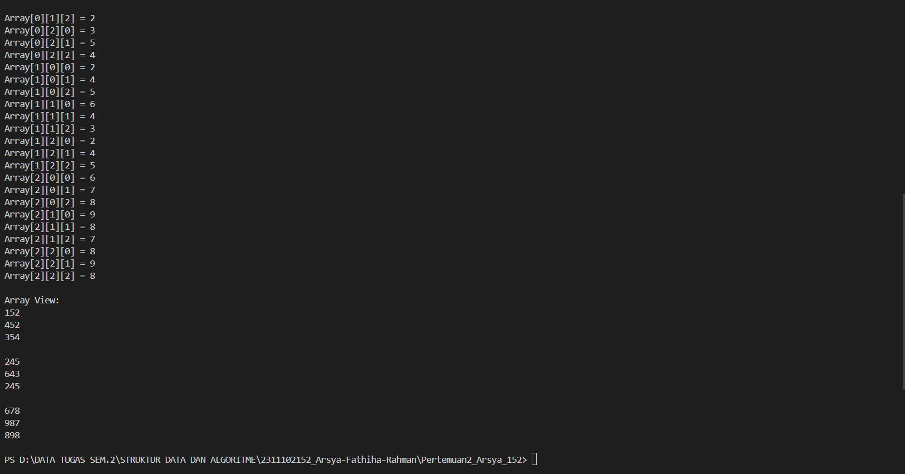

# <h1 align="center">Laporan Praktikum Modul 2 - Array </h1>
<p align="center">Arsya Fathiha Rahman - 2311102152</p>

## Dasar Teori
Array merupakan sekelompok variabel (disebut pula dengan elemen atau komponen) yang memuat nilai-nilai yang bertipe sama. Array adalah objek, jadi dipandang sebagai tipe referensi.
array sebenarnya adalah suatu referensi yang menunjuk kepada suatu objek array di dalam memori. Untuk menunjuk ke elemen tertentu di dalam array,
dispesifikasi nama referensi ke array dan nomor posisi elemen di dalam array. Nomor posisi elemen
disebut pula dengan indeks atau subskrip elemen.

Dimensi pada Array
1.Array 1 dimensi 
  Yaitu array dengan satu tingkat indeks. Contohnya adalah array seperti [1, 2, 3, 4, 5].
  merupakan sebuah penginisialisasian, pembacaan data, penampilan data, dan pencarian elemen terbesar dan/atau terkecil. Selain itu, jika data berupa angka numerik, beberapa operasi dasar lain yang dapat diterapkan pada sebuah array satu - dimensi adalah mencari penjumlahan dan rerata elemen - elemen array. Setiap operasi ini mensyaratkan kemampuan untuk menjelajah elemen-elemen array. <br/>
2.Array 2 dimensi 
  Adalahh Array yang memerlukan dua indeks untuk mengidentifikasi suatu elemen tertentu disebut dengan array dua dimensi. Yang berupa array dengan dua tingkat indeks. <br/>
3.Array 3 dimensi
  Merupakan array dengan tiga tingkat indeks. Contohnya bisa berupa kubus tiga dimensi atau array data berstruktur yang lebih kompleks. <br/>
4.(Array multidimensi dapat memiliki lebih dari dua dimensi) 
   Merupakan Array dengan lebih dari tiga dimensi, seperti tensor dalam ilmu komputer dan matematika. <br/>
 

## Guided1

### 1. [Program Input Array Tiga Dimensi]

```C++
#include <iostream>
using namespace std;
// PROGRAM INPUT ARRAY 3 DIMENSI
int main()
{
    // Deklarasi array
    int arr[2][3][3];
    // Input elemen
    for (int x = 0; x < 2; x++)
    {
        for (int y = 0; y < 3; y++)
        {
            for (int z = 0; z < 3; z++)
            {
                cout << "Input Array[" << x << "][" << y << "][" << z << "] = ";
                cin >> arr[x][y][z];
            }
        }
        cout << endl;
    }
    // Output Array
    for (int x = 0; x < 2; x++)
    {
        for (int y = 0; y < 3; y++)
        {
            for (int z = 0; z < 3; z++)
            {
                cout << "Data Array[" << x << "][" << y << "][" << z
                     << "] = " << arr[x][y][z] << endl;
            }
        }
    }
    cout << endl;
    // Tampilan array
    for (int x = 0; x < 2; x++)
    {
        for (int y = 0; y < 3; y++)
        {
            for (int z = 0; z < 3; z++)
            {
                cout << arr[x][y][z] << ends;
            }
            cout << endl;
        }
        cout << endl;
    }
}
```
Penjelasan Guided1
Program ini adalah sebuah program menggunakan array untuk memasukkan dan menampilkan data dalam bentuk array tiga dimensi. pengguna tinggal mengetikkan nilainya. lalu, programnya bakal menampilkan lagi data yang sudah dimasukkan, berupa nilai x,y dan z. Selanjutnya, ada tampilan berupa matriks dari data yang udah dimasukkan. Jadi, pengguna dapat mengatur dan melihat data dalam bentuk tiga dimensi.

## Guided2
### 2. [Program Mencari Nilai Maksimal pada Array]

```C++
#include <iostream>
using namespace std;
int main()
{
    int maks, a, i = 1, lokasi;
    cout << "Masukkan panjang array: ";
    cin >> a;
    int array[a];
    cout << "Masukkan " << a << " angka\n";
    for (i = 0; i < a; i++)
    {
        cout << "Array ke-" << (i) << ": ";
        cin >> array[i];
    }
    maks = array[0];
    for (i = 0; i < a; i++)
    {
        if (array[i] > maks)
        {
            maks = array[i];
            lokasi = i;
        }
    }
    cout << "Nilai maksimum adalah " << maks << " berada di Array ke " << lokasi << endl;
}
```
Penjelasan Guided2
Program array guided2 yaitu untuk mencari nilai maksimum dalam sebuah array. Pengguna diminta untuk memasukkan panjang array dan elemen-elemen array. Selanjutnya, program akan mencari nilai maksimum dan menampilkan nilai tersebut beserta lokasinya dalam array.

## Unguided1

### 1. [Buatlah program untuk menampilkan Output data array: 1 2 3 4 5 6 7 8 9 10 nomor genap: 2, 4, 6, 8, 10 nomor ganjil: 1, 3, 5, 7, 9]

```C++ 
(Program Unguided2 - Program menampilkan nomor ganjil dan genap)
/*
by Arsya Fathiha Rahman - 2311102152
*/
#include <iostream>
using namespace std;
int main() {
    int bilangan_152[10];

    // Meminta users untuk inputin angka
    cout << "Data Array: ";

    // array data yang dimasukkan users
    for (int i = 0; i < 10; i++) {
        cin >> bilangan_152[i];
    }

    cout << "\nNomor genap: ";
    for (int i = 0; i < 10; i++) {
        if (bilangan_152[i] % 2 == 0) {
            cout << bilangan_152[i];
            if (i < 9) {
                cout << ", ";
            }
        }
    }

    cout << "\nNomor ganjil: ";
    for (int i = 0; i < 10; i++) {
        if (bilangan_152[i] % 2 != 0) {
            cout << bilangan_152[i];
            if (i < 9) {
                cout << ", ";
            }
        }
    }
    
    cout << endl;
    return 0;
}
```
#### Output:


Penjelasan Program Unguided1 <br/>

Program yang telah saya buat adalah program meminta user untuk menginputkan 10 bilangan ke dalam array bilangan. Lalu program akan mencetak bilangan tersebut bilangan genap dan bilangan ganjil. 

Pertama-tama, program meminta user untuk memasukkan 10 angka.
Kemudian, program menggunakan array bilangan dan memeriksa apakah setiap elemen adalah bilangan genap atau ganjil. Jika elemen adalah bilangan genap, program mencetaknya dalam baris yang sesuai dengan pesan "Nomor genap:". Jika elemen adalah bilangan ganjil, program mencetaknya dalam baris yang sesuai dengan pesan "Nomor ganjil:". 
Program menggunakan looping for untuk melakukan perulangan melalui array, dan menggunakan kondisi if untuk memeriksa apakah bilangan tersebut genap atau ganjil di script (bilangan % 2 != 0) untuk ganjil dan (bilangan % 2 == 0) untuk genap.
Setelah itu, program mencetak kategori bilangan genap dan ganjil secara terpisah.


## Unguided2

### 2. [Buatlah program Input array tiga dimensi (seperti pada guided) tetapi jumlah atau ukuran elemennya diinputkan oleh user!]

```C++ (Program Unguided2)
/*
by Arsya Fathiha Rahman - 2311102152
*/
#include <iostream>
using namespace std;

int main() {
    // Menginputkan uk array
    int ukX, ukY, ukZ;
    cout << "Masukkan ukuran array (X Y Z): ";
    cin >> ukX >> ukY >> ukZ;

    // Deklarasi array
    int arr_152[ukX][ukY][ukZ];

    for (int x = 0; x < ukX; x++) {
        for (int y = 0; y < ukY; y++) {
            for (int z = 0; z < ukZ; z++) {
                cout << "Input Array[" << x << "][" << y << "][" << z << "] = ";
                cin >> arr_152[x][y][z];
            }
        }
        cout << endl;
    }

    // Output elemen array
    cout << "\nData Array:\n";
    for (int x = 0; x < ukX; x++) {
        for (int y = 0; y < ukY; y++) {
            for (int z = 0; z < ukZ; z++) {
                cout << "Array[" << x << "][" << y << "][" << z << "] = " << arr_152[x][y][z] << endl;
            }
        }
    }

    // Tampilan array
    cout << "\nArray View:\n";
    for (int x = 0; x < ukX; x++) {
        for (int y = 0; y < ukY; y++) {
            for (int z = 0; z < ukZ; z++) {
                cout << arr_152[x][y][z] << ends;
            }
            cout << endl;
        }
        cout << endl;
    }

    return 0;
}
```
#### Output:


Penjelasan Program Unguided 2 - Program input array 3 dimensi: <br/>
Program yang telah saya buat adalah program meminta user untuk menginputkan ukuran tiga dimensi dari sebuah array, kemudian mengisi array tersebut dengan input yang diberikan oleh pengguna. Setelah itu, program mencetak semua elemen array beserta tampilan array dalam bentuk yang lebih terstruktur. Kesimpulannya, program ini memungkinkan pengguna untuk membuat array tiga dimensi dengan ukuran yang ditentukan oleh pengguna sendiri. Setelah itu, pengguna diminta untuk mengisi setiap elemen array dengan nilai yang diinginkan. Setelah array diisi, program mencetak seluruh elemen array beserta indeksnya. Dimana program mendeklarasikan array tiga dimensi yaitu5 arr_152 dengan ukuran yang sesuai dengan input pengguna (ukX, ukY, dan ukZ)


## Unguided3

### 3. [Buatlah program menu untuk mencari nilai Maksimum, Minimum dan Nilai rata – rata dari suatu array dengan input yang dimasukan oleh user!.]

```C++
/*
oleh Arsya Fathiha Rahman - 2311102139
*/
#include <iostream>
using namespace std;

int main() {
    int pilihan_152;

    do {
        cout << "Menu Pilihan:\n"
             << "1. Mencari Nilai Maksimum\n"
             << "2. Mencari Nilai Minimum\n"
             << "3. Mencari Nilai Rata-rata\n"
             << "0. Keluar\n"
             << "Masukkan pilihan (1/2/3/0): ";
        cin >> pilihan_152;

        if (pilihan_152 >= 1 && pilihan_152 <= 3) {
            int array_152;
            cout << "Masukkan jumlah angka: ";
            cin >> array_152;

            if (array_152 <= 0) {
                cout << "Jumlah angka tidak valid.\n";
                continue;
            }

            int array[array_152];
            cout << "Masukkan " << array_152 << " angka:\n";
            for (int i = 0; i < array_152; i++) {
                cout << "Array ke-" << (i + 1) << ": ";
                cin >> array[i];
            }

            switch (pilihan_152) {
                case 1: {
                    int maks = array[0];
                    for (int i = 1; i < array_152; i++)
                        if (array[i] > maks)
                            maks = array[i];
                    cout << "Nilai maksimum: " << maks << endl;
                    break;
                }
                case 2: {
                    int min = array[0];
                    for (int i = 1; i < array_152; i++)
                        if (array[i] < min)
                            min = array[i];
                    cout << "Nilai minimum: " << min << endl;
                    break;
                }
                case 3: {
                    double total = 0;
                    for (int i = 0; i < array_152; i++)
                        total += array[i];
                    double rataRata = total / array_152;
                    cout << "Nilai rata-rata: " << rataRata << endl;
                    break;
                }
            }
        } else if (pilihan_152 != 0) {
            cout << "Pilihan tidak valid. Silakan coba lagi.\n";
        }

    } while (pilihan_152 != 0);

    cout << "Program selesai.\n";
    return 0;
}
```
#### Output:


Penjelasan Program Unguided 3 - Program mencari nilai Maksimum, Minimum dan Nilai rata – rata <br/>
Program ini adalah sebuah program menu yang memberikan opsi kepada pengguna untuk melakukan operasi perhitungan sederhana pada sejumlah angka yang dimasukkan. Pengguna dapat memilih untuk mencari nilai maksimum, minimum, atau rata-rata dari angka-angka tersebut, atau keluar dari program. Setelah pengguna memilih suatu opsi, program akan meminta pengguna untuk menginputkan angka-angka yang sesuai, lalu melakukan operasi yang diminta, dan mencetak hasilnya. Program akan terus berjalan dan meminta input pengguna hingga pengguna memilih untuk keluar dari program dengan memilih opsi "0".


#### Full code unguided1 Screenshot:


## Kesimpulan
Keseluruhan konsep materi array beserta guided dan unguided yang telah dibuat menunjukkan beragam penggunaan array dalam bahasa pemrograman C++, memperlihatkan bagaimana array dapat digunakan untuk memasukkan, mengelola, dan melakukan operasi seperti pencarian nilai maksimum/minimum serta analisis statistik lainnya, sehingga memberikan pemahaman yang mendalam tentang konsep array dan aplikasinya dalam pemrograman c++ serta memahami mengenai macam macam dimensi dalam array dan bentuk matriks dan urutan elemen array, mencari nilai maksimum dan minimum dalam array.

## Referensi
[1] Vivian Siahaan, Rismon Hasiholan. BUKU PINTAR Pemrograman C# Untuk Pelajar dan Mahasiswa : 2020 <br/>
[2] Edi Satrio, Simon Pakpahan. Pemrograman C++ Untuk Pembelajar Mandiri. Penerbit cahaya Informatika : 2019 <br/>

