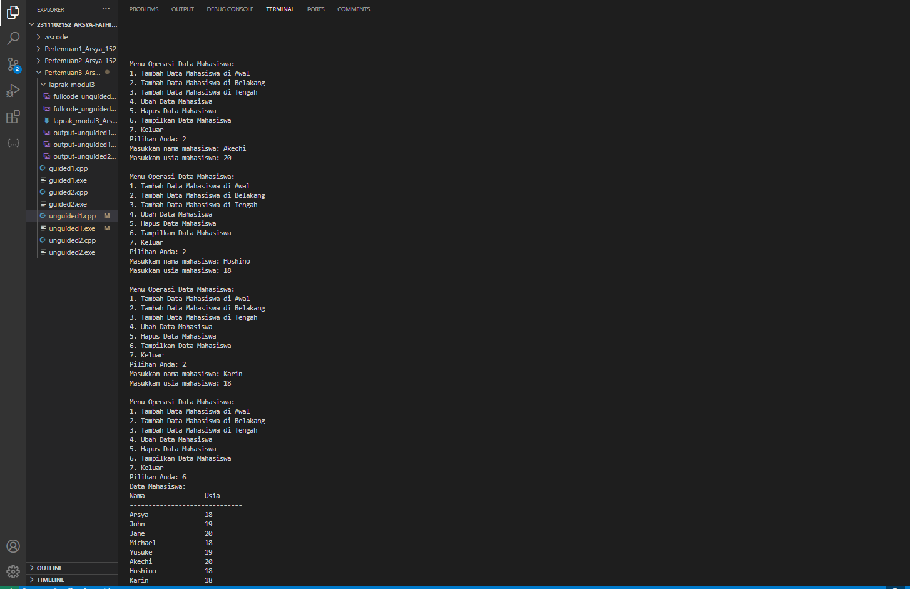
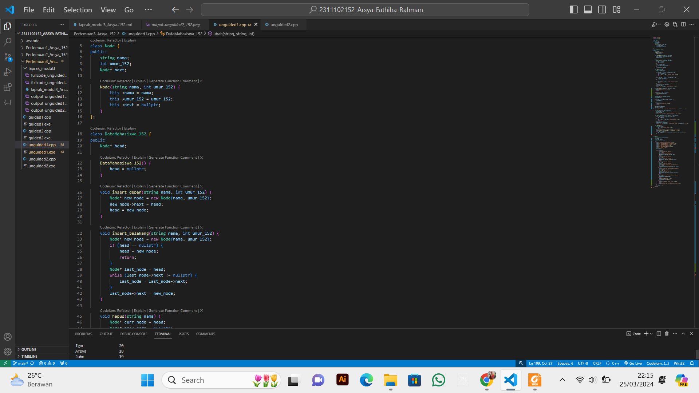

# <h1 align="center">Laporan Praktikum Modul 3 - Single and Double Linked List </h1>
<p align="center">Arsya Fathiha Rahman - 2311102152</p>

## Dasar Teori
Penjelasan Linkedlist<br/>
Linked List dalam C++ adalah suatu struktur data yang menggunakan pointer untuk menyimpan data yang berhubungan dengan data lain dalam sebuah urutan yang terkait. Linked List menggunakan pointer untuk menghubungkan setiap elemen ke elemen berikutnya, memungkinkan pengaksesan dan pengubahsuaian data secara dinamis.
Pengolahan data yang kita lakukan menggunakan komputer yakni berupa penyimpanan data dan pengolahan lain dari sekelompok data yang telah terorganisir dalam sebuah urutan tertentu. Salah satu cara untuk menyimpan sekumpulan data yang kita miliki adalah menggunakan linkedlist.
Keuntungan dan kerugian pemakaian larik/linkedlist untuk menyimpan sekelompok data yang banyaknya selalu berubah dan tidak diketahui dengan pasti kapan penambahan atau penghapusan akan berakhir.<br/>
Sebuah node dalam Linked List C++ terdiri dari dua bagian yaitu, Data untuk Bagian yang berisi nilai data yang akan disimpan, lalu Pointers sebagai Bagian yang berisi alamat pointer ke elemen berikutnya dalam Linked List.<br/>

Jenis Linkedlist: <br/>
a. Single Linked List<br/>

Single linked list terdiri dari elemen-elemen individu, dimana masing masing dihubungkan dengan pointer tunggal. Masing-masing elemen terdiri dari dua bagian, yaitu sebuah data dan sebuah pointer yang disebut dengan pointer next. Dengan menggunakan struktur two-member seperti ini, linked list
dibentuk dengan cara menunjuk pointer next suatu elemen ke elemen yang mengikutinya. Pointer next pada elemen terakhir merupakan NULL, yang menunjukkan akhir dari suatu list. Elemen pada awal suatu list disebut head, dan elemen terakhir dari suatu list disebut tail.<br/>

b. Double Linked List<br/>

Elemen-elemen dihubungkan dengan dua pointer dalam satu elemen. Struktur ini menyebabkan list melintas baik ke depan maupun ke belakang. Masing-masing elemen pada double linked list terdiri dari tiga bagian, disamping data dan pointer next, masing-masing elemen dilengkapi dengan pointer prev yang menunjuk ke elemen sebelumnya. Double linked list dibentuk dengan menyusun sejumlah elemen sehingga pointer next menunjuk ke elemen yang mengikutinya dan pointer prev menunjuk ke elemen yang mendahuluinya. Untuk menunjukkan head dari double linked
list, maka pointer prev dari elemen pertama menunjuk NULL. Untuk menunjukkan tail dari double linked list tersebut, maka pointer next dari elemen terakhir menunjuk NULL.<br/>

## Guided1

### 1. [Program Single Linked List]

```C++
#include <iostream>
using namespace std;
/// PROGRAM SINGLE LINKED LIST NON-CIRCULAR
// Deklarasi Struct Node
struct Node
{
    int data;
    Node *next;
};
Node *head;
Node *tail;
// Inisialisasi Node
void init()
{
    head = NULL;
    tail = NULL;
}
// Pengecekan
bool isEmpty()
{
    if (head == NULL)
        return true;
    else
        return false;
}
// Tambah Depan
void insertDepan(int nilai)
{
    // Buat Node baru
    Node *baru = new Node;
    baru->data = nilai;
    baru->next = NULL;
    if (isEmpty() == true)
    {
        head = tail = baru;
        tail->next = NULL;
    }
    else
    {
        baru->next = head;
        head = baru;
    }
}
// Tambah Belakang
void insertBelakang(int nilai)
{
    // Buat Node baru
    Node *baru = new Node;
    baru->data = nilai;
    baru->next = NULL;
    if (isEmpty() == true)
    {
        head = tail = baru;
        tail->next = NULL;
    }
    else
    {
        tail->next = baru;
        tail = baru;
    }
}
// Hitung Jumlah List
int hitungList()
{
    Node *hitung;
    hitung = head;
    int jumlah = 0;
    while (hitung != NULL)
    {
        jumlah++;
        hitung = hitung->next;
    }
    return jumlah;
}
// Tambah Tengah
void insertTengah(int data, int posisi)
{
    if (posisi < 1 || posisi > hitungList())
    {
        cout << "Posisi diluar jangkauan" << endl;
    }
    else if (posisi == 1)
    {
        cout << "Posisi bukan posisi tengah" << endl;
    }
    else
    {
        Node *baru, *bantu;
        baru = new Node();
        baru->data = data;
        // tranversing
        bantu = head;
        int nomor = 1;
        while (nomor < posisi - 1)
        {
            bantu = bantu->next;
            nomor++;
        }
        baru->next = bantu->next;
        bantu->next = baru;
    }
}
// Hapus Depan
void hapusDepan()
{
    Node *hapus;
    if (isEmpty() == false)
    {
        if (head->next != NULL)
        {
            hapus = head;
            head = head->next;
            delete hapus;
        }
        else
        {
            head = tail = NULL;
        }
    }
    else
    {
        cout << "List kosong!" << endl;
    }
}
// Hapus Belakang
void hapusBelakang()
{
    Node *hapus;
    Node *bantu;
    if (isEmpty() == false)
    {
        if (head != tail)
        {
            hapus = tail;
            bantu = head;
            while (bantu->next != tail)
            {
                bantu = bantu->next;
            }
            tail = bantu;
            tail->next = NULL;
            delete hapus;
        }
        else
        {
            head = tail = NULL;
        }
    }
    else
    {
        cout << "List kosong!" << endl;
    }
}
// Hapus Tengah
void hapusTengah(int posisi)
{
    Node *hapus, *bantu, *bantu2;
    if (posisi < 1 || posisi > hitungList())
    {
        cout << "Posisi di luar jangkauan" << endl;
    }
    else if (posisi == 1)
    {
        cout << "Posisi bukan posisi tengah" << endl;
    }
    else
    {
        int nomor = 1;
        bantu = head;
        while (nomor <= posisi)
        {
            if (nomor == posisi - 1)
            {
                bantu2 = bantu;
            }
            if (nomor == posisi)
            {
                hapus = bantu;
            }
            bantu = bantu->next;
            nomor++;
        }
        bantu2->next = bantu;
        delete hapus;
    }
}
// Ubah Depan
void ubahDepan(int data)
{
    if (isEmpty() == false)
    {
        head->data = data;
    }
    else
    {
        cout << "List masih kosong!" << endl;
    }
}
// Ubah Tengah
void ubahTengah(int data, int posisi)
{
    Node *bantu;
    if (isEmpty() == false)
    {
        if (posisi < 1 || posisi > hitungList())
        {
            cout << "Posisi di luar jangkauan" << endl;
        }
        else if (posisi == 1)
        {
            cout << "Posisi bukan posisi tengah" << endl;
        }
        else
        {
            bantu = head;
            int nomor = 1;
            while (nomor < posisi)
            {
                bantu = bantu->next;
                nomor++;
            }
            bantu->data = data;
        }
    }
    else
    {
        cout << "List masih kosong!" << endl;
    }
}
// Ubah Belakang
void ubahBelakang(int data)
{
    if (isEmpty() == false)
    {
        tail->data = data;
    }
    else
    {
        cout << "List masih kosong!" << endl;
    }
}
// Hapus List
void clearList()
{
    Node *bantu, *hapus;
    bantu = head;
    while (bantu != NULL)
    {
        hapus = bantu;
        bantu = bantu->next;
        delete hapus;
    }
    head = tail = NULL;
    cout << "List berhasil terhapus!" << endl;
}
// Tampilkan List
void tampil()
{
    Node *bantu;
    bantu = head;
    if (isEmpty() == false)
    {
        while (bantu != NULL)
        {
            cout << bantu->data << ends;
            bantu = bantu->next;
        }
        cout << endl;
    }
    else
    {
        cout << "List masih kosong!" << endl;
    }
}
int main()
{
    init();
    insertDepan(3);
    tampil();
    insertBelakang(5);
    tampil();
    insertDepan(2);
    tampil();
    insertDepan(1);
    tampil();
    hapusDepan();
    tampil();
    hapusBelakang();
    tampil();
    insertTengah(7, 2);
    tampil();
    hapusTengah(2);
    tampil();
    ubahDepan(1);
    tampil();
    ubahBelakang(8);
    tampil();
    ubahTengah(11, 2);
    tampil();
    return 0;
}
```
Penjelasan Guided1 <br/>
Program di atas adalah implementasi dari single linked list non-circular dalam bahasa pemrograman C++. Pada Guided1 Single linked list ini memiliki fungsi-fungsi dasar seperti menambah dan menghapus elemen di depan, belakang, dan di tengah, serta mengubah nilai elemen di depan, belakang, dan di tengah. Program ini juga memberikan fungsi untuk menampilkan isi dari linked list serta menghitung jumlah elemen yang tersimpan di dalamnya.

## Guided2
### 2. [Program  Double Linked List]

```C++
#include <iostream>
using namespace std;
class Node
{
public:
    int data;
    Node *prev;
    Node *next;
};
class DoublyLinkedList
{
public:
    Node *head;
    Node *tail;
    DoublyLinkedList()
    {
        head = nullptr;
        tail = nullptr;
    }
    void push(int data)
    {
        Node *newNode = new Node;
        newNode->data = data;
        newNode->prev = nullptr;
        newNode->next = head;
        if (head != nullptr)
        {
            head->prev = newNode;
        }
        else
        {
            tail = newNode;
        }
        head = newNode;
    }
    void pop()
    {
        if (head == nullptr)
        {
            return;
        }
        Node *temp = head;
        head = head->next;
        if (head != nullptr)
        {
            head->prev = nullptr;
        }
        else
        {
            tail = nullptr;
        }
        delete temp;
    }
    bool update(int oldData, int newData)
    {
        Node *current = head;
        while (current != nullptr)
        {
            if (current->data == oldData)
            {
                current->data = newData;
                return true;
            }
            current = current->next;
        }
        return false;
    }
    void deleteAll()
    {
        Node *current = head;
        while (current != nullptr)
        {
            Node *temp = current;
            current = current->next;
            delete temp;
        }
        head = nullptr;
        tail = nullptr;
    }
    void display()
    {
        Node *current = head;
        while (current != nullptr)
        {
            cout << current->data << " ";
            current = current->next;
        }
        cout << endl;
    }
};
int main()
{
    DoublyLinkedList list;
    while (true)
    {
        cout << "1. Add data" << endl;
        cout << "2. Delete data" << endl;
        cout << "3. Update data" << endl;
        cout << "4. Clear data" << endl;
        cout << "5. Display data" << endl;
        cout << "6. Exit" << endl;
        int choice;
        cout << "Enter your choice: ";
        cin >> choice;
        switch (choice)
        {
        case 1:
        {
            int data;
            cout << "Enter data to add: ";
            cin >> data;
            list.push(data);
            break;
        }
        case 2:
        {
            list.pop();
            break;
        }
        case 3:
        {
            int oldData, newData;
            cout << "Enter old data: ";
            cin >> oldData;
            cout << "Enter new data: ";
            cin >> newData;
            bool updated = list.update(oldData,
                                       newData);
            if (!updated)
            {
                cout << "Data not found" << endl;
            }
            break;
        }
        case 4:
        {
            list.deleteAll();
            break;
        }
        case 5:
        {
            list.display();
            break;
        }
        case 6:
        {
            return 0;
        }
        default:
        {
            cout << "Invalid choice" << endl;
            break;
        }
        }
    }
    return 0;
}
```
Penjelasan Guided2<br/>
Program guided2 diatas yaitu sebuah program  Double linked list yang memberikan pilihan untuk menambah, menghapus, memperbarui, menampilkan, dan menghapus semua data dalam linked list sesuai keinginan users. Program akan terus berjalan hingga pengguna memilih untuk keluar.<br/>

## Unguided1

### 1. [Buatlah program menu Single Linked List Non-Circular untuk menyimpan Nama dan usia mahasiswa, dengan menggunakan inputan dari user. ]

```C++ 
(Program Unguided1 - Program mmenyimpan Nama dan usia mahasiswa)
/*
by Arsya Fathiha Rahman - 2311102152
*/
#include <iostream>
#include <iomanip>
using namespace std;

class Node {
public:
    string nama;
    int umur_152;
    Node* next;

    Node(string nama, int umur_152) {
        this->nama = nama;
        this->umur_152 = umur_152;
        this->next = nullptr;
    }
};

class DataMahasiswa_152 {
public:
    Node* head;

    DataMahasiswa_152() {
        head = nullptr;
    }

    void insert_depan(string nama, int umur_152) {
        Node* new_node = new Node(nama, umur_152);
        new_node->next = head;
        head = new_node;
    }

    void insert_belakang(string nama, int umur_152) {
        Node* new_node = new Node(nama, umur_152);
        if (head == nullptr) {
            head = new_node;
            return;
        }
        Node* last_node = head;
        while (last_node->next != nullptr) {
            last_node = last_node->next;
        }
        last_node->next = new_node;
    }

    void hapus(string nama) {
        Node* curr_node = head;
        Node* prev_node = nullptr;

        if (curr_node != nullptr && curr_node->nama == nama) {
            head = curr_node->next;
            delete curr_node;
            cout << "Data " << nama << " berhasil dihapus." << endl;
            return;
        }

        while (curr_node != nullptr && curr_node->nama != nama) {
            prev_node = curr_node;
            curr_node = curr_node->next;
        }

        if (curr_node == nullptr) {
            cout << "Data " << nama << " tidak ditemukan." << endl;
            return;
        }

        prev_node->next = curr_node->next;
        delete curr_node;
        cout << "Data " << nama << " berhasil dihapus." << endl;
    }

   void insert_tengah(string nama, int umur_152, int posisi) {
    if (posisi <= 0) {
        cout << "Posisi tidak valid." << endl;
        return;
    }

    if (posisi == 1 || head == nullptr) {
        insert_depan(nama, umur_152);
        return;
    }

    Node* new_node = new Node(nama, umur_152);
    Node* temp = head;
    int current_pos = 1;

    while (temp != nullptr && current_pos < posisi - 1) {
        temp = temp->next;
        current_pos++;
    }

    if (temp == nullptr) {
        cout << "Posisi tidak valid." << endl;
        return;
    }

    new_node->next = temp->next;
    temp->next = new_node;
    cout << "Data " << nama << " berhasil ditambahkan di posisi " << posisi << "." << endl;
}

    void insert_awal(string nama, int umur_152) {
        Node* new_node = new Node(nama, umur_152);
        new_node->next = head;
        head = new_node;
        cout << "Data " << nama << " berhasil ditambahkan di awal." << endl;
    }

    void ubah(string nama_lama, string nama_baru, int umur_baru_152) {
        Node* temp = head;
        while (temp != nullptr && temp->nama != nama_lama) {
            temp = temp->next;
        }
        if (temp == nullptr) {
            cout << "Data " << nama_lama << " tidak ditemukan." << endl;
            return;
        }
        temp->nama = nama_baru;
        temp->umur_152 = umur_baru_152;
        cout << "Data " << nama_lama << " berhasil diubah menjadi " << nama_baru << "." << endl;
    }

    void tampilkan() {
        Node* temp = head;
        if (temp == nullptr) {
            cout << "Data Mahasiswa kosong." << endl;
            return;
        }
        cout << left << setw(20) << "Nama" << setw(10) << "Usia" << endl;
        cout << setfill('-') << setw(30) << "-" << setfill(' ') << endl;
        while (temp != nullptr) {
            cout << left << setw(20) << temp->nama << setw(10) << temp->umur_152 << endl;
            temp = temp->next;
        }
    }
};

int main() {
    DataMahasiswa_152 Data_mahasiswa_152;

    int choice;
    string nama, nama_baru;
    int umur, umur_baru, posisi;

    do {
        cout << "\nMenu Operasi Data Mahasiswa:" << endl;
        cout << "1. Tambah Data Mahasiswa di Awal" << endl;
        cout << "2. Tambah Data Mahasiswa di Belakang" << endl;
        cout << "3. Tambah Data Mahasiswa di Tengah" << endl;
        cout << "4. Ubah Data Mahasiswa" << endl;
        cout << "5. Hapus Data Mahasiswa" << endl;
        cout << "6. Tampilkan Data Mahasiswa" << endl;
        cout << "7. Keluar" << endl;
        cout << "Pilihan Anda: ";
        cin >> choice;

        switch (choice) {
            case 1:
                cout << "Masukkan nama mahasiswa: ";
                cin >> nama;
                cout << "Masukkan usia mahasiswa: ";
                cin >> umur;
                Data_mahasiswa_152.insert_awal(nama, umur);
                break;
            case 2:
                cout << "Masukkan nama mahasiswa: ";
                cin >> nama;
                cout << "Masukkan usia mahasiswa: ";
                cin >> umur;
                Data_mahasiswa_152.insert_belakang(nama, umur);
                break;
            case 3:
                cout << "Masukkan nama mahasiswa: ";
                cin >> nama;
                cout << "Masukkan usia mahasiswa: ";
                cin >> umur;
                cout << "Masukkan posisi untuk menyisipkan data: ";
                cin >> posisi;
                Data_mahasiswa_152.insert_tengah(nama, umur, posisi);
                break;
            case 4:
                cout << "Masukkan nama mahasiswa yang ingin diubah: ";
                cin >> nama;
                cout << "Masukkan nama baru: ";
                cin >> nama_baru;
                cout << "Masukkan usia baru: ";
                cin >> umur_baru;
                Data_mahasiswa_152.ubah(nama, nama_baru, umur_baru);
                break;
            case 5:
                cout << "Masukkan nama mahasiswa yang ingin dihapus: ";
                cin >> nama;
                Data_mahasiswa_152.hapus(nama);
                break;
            case 6:
                cout << "Data Mahasiswa:" << endl;
                Data_mahasiswa_152.tampilkan();
                break;
            case 7:
                cout << "Terima kasih, program selesai." << endl;
                break;
            default:
                cout << "Pilihan tidak valid. Silakan pilih lagi." << endl;
        }
    } while (choice != 7);

    return 0;
}
```
#### Output:
### Data seluruh mahasiswa

### Menghapus mahasiswa Akechi


### Menambah data Fataba di antara John dan Jane

### Menambah data Igor diawal

### Mengubah data Michael menjadi Reyn dan menampilkan seluruh data mahasiswa 


Penjelasan Program Unguided1 <br/>
Program yang telah saya buat pada Unguided1 adalah program menu Single Linked List Non-Circular untuk menyimpan Nama dan usia mahasiswa, dengan menggunakan inputan dari user. Dengan beragam pilihan menu yakni hapus data, menambahkan data tengah, menambahkan data awal, ubah data, dan menampilkan seluruh data. lalu dikelola oleh (Kelas DataMahasiswa_152) yang dapat digunakan untuk menyimpan data mahasiswa.
Selanjutnya pada penggunaan Metode insert_depan, insert_belakang, insert_tengah, dan insert_awal digunakan untuk menambahkan data mahasiswa ke dalam linked list. Sehingga Output dari program ini akan menampilkan langkah-langkah operasi yang dilakukan pada linked list, serta hasil akhir dari linked list setelah operasi-operasi tersebut dilakukan. Misalnya, hasil output akan menampilkan data mahasiswa sesuai dengan operasi-operasi yang telah diinputkan oleh users seperti dapat mengubah/edit datanya.<br/>

#### Full code Screenshot:


## Unguided2

### 2. [Program Double Linked List penambahan operasi untuk menambah data, menghapus, dan update di tengah / diurutan tertentu yang diminta. Selain itu, buatlah agar tampilannya menampilkan Nama produk dan harga skincare]

```C++ (Program Unguided2)
/*
by Arsya Fathiha Rahman - 2311102152
*/
#include <iostream>
#include <iomanip> 
#include <string>

using namespace std;

class Node {
public:
    string nama_produk_152;
    double harga;
    Node* prev;
    Node* next;

    Node(string nama, double harga_152) : nama_produk_152(nama), harga(harga_152), prev(nullptr), next(nullptr) {}
};

class DoublyLinkedList {
private:
    Node* head;

public:
    DoublyLinkedList() : head(nullptr) {}

    void add_data_152(string nama_produk, double harga) {
        Node* new_node = new Node(nama_produk, harga);
        if (head == nullptr) {
            head = new_node;
        } else {
            Node* current = head;
            while (current->next != nullptr) {
                current = current->next;
            }
            current->next = new_node;
            new_node->prev = current;
        }
    }

    void tambah_data_urutan_tertentu(string nama_produk, double harga, int urutan) {
        if (urutan < 1) {
            cout << "Urutan tidak valid" << endl;
            return;
        }

        Node* new_node = new Node(nama_produk, harga);
        if (urutan == 1 || head == nullptr) {
            new_node->next = head;
            if (head != nullptr) {
                head->prev = new_node;
            }
            head = new_node;
        } else {
            Node* current = head;
            int pos = 1;
            while (current != nullptr && pos < urutan - 1) {
                current = current->next;
                pos++;
            }
            if (current == nullptr) {
                cout << "Urutan tidak valid" << endl;
                return;
            }
            new_node->next = current->next;
            new_node->prev = current;
            if (current->next != nullptr) {
                current->next->prev = new_node;
            }
            current->next = new_node;
        }
    }

    void hapus_data(string nama_produk) {
        Node* current = head;
        while (current != nullptr) {
            if (current->nama_produk_152 == nama_produk) {
                if (current->prev) {
                    current->prev->next = current->next;
                }
                if (current->next) {
                    current->next->prev = current->prev;
                }
                if (current == head) {
                    head = current->next;
                }
                delete current;
                return;
            }
            current = current->next;
        }
        cout << "Produk tidak ditemukan" << endl;
    }

    void update_data(string nama_produk, string new_nama_produk, double new_harga) {
        Node* current = head;
        while (current != nullptr) {
            if (current->nama_produk_152 == nama_produk) {
                current->nama_produk_152 = new_nama_produk;
                current->harga = new_harga;
                return;
            }
            current = current->next;
        }
        cout << "Produk tidak ditemukan" << endl;
    }

    void hapus_seluruh_data() {
        Node* current = head;
        while (current != nullptr) {
            Node* temp = current;
            current = current->next;
            delete temp;
        }
        head = nullptr;
    }

    void hapus_data_urutan_tertentu(int urutan) {
        if (urutan < 1) {
            cout << "Urutan tidak valid" << endl;
            return;
        }
        Node* current = head;
        int pos = 1;
        while (current != nullptr && pos < urutan) {
            current = current->next;
            pos++;
        }
        if (current == nullptr) {
            cout << "Urutan tidak valid" << endl;
            return;
        }
        if (current->prev) {
            current->prev->next = current->next;
        }
        if (current->next) {
            current->next->prev = current->prev;
        }
        if (current == head) {
            head = current->next;
        }
        delete current;
    }

    void tampilkan_data() {
        if (head == nullptr) {
            cout << "Tidak ada data yang tersedia" << endl;
            return;
        }
        cout << left << setw(20) << "Nama Produk" << "Harga" << endl;
        Node* current = head;
        while (current != nullptr) {
            cout << left << setw(20) << current->nama_produk_152 << current->harga << endl;
            current = current->next;
        }
    }
};

int main() {
    DoublyLinkedList dll;

    // add data awal penjualan skincare purwokerto
    dll.add_data_152("Originote", 60000);
    dll.add_data_152("Somethinc", 150000);
    dll.add_data_152("Skintific", 100000);
    dll.add_data_152("Wardah", 50000);
    dll.add_data_152("Hanasui", 30000);

    int pilihan;
    do {
        cout << "\nToko Skincare Purwokerto by Arsya" << endl;
        cout << "1. Tambah Data" << endl;
        cout << "2. Hapus Data" << endl;
        cout << "3. Update Data" << endl;
        cout << "4. Tambah Data Urutan Tertentu" << endl;
        cout << "5. Hapus Data Urutan Tertentu" << endl;
        cout << "6. Hapus Seluruh Data" << endl;
        cout << "7. Tampilkan Data" << endl;
        cout << "8. Exit" << endl;

        cout << "Masukkan pilihan: ";
        cin >> pilihan;

        string nama_produk, new_nama_produk;
        double harga, new_harga;
        int urutan;

        switch (pilihan) {
            case 1:
                cout << "Masukkan Nama Produk: ";
                cin >> nama_produk;
                cout << "Masukkan Harga: ";
                cin >> harga;
                dll.add_data_152(nama_produk, harga);
                break;
                 case 2:
                cout << "Masukkan Nama Produk yang akan dihapus: ";
                cin >> nama_produk;
                dll.hapus_data(nama_produk);
                break;
            case 3:
                cout << "Masukkan Nama Produk yang akan diupdate: ";
                cin >> nama_produk;
                cout << "Masukkan Nama Produk baru: ";
                cin >> new_nama_produk;
                cout << "Masukkan Harga baru: ";
                cin >> new_harga;
                dll.update_data(nama_produk, new_nama_produk, new_harga);
                break;
            case 4:
                cout << "Masukkan Nama Produk baru: ";
                cin >> nama_produk;
                cout << "Masukkan Harga: ";
                cin >> harga;
                cout << "Masukkan Urutan: ";
                cin >> urutan;
                dll.tambah_data_urutan_tertentu(nama_produk, harga, urutan);
                break;
            case 5:
                cout << "Masukkan Urutan produk yang akan dihapus: ";
                cin >> urutan;
                dll.hapus_data_urutan_tertentu(urutan);
                break;
            case 6:
                dll.hapus_seluruh_data();
                cout << "Data telah dihapus semua" << endl;
                break;
            case 7:
                dll.tampilkan_data();
                break;
            case 8:
                cout << "Terima kasih!" << endl;
                break;
            default:
                cout << "Pilihan tidak valid. Silakan pilih kembali." << endl;
        }
    } while (pilihan != 8);

    return 0;
}

```
#### Output:


Penjelasan Program Unguided 2 - Program Penjualan Skincare: <br/>
Program yang telah saya buat pada Unguided2 adalah program menu Double Linked List untuk menyimpan data produk skincare disebuah toko di Purwokerto. Doubly linked list sendiri adalah jenis linked list di mana setiap elemen memiliki dua pointer, yaitu pointer ke elemen sebelumnya (prev) dan pointer ke elemen berikutnya (next). Program ini menggunakan struktur data tersebut untuk menyimpan data produk skincare.
Users diberikan pilihan menu yang berisi opsi untuk melakukan operasi yang diinginkan pada data produk skincare.
Lalu pada (Kelas DoublyLinkedList) digunakan untuk mengelola linked list. Hal ini mencakup operasi penambahan, penghapusan, pembaruan, dan penampilan data. <br/>
Sehingga users dapat memilih 7 opsi pada menu program penjualan skincare yang terdiri dari: <br/>
1. Tambah Data :  menambahkan data produk skincare ke dalam linked list. Pengguna diminta untuk memasukkan nama produk dan harganya. <br/>
2. Hapus Data : memungkinkan pengguna untuk menghapus data produk skincare dari linked list berdasarkan nama produk. Pengguna diminta untuk memasukkan nama produk yang ingin dihapus. <br/>
3. Update Data:  memungkinkan pengguna untuk memperbarui data produk skincare dalam linked list. Pengguna diminta untuk memasukkan nama produk yang ingin diperbarui, serta nama dan harga baru untuk produk tersebut. <br/>
4. Tambah Data Urutan Tertentu: Pengguna dapat menambahkan data produk skincare ke dalam linked list pada posisi tertentu. Pengguna diminta untuk memasukkan nama produk, harganya, dan urutan tempat data baru akan dimasukkan. <br/>
5. Hapus Data Urutan Tertentu: Pengguna dapat menghapus data produk skincare dari linked list berdasarkan urutan. Pengguna diminta untuk memasukkan urutan dari data yang ingin dihapus <br/>
6. Hapus Seluruh Data: di menu ini pengguna dapat menghapus semua data produk skincare dari linked list. Setelah dipilih, seluruh data akan dihapus dan linked list akan menjadi kosong. <br/>
7. Tampilkan Data: meminta pengguna untuk menampilkan semua data produk skincare yang ada dalam linked list. Data akan ditampilkan dalam format yang sesuai, termasuk nama produk dan harganya. <br/>

#### Full code Screenshot:


## Kesimpulan
Keseluruhan konsep materi linkedlist beserta guided dan unguided yang telah dibuat, baik single linked list maupun double linked list, Dengan menggunakan struktur data linked list, program dapat menyimpan dan mengelola data secara dinamis. User juga diberikan berbagai opsi, seperti menambah, menghapus, memperbarui, dan menampilkan data, sehingga memudahkan dalam pengelolaan data. Melalui implementasi ini, dapat memberikan program yang efektif dan efisien untuk mengelola data secara dinamis dengan bantuan linked list. Dalam kedua Guided dan Unguided, menggunakan konsep linked list untuk menyimpan dan mengelola data dengan cara yang efisien dan dinamis. Guided memberikan contoh implementasi dari linked list dalam bahasa pemrograman C++ seperti menambah, menghapus, dan mengubah elemen-elemen linked list, Lalu pada Unguided nya berisi sebuah program menggunakan konsep single dan double linked list juga. Dalam Unguided, pada unguided1 berisi program untuk menyimpan nama dan usia mahasiswa menggunakan single linked list, sedangkan pada unguided2 untuk menyimpan data produk skincare menggunakan double linked list. Melalui guided dan unguided ini kita dapat melihat bagaimana linked list dapat diterapkan dalam berbagai konteks dan memahami kegunaannya dalam menyimpan dan mengelola data dengan cara yang fleksibel dan efisien.


## Referensi
[1] Anita, Sindar. STRUKTUR DATA DAN ALGORITMA DENGAN C++ : 2019 <br/>
[2] Edi Satrio, Simon Pakpahan. Pemrograman C++ Untuk Pembelajar Mandiri. Penerbit cahaya Informatika : 2019 <br/>

