# <h1 align="center">Laporan Praktikum Modul 4 - Linked List Circular dan Non Circular </h1>
<p align="center">Arsya Fathiha Rahman - 2311102152</p>

## Dasar Teori
Penjelasan Linkedlist<br/>
Linked List dalam C++ adalah suatu struktur data yang menggunakan pointer untuk menyimpan data yang berhubungan dengan data lain dalam sebuah urutan yang terkait. Linked List menggunakan pointer untuk menghubungkan setiap elemen ke elemen berikutnya, memungkinkan pengaksesan dan pengubahsuaian data secara dinamis.
Pengolahan data yang kita lakukan menggunakan komputer yakni berupa penyimpanan data dan pengolahan lain dari sekelompok data yang telah terorganisir dalam sebuah urutan tertentu. Salah satu cara untuk menyimpan sekumpulan data yang kita miliki adalah menggunakan linkedlist.
Keuntungan dan kerugian pemakaian larik/linkedlist untuk menyimpan sekelompok data yang banyaknya selalu berubah dan tidak diketahui dengan pasti kapan penambahan atau penghapusan akan berakhir.<br/>
Sebuah node dalam Linked List C++ terdiri dari dua bagian yaitu, Data untuk Bagian yang berisi nilai data yang akan disimpan, lalu Pointers sebagai Bagian yang berisi alamat pointer ke elemen berikutnya dalam Linked List.<br/>

Penjelasan Jenis Linkedlist yang dibahas pada modul ini: <br/>
1. Linked list Circular<br/>
Circular Linked List merupakan suatu linked list dimana tail (node terakhir) menunjuk ke head (node pertama). Jadi tidak ada pointer yang menunjuk NULL. Multiple Linked List merupakan suatu linked list yang memiliki lebih dar 2 buat variabel pointer. Dimana setiap simpul (node) memiliki pointer yang menunjuk kembali ke simpul awal, membentuk sebuah lingkaran, sehingga tidak ada akhir dari daftar dan traversal dapat dilakukan secara berkelanjutan.<br/>
2. Linked List non Circular adalah struktur data berantai di mana setiap simpul (node) memiliki pointer yang menunjuk ke simpul berikutnya dalam urutan tertentu, dan simpul terakhir menunjuk ke NULL, sehingga memiliki akhir yang terdefinisi.<br/>


## Guided1

### 1. [Program Linked List Non Circular]

```C++
#include <iostream>
using namespace std;

struct Node
{
    int data;
    Node *next;
};

Node *head;
Node *tail;

void init()
{
    head = NULL;
    tail = NULL;
}

bool isEmpty()
{
    return head == NULL;
}

void insertDepan(int nilai)
{
    Node *baru = new Node;
    baru->data = nilai;
    baru->next = NULL;

    if (isEmpty())
    {
        head = tail = baru;
    }
    else
    {
        baru->next = head;
        head = baru;
    }
}

void insertBelakang(int nilai)
{
    Node *baru = new Node;
    baru->data = nilai;
    baru->next = NULL;

    if (isEmpty())
    {
        head = tail = baru;
    }
    else
    {
        tail->next = baru;
        tail = baru;
    }
}

int hitungList()
{
    Node *hitung = head;
    int jumlah = 0;

    while (hitung != NULL)
    {
        jumlah++;
        hitung = hitung->next;
    }

    return jumlah;
}

void insertTengah(int data, int posisi)
{
    if (posisi < 1 || posisi > hitungList() + 1)
    {
        cout << "Posisi diluar jangkauan" << endl;
    }
    else if (posisi == 1)
    {
        cout << "Posisi bukan posisi tengah" << endl;
    }
    else
    {
        Node *baru = new Node;
        baru->data = data;

        Node *bantu = head;
        for (int i = 1; i < posisi - 1; i++)
        {
            bantu = bantu->next;
        }

        baru->next = bantu->next;
        bantu->next = baru;
    }
}

void hapusDepan()
{
    if (!isEmpty())
    {
        Node *hapus = head;
        if (head->next != NULL)
        {
            head = head->next;
        }
        else
        {
            head = tail = NULL;
        }
        delete hapus;
    }
    else
    {
        cout << "List kosong!" << endl;
    }
}

void hapusBelakang()
{
    if (!isEmpty())
    {
        Node *hapus = tail;
        if (head != tail)
        {
            Node *bantu = head;
            while (bantu->next != tail)
            {
                bantu = bantu->next;
            }
            tail = bantu;
            tail->next = NULL;
        }
        else
        {
            head = tail = NULL;
        }
        delete hapus;
    }
    else
    {
        cout << "List kosong!" << endl;
    }
}

void hapusTengah(int posisi)
{
    if (posisi < 1 || posisi > hitungList())
    {
        cout << "Posisi di luar jangkauan" << endl;
    }
    else if (posisi == 1)
    {
        cout << "Posisi bukan posisi tengah" << endl;
    }
    else
    {
        Node *hapus, *bantu;
        bantu = head;
        for (int i = 1; i < posisi - 1; i++)
        {
            bantu = bantu->next;
        }
        hapus = bantu->next;
        bantu->next = hapus->next;
        delete hapus;
    }
}

void ubahDepan(int data)
{
    if (!isEmpty())
    {
        head->data = data;
    }
    else
    {
        cout << "List masih kosong!" << endl;
    }
}

void ubahTengah(int data, int posisi)
{
    if (!isEmpty())
    {
        if (posisi < 1 || posisi > hitungList())
        {
            cout << "Posisi di luar jangkauan" << endl;
        }
        else if (posisi == 1)
        {
            cout << "Posisi bukan posisi tengah" << endl;
        }
        else
        {
            Node *bantu = head;
            for (int i = 1; i < posisi; i++)
            {
                bantu = bantu->next;
            }
            bantu->data = data;
        }
    }
    else
    {
        cout << "List masih kosong!" << endl;
    }
}

void ubahBelakang(int data)
{
    if (!isEmpty())
    {
        tail->data = data;
    }
    else
    {
        cout << "List masih kosong!" << endl;
    }
}

void clearList()
{
    Node *bantu = head;
    Node *hapus;
    while (bantu != NULL)
    {
        hapus = bantu;
        bantu = bantu->next;
        delete hapus;
    }
    head = tail = NULL;
    cout << "List berhasil terhapus!" << endl;
}

void tampil()
{
    if (!isEmpty())
    {
        Node *bantu = head;
        while (bantu != NULL)
        {
            cout << bantu->data << " ";
            bantu = bantu->next;
        }
        cout << endl;
    }
    else
    {
        cout << "List masih kosong!" << endl;
    }
}

int main()
{
    init();
    insertDepan(3);
    tampil();
    insertBelakang(5);
    tampil();
    insertDepan(2);
    tampil();
    insertDepan(1);
    tampil();
    hapusDepan();
    tampil();
    hapusBelakang();
    tampil();
    insertTengah(7, 2);
    tampil();
    hapusTengah(2);
    tampil();
    ubahDepan(1);
    tampil();
    ubahBelakang(8);
    tampil();
    ubahTengah(11, 2);
    tampil();

    return 0;
}

```
Penjelasan Guided1 <br/>
Program di atas adalah implementasi dari linked list non-circular dalam bahasa pemrograman C++. Pada Guided1 Single linked list ini memiliki fungsi-fungsi dasar seperti menambah dan menghapus elemen di depan, belakang, dan di tengah, serta mengubah nilai elemen di depan, belakang, dan di tengah. Program ini juga memberikan fungsi untuk menampilkan isi dari linked list serta menghitung jumlah elemen yang tersimpan di dalamnya. Program tersebut menunjukkan bagaimana membuat, mengubah, dan menghapus elemen-elemen dalam Linked List, serta menampilkan isi dari Linked List tersebut.

## Guided2
### 2. [Program Linked List Circular]

```C++
#include <iostream>
using namespace std;

// Deklarasi Struct Node
struct Node
{
    string data;
    Node* next;
};

Node* head, * tail, * baru, * bantu, * hapus;

void init()
{
    head = NULL;
    tail = head;
}

// Pengecekan
int isEmpty()
{
    if (head == NULL)
        return 1; // true
    else
        return 0; // false
}

// Buat Node Baru
void buatNode(string data)
{
    baru = new Node;
    baru->data = data;
    baru->next = NULL;
}

// Hitung List
int hitungList()
{
    bantu = head;
    int jumlah = 0;
    while (bantu != NULL)
    {
        jumlah++;
        bantu = bantu->next;
    }
    return jumlah;
}

// Tambah Depan
void insertDepan(string data)
{
    // Buat Node baru
    buatNode(data);

    if (isEmpty() == 1)
    {
        head = baru;
        tail = head;
        baru->next = head;
    }
    else
    {
        while (tail->next != head)
        {
            tail = tail->next;
        }
        baru->next = head;
        head = baru;
        tail->next = head;
    }
}

// Tambah Belakang
void insertBelakang(string data)
{
    // Buat Node baru
    buatNode(data);

    if (isEmpty() == 1)
    {
        head = baru;
        tail = head;
        baru->next = head;
    }
    else
    {
        while (tail->next != head)
        {
            tail = tail->next;
        }
        tail->next = baru;
        baru->next = head;
    }
}

// Tambah Tengah
void insertTengah(string data, int posisi)
{
    if (isEmpty() == 1)
    {
        head = baru;
        tail = head;
        baru->next = head;
    }
    else
    {
        baru->data = data;
        // transversing
        int nomor = 1;
        bantu = head;
        while (nomor < posisi - 1)
        {
            bantu = bantu->next;
            nomor++;
        }
        baru->next = bantu->next;
        bantu->next = baru;
    }
}

// Hapus Depan
void hapusDepan()
{
    if (isEmpty() == 0)
    {
        hapus = head;
        tail = head;
        if (hapus->next == head)
        {
            head = NULL;
            tail = NULL;
            delete hapus;
        }
        else
        {
            while (tail->next != hapus)
            {
                tail = tail->next;
            }
            head = head->next;
            tail->next = head;
            hapus->next = NULL;
            delete hapus;
        }
    }
    else
    {
        cout << "List masih kosong!" << endl;
    }
}

// Hapus Belakang
void hapusBelakang()
{
    if (isEmpty() == 0)
    {
        hapus = head;
        tail = head;
        if (hapus->next == head)
        {
            head = NULL;
            tail = NULL;
            delete hapus;
        }
        else
        {
            while (hapus->next != head)
            {
                hapus = hapus->next;
            }
            while (tail->next != hapus)
            {
                tail = tail->next;
            }
            tail->next = head;
            hapus->next = NULL;
            delete hapus;
        }
    }
    else
    {
        cout << "List masih kosong!" << endl;
    }
}

// Hapus Tengah
void hapusTengah(int posisi)
{
    if (isEmpty() == 0)
    {
        // transversing
        int nomor = 1;
        bantu = head;
        while (nomor < posisi - 1)
        {
            bantu = bantu->next;
            nomor++;
        }
        hapus = bantu->next;
        bantu->next = hapus->next;
        delete hapus;
    }
    else
    {
        cout << "List masih kosong!" << endl;
    }
}

// Hapus List
void clearList()
{
    if (head != NULL)
    {
        hapus = head->next;
        while (hapus != head)
        {
            bantu = hapus->next;
            delete hapus;
            hapus = bantu;
        }
        delete head;
        head = NULL;
    }
    cout << "List berhasil terhapus!" << endl;
}

// Tampilkan List
void tampil()
{
    if (isEmpty() == 0)
    {
        tail = head;
        do
        {
            cout << tail->data << ends;
            tail = tail->next;
        } while (tail != head);
        cout << endl;
    }
    else
    {
        cout << "List masih kosong!" << endl;
    }
}

int main()
{
    init();
    insertDepan("Ayam");
    tampil();
    insertDepan("Bebek");
    tampil();
    insertBelakang("Cicak");
    tampil();
    insertBelakang("Domba");
    tampil();
    hapusBelakang();
    tampil();
    hapusDepan();
    tampil();
    insertTengah("Sapi", 2);
    tampil();
    hapusTengah(2);
    tampil();
    return 0;
}
```
Penjelasan Guided2<br/>
Program guided2 diatas yaitu sebuah program  Linked List Circular yakni program  operasi-operasi dasar yang dapat dilakukan seperti penyisipan (depan, belakang, dan tengah), penghapusan (depan, belakang, dan tengah), serta penghitungan dan penampilan isi linked list. Dalam program ini, setiap kali sebuah node baru ditambahkan ke dalam linked list, pointer tail akan selalu menunjuk kembali ke head, sehingga membentuk siklus yang tidak terputus. Hal ini dapat dilihat pada fungsi insertDepan dan insertBelakang, di mana saat sebuah node baru ditambahkan, pointer tail akan selalu diperbarui agar menunjuk kembali ke head. Dimana di program tersebut memanggil insertDepan("Ayam");: Menambahkan node dengan data "Ayam" di depan linked list. Insertdepan(ayam) Menampilkan isi linked list setelah penambahan node "Ayam" di depan, insertDepan("Bebek");: Menambahkan node dengan data "Bebek" di depan linked list, insertBelakang("Cicak");: Menambahkan node dengan data "Cicak" di belakang linked list, insertBelakang("Domba");: Menambahkan node dengan data "Domba" di belakang linked list, hapusBelakang();: Menghapus node terakhir dari linked list, insertTengah("Sapi", 2);: Menambahkan node dengan data "Sapi" pada posisi kedua dalam linked list. <br/>

## Unguided

### 1. [Program menu Linked List Non Circular untuk menyimpan Nama dan NIM mahasiswa, dengan menggunakan input dari user ]

```C++ 
/*
by Arsya Fathiha Rahman - 2311102152
*/
#include <iostream>
#include <iomanip>
#include <string>
using namespace std;

struct Mahasiswa {
    string nama_152;
    string nim_152;
    Mahasiswa* next;
};

class LinkedList {
private:
    Mahasiswa* head;

public:
    LinkedList() {
        head = NULL;
    }

    void tambah_depan(string nama, string nim) {
        Mahasiswa* new_mahasiswa = new Mahasiswa;
        new_mahasiswa->nama_152 = nama;
        new_mahasiswa->nim_152 = nim;
        new_mahasiswa->next = head;
        head = new_mahasiswa;
    }

    void tambah_belakang(string nama, string nim) {
        Mahasiswa* new_mahasiswa = new Mahasiswa;
        new_mahasiswa->nama_152 = nama;
        new_mahasiswa->nim_152 = nim;
        new_mahasiswa->next = NULL;

        if (head == NULL) {
            head = new_mahasiswa;
            return;
        }

        Mahasiswa* current = head;
        while (current->next != NULL) {
            current = current->next;
        }
        current->next = new_mahasiswa;
    }

    void tambah_tengah(int posisi, string nama, string nim) {
        if (posisi <= 1) {
            tambah_depan(nama, nim);
            return;
        }

        Mahasiswa* new_mahasiswa = new Mahasiswa;
        new_mahasiswa->nama_152 = nama;
        new_mahasiswa->nim_152 = nim;

        Mahasiswa* current = head;
        for (int i = 1; i < posisi - 1 && current != NULL; i++) {
            current = current->next;
        }

        if (current != NULL) {
            new_mahasiswa->next = current->next;
            current->next = new_mahasiswa;
        } else {
            cout << "Posisi tidak valid." << endl;
        }
    }

    void hapus_belakang() {
        if (head == NULL) {
            cout << "Linked list kosong." << endl;
            return;
        }

        if (head->next == NULL) {
            delete head;
            head = NULL;
            return;
        }

        Mahasiswa* current = head;
        while (current->next->next != NULL) {
            current = current->next;
        }

        delete current->next;
        current->next = NULL;
    }

    void hapus_tengah(int posisi) {
        if (posisi <= 1) {
            Mahasiswa* temp = head;
            head = head->next;
            delete temp;
            return;
        }

        Mahasiswa* current = head;
        for (int i = 1; i < posisi - 1 && current != NULL; i++) {
            current = current->next;
        }

        if (current != NULL && current->next != NULL) {
            Mahasiswa* temp = current->next;
            current->next = temp->next;
            delete temp;
        } else {
            cout << "Posisi tidak valid." << endl;
        }
    }

    void tampilkan() {
        Mahasiswa* current = head;
        cout << "==============================================================" << endl;
        cout << setw(5) << left << "NO." << setw(20) << left << "NAMA" << "NIM" << endl;
        int i = 1;
        while (current != NULL) {
            cout << setw(5) << left << i << setw(20) << left << current->nama_152 << current->nim_152 << endl;
            current = current->next;
            i++;
        }
        cout << "==============================================================" << endl;
    }

    void ubah_depan(string nama_baru, string nim_baru) {
        if (head == NULL) {
            cout << "Linked list kosong." << endl;
            return;
        }

        head->nama_152 = nama_baru;
        head->nim_152 = nim_baru;
        cout << "Data " << head->nama_152 << " telah diganti dengan data " << nama_baru << endl;
    }

    void ubah_belakang(string nama_baru, string nim_baru) {
    if (head == NULL) {
        cout << "Linked list kosong." << endl;
        return;
    }

    Mahasiswa* current = head;
    Mahasiswa* previous = NULL;
    while (current->next != NULL) {
        previous = current;
        current = current->next;
    }
    
    string nama_lama = current->nama_152;
    current->nama_152 = nama_baru;
    current->nim_152 = nim_baru;
    cout << "Data " << nama_lama << " telah diganti dengan data " << nama_baru << endl;
}


    void ubah_tengah(int posisi, string nama_baru, string nim_baru) {
    if (posisi <= 1) {
        ubah_depan(nama_baru, nim_baru);
    } else {
        Mahasiswa* current = head;
        for (int i = 1; i < posisi && current != NULL; i++) {
            current = current->next;
        }
        if (current != NULL) {
            string nama_lama = current->nama_152;
            current->nama_152 = nama_baru;
            current->nim_152 = nim_baru;
            cout << "Data " << nama_lama << " telah diganti dengan data " << nama_baru << endl;
        } else {
            cout << "Posisi tidak valid." << endl;
        }
    }
}

    void hapus_list() {
        while (head != NULL) {
            hapus_depan();
        }
        cout << "Seluruh data mahasiswa telah dihapus." << endl;
    }

    void hapus_depan() {
        if (head != NULL) {
            Mahasiswa* temp = head;
            head = head->next;
            delete temp;
        }
    }
};

int main() {
    LinkedList linked_list;
    int pilihan;
    string nama, nim;
    int posisi;

    do {
        cout << "==============================================================" << endl;
        cout << "                PROGRAM SINGLE LINKED LIST                    " << endl;
        cout << "==============================================================" << endl;
        cout << setw(2) << "1. " << setw(17) << left << "Tambah Depan" << endl;
        cout << setw(2) << "2. " << setw(17) << left << "Tambah Belakang" << endl;
        cout << setw(2) << "3. " << setw(17) << left << "Tambah Tengah" << endl;
        cout << setw(2) << "4. " << setw(17) << left << "Ubah Depan" << endl;
        cout << setw(2) << "5. " << setw(17) << left << "Ubah Belakang" << endl;
        cout << setw(2) << "6. " << setw(17) << left << "Ubah Tengah" << endl;
        cout << setw(2) << "7. " << setw(17) << left << "Hapus Depan" << endl;
        cout << setw(2) << "8. " << setw(17) << left << "Hapus Belakang" << endl;
        cout << setw(2) << "9. " << setw(17) << left << "Hapus Tengah" << endl;
        cout << setw(2) << "10." << setw(17) << left << "Hapus List" << endl;
        cout << setw(2) << "11." << setw(17) << left << "Tampilkan" << endl;
        cout << setw(2) << "0. " << setw(17) << left << "Keluar" << endl;
        cout << "Pilih Operasi: ";
        cin >> pilihan;
        cout << "==============================================================" << endl;

        switch (pilihan) {
            case 1:
                cout << "Tambah Depan" << endl;
                cout << "Masukkan Nama: ";
                cin >> nama;
                cout << "Masukkan NIM: ";
                cin >> nim;
                linked_list.tambah_depan(nama, nim);
                cout << "Data telah ditambahkan" << endl;
                break;
            case 2:
                cout << "Tambah Belakang" << endl;
                cout << "Masukkan Nama: ";
                cin >> nama;
                cout << "Masukkan NIM: ";
                cin >> nim;
                linked_list.tambah_belakang(nama, nim);
                cout << "Data telah ditambahkan" << endl;
                break;
            case 3:
                cout << "Tambah Tengah" << endl;
                cout << "Masukkan Nama: ";
                cin >> nama;
                cout << "Masukkan NIM: ";
                cin >> nim;
                cout << "Masukkan Posisi: ";
                cin >> posisi;
                linked_list.tambah_tengah(posisi, nama, nim);
                cout << "Data telah ditambahkan" << endl;
                break;
            case 4:
                cout << "Ubah Depan" << endl;
                cout << "Masukkan Nama Baru: ";
                cin >> nama;
                cout << "Masukkan NIM Baru: ";
                cin >> nim;
                linked_list.ubah_depan(nama, nim);
                cout << "Data telah diubah" << endl;
                break;
            case 5:
                cout << "Ubah Belakang" << endl;
                cout << "Masukkan Nama Baru: ";
                cin >> nama;
                cout << "Masukkan NIM Baru: ";
                cin >> nim;
                linked_list.ubah_belakang(nama, nim);
                break;
            case 6:
                cout << "Ubah Tengah" << endl;
                cout << "Masukkan Nama Baru: ";
                cin >> nama;
                cout << "Masukkan NIM Baru: ";
                cin >> nim;
                cout << "Masukkan Posisi: ";
                cin >> posisi;
                linked_list.ubah_tengah(posisi, nama, nim);
                break;
            case 7:
                cout << "Hapus Depan" << endl;
                linked_list.hapus_depan();
                cout << "Data depan berhasil dihapus." << endl;
                break;
            case 8:
                cout << "Hapus Belakang" << endl;
                linked_list.hapus_belakang();
                cout << "Data belakang berhasil dihapus." << endl;
                break;
            case 9:
                cout << "Hapus Tengah" << endl;
                cout << "Masukkan Posisi: ";
                cin >> posisi;
                linked_list.hapus_tengah(posisi);
                cout << "Data pada posisi " << posisi << " berhasil dihapus." << endl;
                break;
            case 10:
                cout << "Hapus List" << endl;
                linked_list.hapus_list();
                break;
            case 11:
                cout << "Tampilkan" << endl;
                linked_list.tampilkan();
                break;
            case 0:
                cout << "Keluar" << endl;
                break;
            default:
                cout << "Pilihan tidak valid, silakan coba lagi." << endl;
        }

    } while (pilihan != 0);

    cout << "==============================================================" << endl;
    cout << "                Made By: ArsyafathihaRahman                   " << endl;
    cout << "==============================================================" << endl;

    return 0;
}
```

#### Output Unguided1
### Output Program Single Linked List Non-Circular (program menu Linked List Non Circular untuk menyimpan Nama dan NIM mahasiswa, dengan menggunakan input dari user.)
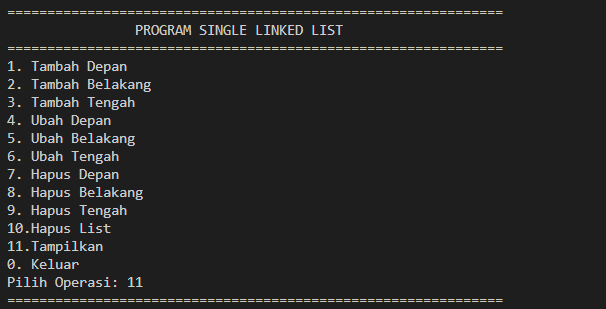
### Menu Tambah Depan
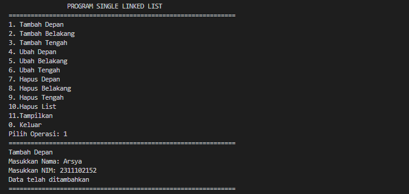
## Menu Tambah Belakang
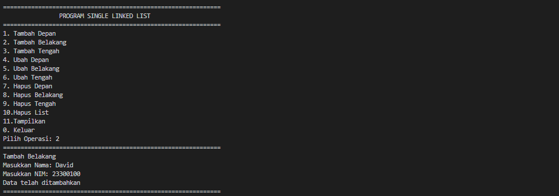
### Menu Tambah Tengah
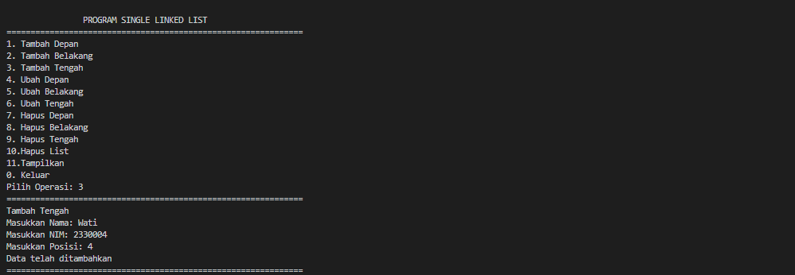
### Menu Ubah Depan
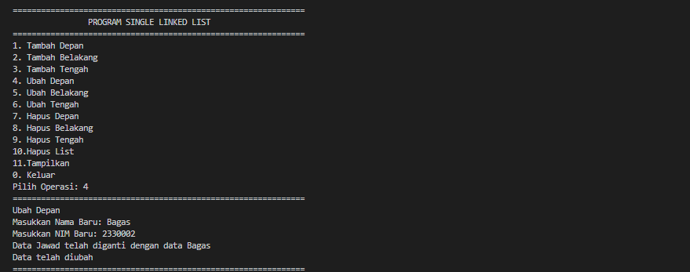
### Menu Ubah Belakang
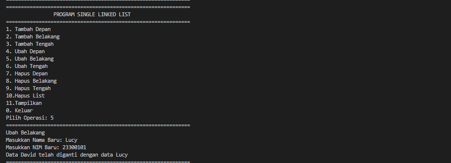
### Menu Ubah Tengah 
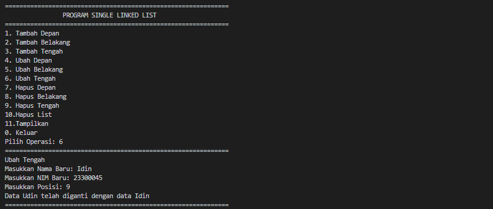
### Menu Hapus Depan
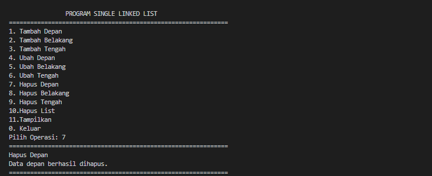
### Menu Hapus Belakang
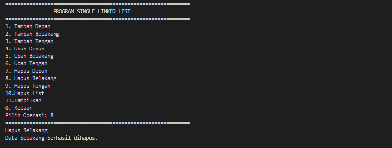
### Menu Hapus Tengah
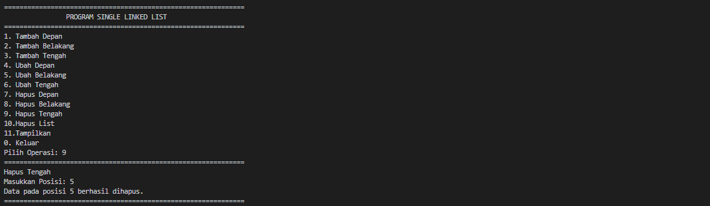
### Menu Hapus List
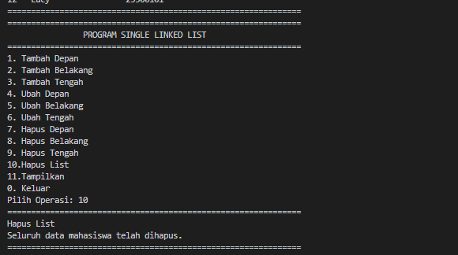
### Menu Tampilkan
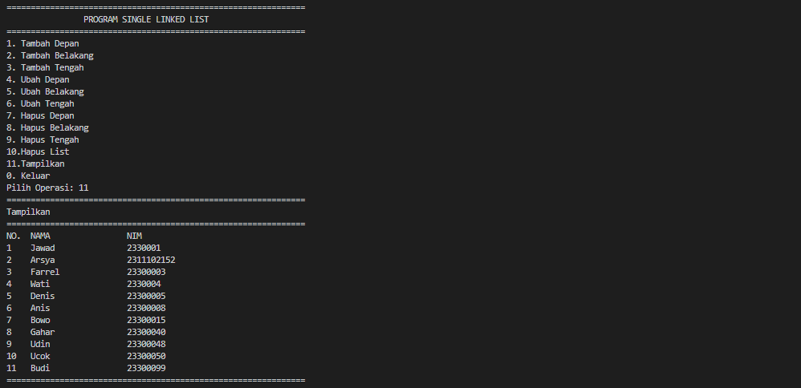


Penjelasan Program Unguided1 <br/>
Program yang telah saya buat pada Unguided1 adalah program menu Linked List Non-Circular untuk menyimpan Nama dan NIM mahasiswa, dengan menggunakan inputan dari user. Program tersebut menyediakan beberapa fungsi operasi dasar seperti penambahan data (di depan, di belakang, atau di tengah), penghapusan data (di depan, di belakang, atau di tengah), pengubahan data, serta menampilkan isi linked list. Users dapat memilih operasi yang diinginkan melalui menu yang disediakan hingga memilih untuk keluar dari program. Setiap operasi yang dipilih akan memanggil metode yang sesuai pada kelas LinkedList. Setiap node memiliki dua bagian yakni data (nama dan NIM mahasiswa) dan pointer yang menunjuk ke node berikutnya. Pada tampilan screenshoot diatas sudah saya tampilkan menu menunya.<br/>
 
<br/> Penjelasan dari setiap opsi dalam menu:<br/> 
tambah_depan: Menambahkan node dengan data baru di depan linked list.<br/>
tambah_belakang: Menambahkan node dengan data baru di belakang linked list.<br/>
tambah_tengah: Menambahkan node dengan data baru pada posisi tertentu dalam linked list.<br/>
hapus_depan: Menghapus node pertama dari linked list.<br/>
hapus_belakang: Menghapus node terakhir dari linked list.<br/>
hapus_tengah: Menghapus node pada posisi tertentu dalam linked list.<br/>
ubah_depan: Mengubah data pada node pertama dalam linked list.<br/>
ubah_belakang: Mengubah data pada node terakhir dalam linked list.<br/>
ubah_tengah: Mengubah data pada node pada posisi tertentu dalam linked list.<br/>
tampilkan: Menampilkan seluruh data dalam linked list.<br/>
hapus_list: Menghapus seluruh data dalam linked list.<br/>

## Unguided2

### 2. [Setelah membuat menu tersebut, masukkan data sesuai urutan berikut, lalu tampilkan data yang telah dimasukkan. (Gunakan insert depan, belakang atau tengah) ]
```C++ 
/*
by Arsya Fathiha Rahman - 2311102152
*/
#include <iostream>
#include <iomanip>
#include <string>
using namespace std;

struct Mahasiswa {
    string nama_152;
    string nim_152;
    Mahasiswa* next;
};

class LinkedList_Mahasiswa {
private:
    Mahasiswa* head;

public:
    LinkedList_Mahasiswa() {
        head = NULL;
    }

    void tambah_depan(string nama, string nim) {
        Mahasiswa* new_mahasiswa = new Mahasiswa;
        new_mahasiswa->nama_152 = nama;
        new_mahasiswa->nim_152 = nim;
        new_mahasiswa->next = head;
        head = new_mahasiswa;
    }

    void tambah_belakang(string nama, string nim) {
        Mahasiswa* new_mahasiswa = new Mahasiswa;
        new_mahasiswa->nama_152 = nama;
        new_mahasiswa->nim_152 = nim;
        new_mahasiswa->next = NULL;

        if (head == NULL) {
            head = new_mahasiswa;
            return;
        }

        Mahasiswa* current = head;
        while (current->next != NULL) {
            current = current->next;
        }
        current->next = new_mahasiswa;
    }

    void tambah_tengah(int posisi, string nama, string nim) {
        if (posisi <= 1) {
            tambah_depan(nama, nim);
            return;
        }

        Mahasiswa* new_mahasiswa = new Mahasiswa;
        new_mahasiswa->nama_152 = nama;
        new_mahasiswa->nim_152 = nim;

        Mahasiswa* current = head;
        for (int i = 1; i < posisi - 1 && current != NULL; i++) {
            current = current->next;
        }

        if (current != NULL) {
            new_mahasiswa->next = current->next;
            current->next = new_mahasiswa;
        } else {
            cout << "Posisi tidak valid." << endl;
        }
    }

    void hapus_belakang() {
        if (head == NULL) {
            cout << "Linked list kosong." << endl;
            return;
        }

        if (head->next == NULL) {
            delete head;
            head = NULL;
            return;
        }

        Mahasiswa* current = head;
        while (current->next->next != NULL) {
            current = current->next;
        }

        delete current->next;
        current->next = NULL;
    }

    void hapus_tengah(int posisi) {
        if (posisi <= 1) {
            Mahasiswa* temp = head;
            head = head->next;
            delete temp;
            return;
        }

        Mahasiswa* current = head;
        for (int i = 1; i < posisi - 1 && current != NULL; i++) {
            current = current->next;
        }

        if (current != NULL && current->next != NULL) {
            Mahasiswa* temp = current->next;
            current->next = temp->next;
            delete temp;
        } else {
            cout << "Posisi tidak valid." << endl;
        }
    }

    void tampilkan() {
        Mahasiswa* current = head;
        cout << "==============================================================" << endl;
        cout << setw(5) << left << "NO." << setw(20) << left << "NAMA" << "NIM" << endl;
        int i = 1;
        while (current != NULL) {
            cout << setw(5) << left << i << setw(20) << left << current->nama_152 << current->nim_152 << endl;
            current = current->next;
            i++;
        }
        cout << "==============================================================" << endl;
    }

  void ubah_depan(string nama_baru, string nim_baru) {
    if (head == NULL) {
        cout << "Linked list kosong." << endl;
        return;
    }

    string nama_lama = head->nama_152; 
    head->nama_152 = nama_baru;
    head->nim_152 = nim_baru;
    cout << "Data " << nama_lama << " telah diganti dengan data " << nama_baru << endl;
}


    void ubah_belakang(string nama_baru, string nim_baru) {
    if (head == NULL) {
        cout << "Linked list kosong." << endl;
        return;
    }

    Mahasiswa* current = head;
    Mahasiswa* previous = NULL;
    while (current->next != NULL) {
        previous = current;
        current = current->next;
    }
    
    string nama_lama = current->nama_152;
    current->nama_152 = nama_baru;
    current->nim_152 = nim_baru;
    cout << "Data " << nama_lama << " telah diganti dengan data " << nama_baru << endl;
}


    void ubah_tengah(int posisi, string nama_baru, string nim_baru) {
    if (posisi <= 1) {
        ubah_depan(nama_baru, nim_baru);
    } else {
        Mahasiswa* current = head;
        for (int i = 1; i < posisi && current != NULL; i++) {
            current = current->next;
        }
        if (current != NULL) {
            string nama_lama = current->nama_152;
            current->nama_152 = nama_baru;
            current->nim_152 = nim_baru;
            cout << "Data " << nama_lama << " telah diganti dengan data " << nama_baru << endl;
        } else {
            cout << "Posisi tidak valid." << endl;
        }
    }
}

    void hapus_list() {
        while (head != NULL) {
            hapus_depan();
        }
        cout << "Seluruh data mahasiswa telah dihapus." << endl;
    }

    void hapus_depan() {
        if (head != NULL) {
            Mahasiswa* temp = head;
            head = head->next;
            delete temp;
        }
    }
};

int main() {
    LinkedList_Mahasiswa linked_list;
    int pilihan;
    string nama, nim;
    int posisi;

    do {
        cout << "==============================================================" << endl;
        cout << "                PROGRAM SINGLE LINKED LIST                    " << endl;
        cout << "==============================================================" << endl;
        cout << setw(2) << "1. " << setw(17) << left << "Tambah Depan" << endl;
        cout << setw(2) << "2. " << setw(17) << left << "Tambah Belakang" << endl;
        cout << setw(2) << "3. " << setw(17) << left << "Tambah Tengah" << endl;
        cout << setw(2) << "4. " << setw(17) << left << "Ubah Depan" << endl;
        cout << setw(2) << "5. " << setw(17) << left << "Ubah Belakang" << endl;
        cout << setw(2) << "6. " << setw(17) << left << "Ubah Tengah" << endl;
        cout << setw(2) << "7. " << setw(17) << left << "Hapus Depan" << endl;
        cout << setw(2) << "8. " << setw(17) << left << "Hapus Belakang" << endl;
        cout << setw(2) << "9. " << setw(17) << left << "Hapus Tengah" << endl;
        cout << setw(2) << "10." << setw(17) << left << "Hapus List" << endl;
        cout << setw(2) << "11." << setw(17) << left << "Tampilkan" << endl;
        cout << setw(2) << "0. " << setw(17) << left << "Keluar" << endl;
        cout << "Pilih Operasi: ";
        cin >> pilihan;
        cout << "==============================================================" << endl;

        switch (pilihan) {
            case 1:
                cout << "Tambah Depan" << endl;
                cout << "Masukkan Nama: ";
                cin >> nama;
                cout << "Masukkan NIM: ";
                cin >> nim;
                linked_list.tambah_depan(nama, nim);
                cout << "Data telah ditambahkan" << endl;
                break;
            case 2:
                cout << "Tambah Belakang" << endl;
                cout << "Masukkan Nama: ";
                cin >> nama;
                cout << "Masukkan NIM: ";
                cin >> nim;
                linked_list.tambah_belakang(nama, nim);
                cout << "Data telah ditambahkan" << endl;
                break;
            case 3:
                cout << "Tambah Tengah" << endl;
                cout << "Masukkan Nama: ";
                cin >> nama;
                cout << "Masukkan NIM: ";
                cin >> nim;
                cout << "Masukkan Posisi: ";
                cin >> posisi;
                linked_list.tambah_tengah(posisi, nama, nim);
                cout << "Data telah ditambahkan" << endl;
                break;
            case 4:
                cout << "Ubah Depan" << endl;
                cout << "Masukkan Nama Baru: ";
                cin >> nama;
                cout << "Masukkan NIM Baru: ";
                cin >> nim;
                linked_list.ubah_depan(nama, nim);
                cout << "Data telah diubah" << endl;
                break;
            case 5:
                cout << "Ubah Belakang" << endl;
                cout << "Masukkan Nama Baru: ";
                cin >> nama;
                cout << "Masukkan NIM Baru: ";
                cin >> nim;
                linked_list.ubah_belakang(nama, nim);
                break;
            case 6:
                cout << "Ubah Tengah" << endl;
                cout << "Masukkan Nama Baru: ";
                cin >> nama;
                cout << "Masukkan NIM Baru: ";
                cin >> nim;
                cout << "Masukkan Posisi: ";
                cin >> posisi;
                linked_list.ubah_tengah(posisi, nama, nim);
                break;
            case 7:
                cout << "Hapus Depan" << endl;
                linked_list.hapus_depan();
                cout << "Data depan berhasil dihapus." << endl;
                break;
            case 8:
                cout << "Hapus Belakang" << endl;
                linked_list.hapus_belakang();
                cout << "Data belakang berhasil dihapus." << endl;
                break;
            case 9:
                cout << "Hapus Tengah" << endl;
                cout << "Masukkan Posisi: ";
                cin >> posisi;
                linked_list.hapus_tengah(posisi);
                cout << "Data pada posisi " << posisi << " berhasil dihapus." << endl;
                break;
            case 10:
                cout << "Hapus List" << endl;
                linked_list.hapus_list();
                break;
            case 11:
                cout << "Tampilkan" << endl;
                linked_list.tampilkan();
                break;
            case 0:
                cout << "Keluar" << endl;
                break;
            default:
                cout << "Pilihan tidak valid, silakan coba lagi." << endl;
        }

    } while (pilihan != 0);

    cout << "==============================================================" << endl;
    cout << "                Made By: ArsyafathihaRahman                   " << endl;
    cout << "==============================================================" << endl;

    return 0;
}

```
#### Output Unguided2

### Menanampilkan data yang telah dimasukkan. (Gunakan insert depan, belakang atau tengah)
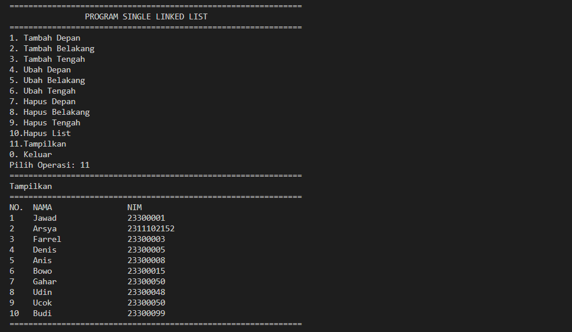

Penjelasan Program Unguided 2 - Program <br/>
Setelah membuat menu tersebut, masukkan data sesuai urutan (dari soal Unguided2), lalu tampilkan data yang telah dimasukkan. (Gunakan insert depan, belakang atau
tengah). Pertama Inputkan data dengan nama Jawad dengan NIM 23300001 menggunakan insert depan (pada tampilan menu nomor 4 (ubah depan)), setelah itu menginputkan nama dan NIM yang lainnya menggunakan insert belakang(pada tampilan menu nomor 5 (ubah belakang)). Setelah semua sudah pada unguided2 ini disuruh untuk menginputkan nama dan nim saya, disini baru menggunakan Insert Tengah (pada tampilan menu nomor 6 (ubah tengah)).<br/>

Inputan tersebut dimasukkan sesuai urutan yang diminta pada unguided ini, dengan penggunaan fungsi tambah depan, belakang, atau tengah yang sesuai dengan posisi yang diminta pada unguided2 ini. Berikut adalah penjelasan dari unguided2: <br/>

Jawad 23300001: Dimasukkan pertama kali menggunakan fungsi tambah depan, karena harus menjadi elemen pertama pada linked list.<br/>
Farrel 23300003: Dimasukkan menggunakan fungsi tambah belakang untuk menempatkannya setelah Jawad.<br/>
Denis 23300005: Dimasukkan menggunakan fungsi tambah belakang, untuk menempatkannya setelah Farrel.<br/>
Anis 23300008: Dimasukkan menggunakan fungsi tambah belakang, untuk menempatkannya setelah Denis.<br/>
Bowo 23300015: Dimasukkan menggunakan fungsi tambah belakang, untuk menempatkannya setelah Anis.<br/>
Gahar 23300040: Dimasukkan menggunakan fungsi tambah belakang, untuk menempatkannya setelah Bowo.<br/>
Udin 23300048: Dimasukkan menggunakan fungsi tambah belakang, untuk menempatkannya setelah Gahar.<br/>
Ucok 23300050: Dimasukkan menggunakan fungsi tambah belakang, untuk menempatkannya setelah Udin.<br/>
Budi 23300099: Dimasukkan menggunakan fungsi tambah belakang, untuk menempatkannya sebagai elemen terakhir sebelum tampilkan data.<br/>
[Nama saya] [NIM saya]: Dimasukkan menggunakan fungsi tambah tengah karena diperintahkan untuk menggunakan insert tengah pada unguidednya, lalu masukkan pada posisi kedua agar sesuai pada perintah untuk nama dan nim saya dimasukkan keurutan kedua.<br/>

## Unguided3

### 3. [Program Lakukan perintah dari users]
```C++ 
/*
by Arsya Fathiha Rahman - 2311102152
*/
#include <iostream>
#include <iomanip>
#include <string>
using namespace std;

struct Mahasiswa {
    string nama_152;
    string nim_152;
    Mahasiswa* next;
};

class LinkedList_Mahasiswa {
private:
    Mahasiswa* head;

public:
    LinkedList_Mahasiswa() {
        head = NULL;
    }

    void tambah_depan(string nama, string nim) {
        Mahasiswa* new_mahasiswa = new Mahasiswa;
        new_mahasiswa->nama_152 = nama;
        new_mahasiswa->nim_152 = nim;
        new_mahasiswa->next = head;
        head = new_mahasiswa;
    }

    void tambah_belakang(string nama, string nim) {
        Mahasiswa* new_mahasiswa = new Mahasiswa;
        new_mahasiswa->nama_152 = nama;
        new_mahasiswa->nim_152 = nim;
        new_mahasiswa->next = NULL;

        if (head == NULL) {
            head = new_mahasiswa;
            return;
        }

        Mahasiswa* current = head;
        while (current->next != NULL) {
            current = current->next;
        }
        current->next = new_mahasiswa;
    }

    void tambah_tengah(int posisi, string nama, string nim) {
        if (posisi <= 1) {
            tambah_depan(nama, nim);
            return;
        }

        Mahasiswa* new_mahasiswa = new Mahasiswa;
        new_mahasiswa->nama_152 = nama;
        new_mahasiswa->nim_152 = nim;

        Mahasiswa* current = head;
        for (int i = 1; i < posisi - 1 && current != NULL; i++) {
            current = current->next;
        }

        if (current != NULL) {
            new_mahasiswa->next = current->next;
            current->next = new_mahasiswa;
        } else {
            cout << "Posisi tidak valid." << endl;
        }
    }

    void hapus_belakang() {
        if (head == NULL) {
            cout << "Linked list kosong." << endl;
            return;
        }

        if (head->next == NULL) {
            delete head;
            head = NULL;
            return;
        }

        Mahasiswa* current = head;
        while (current->next->next != NULL) {
            current = current->next;
        }

        delete current->next;
        current->next = NULL;
    }

    void hapus_tengah(int posisi) {
        if (posisi <= 1) {
            Mahasiswa* temp = head;
            head = head->next;
            delete temp;
            return;
        }

        Mahasiswa* current = head;
        for (int i = 1; i < posisi - 1 && current != NULL; i++) {
            current = current->next;
        }

        if (current != NULL && current->next != NULL) {
            Mahasiswa* temp = current->next;
            current->next = temp->next;
            delete temp;
        } else {
            cout << "Posisi tidak valid." << endl;
        }
    }

    void tampilkan() {
        Mahasiswa* current = head;
        cout << "==============================================================" << endl;
        cout << setw(5) << left << "NO." << setw(20) << left << "NAMA" << "NIM" << endl;
        int i = 1;
        while (current != NULL) {
            cout << setw(5) << left << i << setw(20) << left << current->nama_152 << current->nim_152 << endl;
            current = current->next;
            i++;
        }
        cout << "==============================================================" << endl;
    }

  void ubah_depan(string nama_baru, string nim_baru) {
    if (head == NULL) {
        cout << "Linked list kosong." << endl;
        return;
    }

    string nama_lama = head->nama_152; 
    head->nama_152 = nama_baru;
    head->nim_152 = nim_baru;
    cout << "Data " << nama_lama << " telah diganti dengan data " << nama_baru << endl;
}


    void ubah_belakang(string nama_baru, string nim_baru) {
    if (head == NULL) {
        cout << "Linked list kosong." << endl;
        return;
    }

    Mahasiswa* current = head;
    Mahasiswa* previous = NULL;
    while (current->next != NULL) {
        previous = current;
        current = current->next;
    }
    
    string nama_lama = current->nama_152;
    current->nama_152 = nama_baru;
    current->nim_152 = nim_baru;
    cout << "Data " << nama_lama << " telah diganti dengan data " << nama_baru << endl;
}


    void ubah_tengah(int posisi, string nama_baru, string nim_baru) {
    if (posisi <= 1) {
        ubah_depan(nama_baru, nim_baru);
    } else {
        Mahasiswa* current = head;
        for (int i = 1; i < posisi && current != NULL; i++) {
            current = current->next;
        }
        if (current != NULL) {
            string nama_lama = current->nama_152;
            current->nama_152 = nama_baru;
            current->nim_152 = nim_baru;
            cout << "Data " << nama_lama << " telah diganti dengan data " << nama_baru << endl;
        } else {
            cout << "Posisi tidak valid." << endl;
        }
    }
}

    void hapus_list() {
        while (head != NULL) {
            hapus_depan();
        }
        cout << "Seluruh data mahasiswa telah dihapus." << endl;
    }

    void hapus_depan() {
        if (head != NULL) {
            Mahasiswa* temp = head;
            head = head->next;
            delete temp;
        }
    }
};

int main() {
    LinkedList_Mahasiswa linked_list;
    int pilihan;
    string nama, nim;
    int posisi;

    do {
        cout << "==============================================================" << endl;
        cout << "                PROGRAM SINGLE LINKED LIST                    " << endl;
        cout << "==============================================================" << endl;
        cout << setw(2) << "1. " << setw(17) << left << "Tambah Depan" << endl;
        cout << setw(2) << "2. " << setw(17) << left << "Tambah Belakang" << endl;
        cout << setw(2) << "3. " << setw(17) << left << "Tambah Tengah" << endl;
        cout << setw(2) << "4. " << setw(17) << left << "Ubah Depan" << endl;
        cout << setw(2) << "5. " << setw(17) << left << "Ubah Belakang" << endl;
        cout << setw(2) << "6. " << setw(17) << left << "Ubah Tengah" << endl;
        cout << setw(2) << "7. " << setw(17) << left << "Hapus Depan" << endl;
        cout << setw(2) << "8. " << setw(17) << left << "Hapus Belakang" << endl;
        cout << setw(2) << "9. " << setw(17) << left << "Hapus Tengah" << endl;
        cout << setw(2) << "10." << setw(17) << left << "Hapus List" << endl;
        cout << setw(2) << "11." << setw(17) << left << "Tampilkan" << endl;
        cout << setw(2) << "0. " << setw(17) << left << "Keluar" << endl;
        cout << "Pilih Operasi: ";
        cin >> pilihan;
        cout << "==============================================================" << endl;

        switch (pilihan) {
            case 1:
                cout << "Tambah Depan" << endl;
                cout << "Masukkan Nama: ";
                cin >> nama;
                cout << "Masukkan NIM: ";
                cin >> nim;
                linked_list.tambah_depan(nama, nim);
                cout << "Data telah ditambahkan" << endl;
                break;
            case 2:
                cout << "Tambah Belakang" << endl;
                cout << "Masukkan Nama: ";
                cin >> nama;
                cout << "Masukkan NIM: ";
                cin >> nim;
                linked_list.tambah_belakang(nama, nim);
                cout << "Data telah ditambahkan" << endl;
                break;
            case 3:
                cout << "Tambah Tengah" << endl;
                cout << "Masukkan Nama: ";
                cin >> nama;
                cout << "Masukkan NIM: ";
                cin >> nim;
                cout << "Masukkan Posisi: ";
                cin >> posisi;
                linked_list.tambah_tengah(posisi, nama, nim);
                cout << "Data telah ditambahkan" << endl;
                break;
            case 4:
                cout << "Ubah Depan" << endl;
                cout << "Masukkan Nama Baru: ";
                cin >> nama;
                cout << "Masukkan NIM Baru: ";
                cin >> nim;
                linked_list.ubah_depan(nama, nim);
                cout << "Data telah diubah" << endl;
                break;
            case 5:
                cout << "Ubah Belakang" << endl;
                cout << "Masukkan Nama Baru: ";
                cin >> nama;
                cout << "Masukkan NIM Baru: ";
                cin >> nim;
                linked_list.ubah_belakang(nama, nim);
                break;
            case 6:
                cout << "Ubah Tengah" << endl;
                cout << "Masukkan Nama Baru: ";
                cin >> nama;
                cout << "Masukkan NIM Baru: ";
                cin >> nim;
                cout << "Masukkan Posisi: ";
                cin >> posisi;
                linked_list.ubah_tengah(posisi, nama, nim);
                break;
            case 7:
                cout << "Hapus Depan" << endl;
                linked_list.hapus_depan();
                cout << "Data depan berhasil dihapus." << endl;
                break;
            case 8:
                cout << "Hapus Belakang" << endl;
                linked_list.hapus_belakang();
                cout << "Data belakang berhasil dihapus." << endl;
                break;
            case 9:
                cout << "Hapus Tengah" << endl;
                cout << "Masukkan Posisi: ";
                cin >> posisi;
                linked_list.hapus_tengah(posisi);
                cout << "Data pada posisi " << posisi << " berhasil dihapus." << endl;
                break;
            case 10:
                cout << "Hapus List" << endl;
                linked_list.hapus_list();
                break;
            case 11:
                cout << "Tampilkan" << endl;
                linked_list.tampilkan();
                break;
            case 0:
                cout << "Keluar" << endl;
                break;
            default:
                cout << "Pilihan tidak valid, silakan coba lagi." << endl;
        }

    } while (pilihan != 0);

    cout << "==============================================================" << endl;
    cout << "                Made By: ArsyafathihaRahman                   " << endl;
    cout << "==============================================================" << endl;

    return 0;
}
```

#### Output:
### Tambahkan data berikut diantara Farrel dan Denis: Wati 2330004
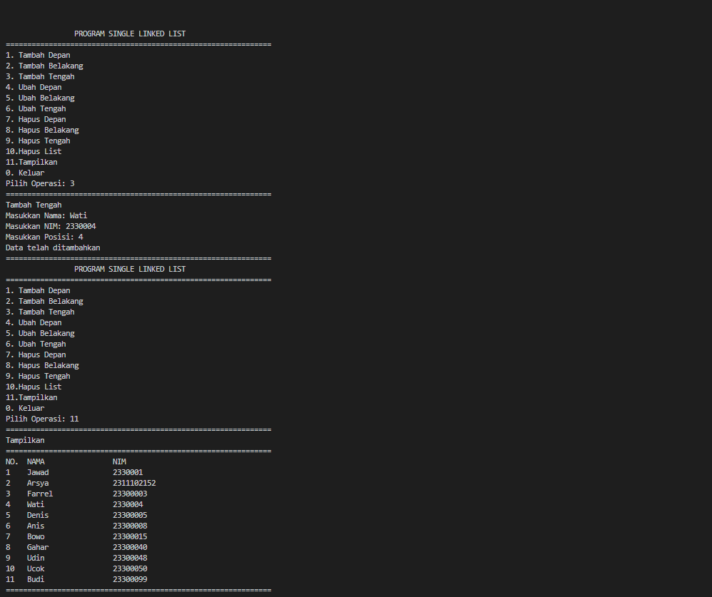
### Hapus data Denis
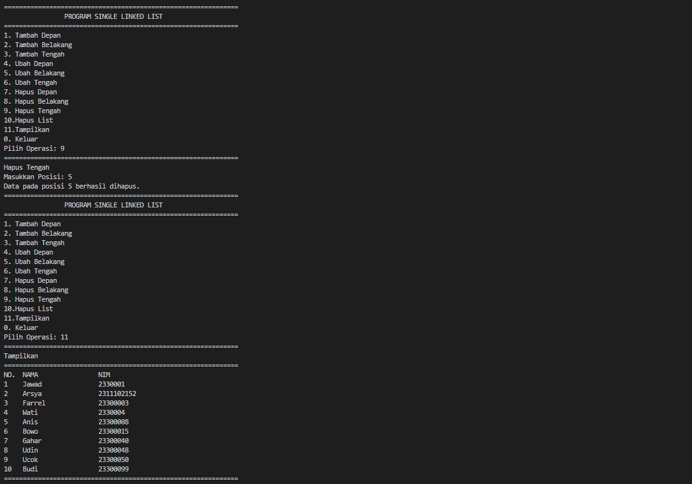
## Tambahkan data berikut di awal: Owi 2330000
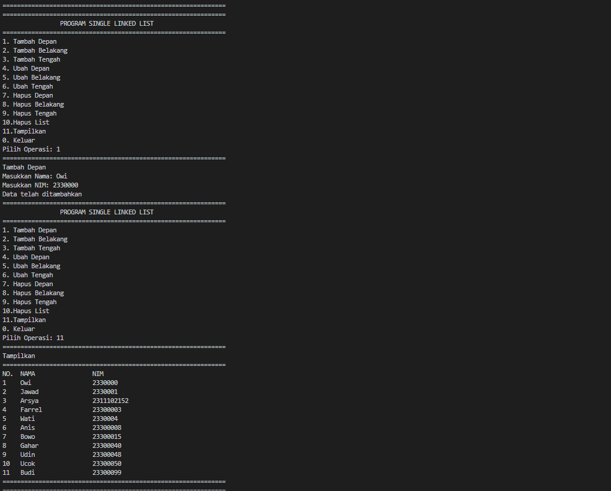
### Tambahkan data berikut di akhir: David 23300100
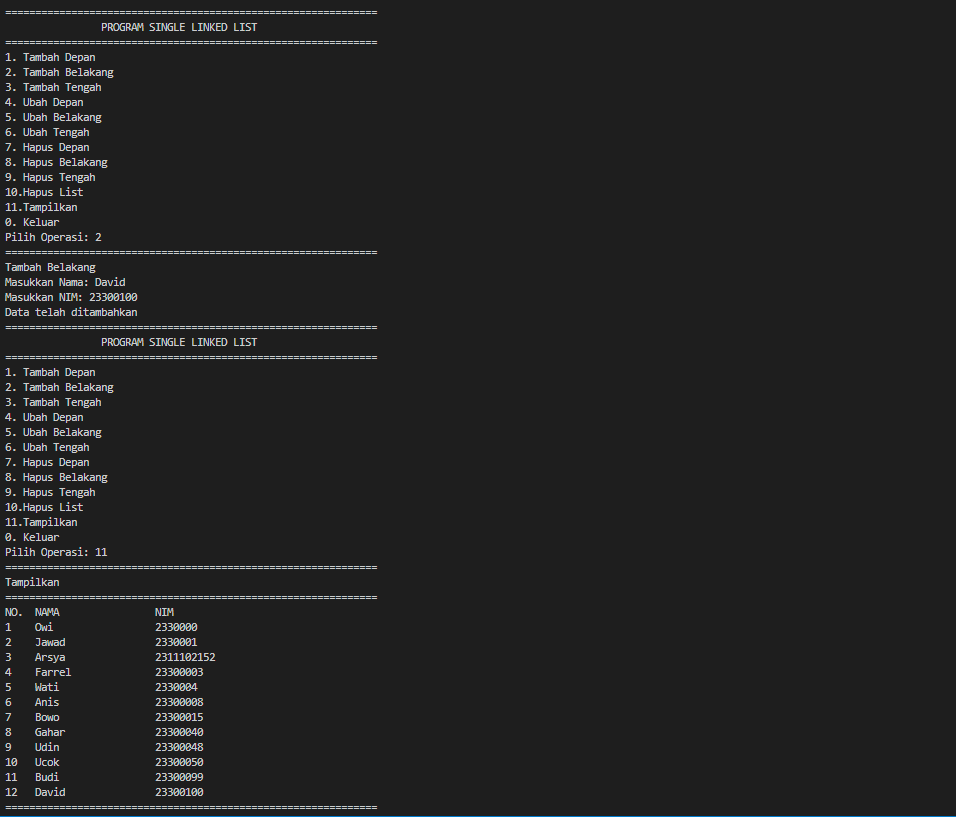
### Ubah data Udin menjadi data berikut: Idin 23300045
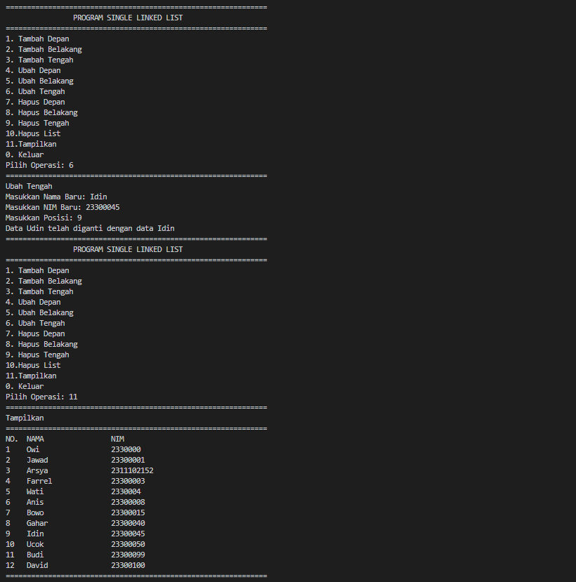
### Ubah data terkahir menjadi berikut: Lucy 23300101
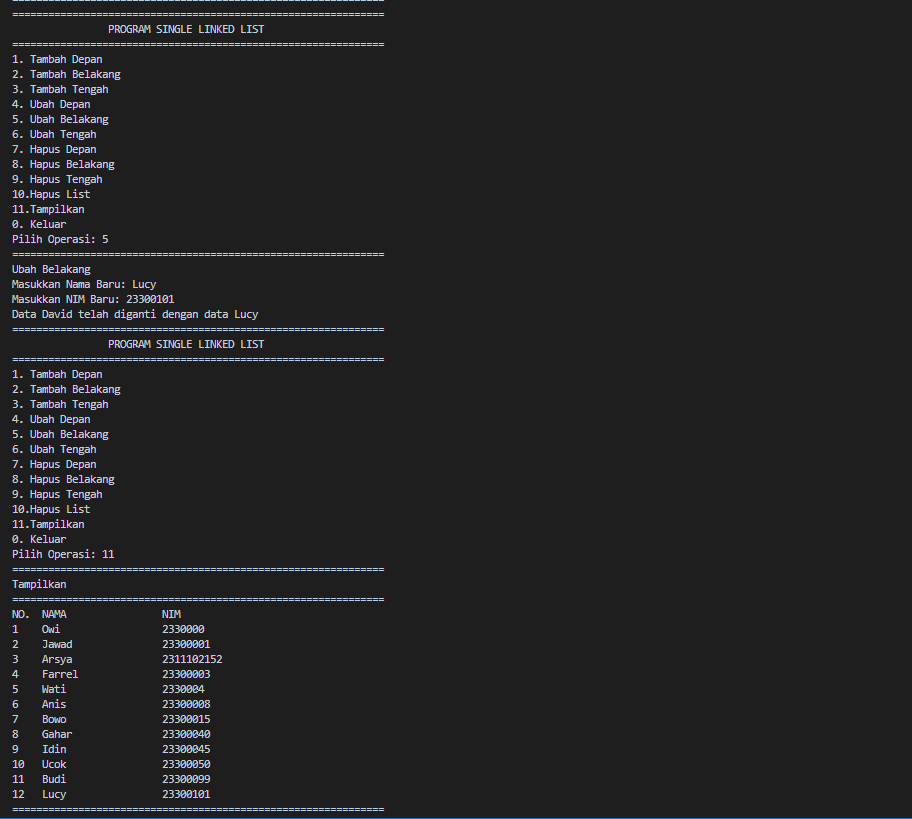
### Hapus data awal
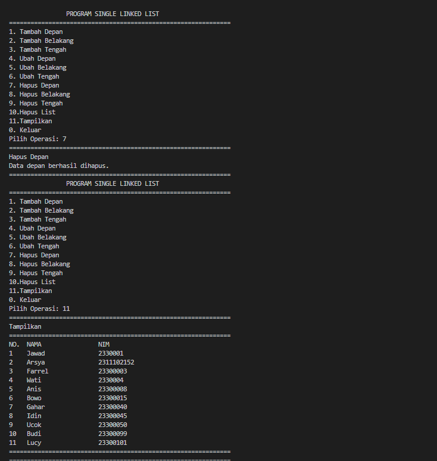
### Ubah data awal menjadi berikut: Bagas 2330002
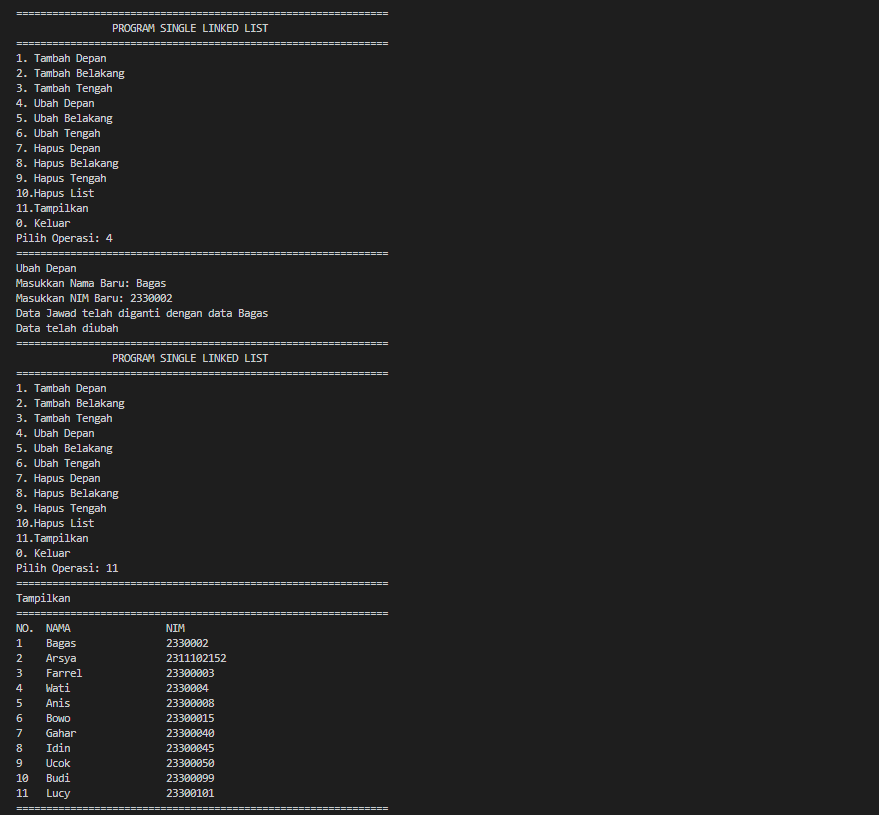
### Hapus data akhir
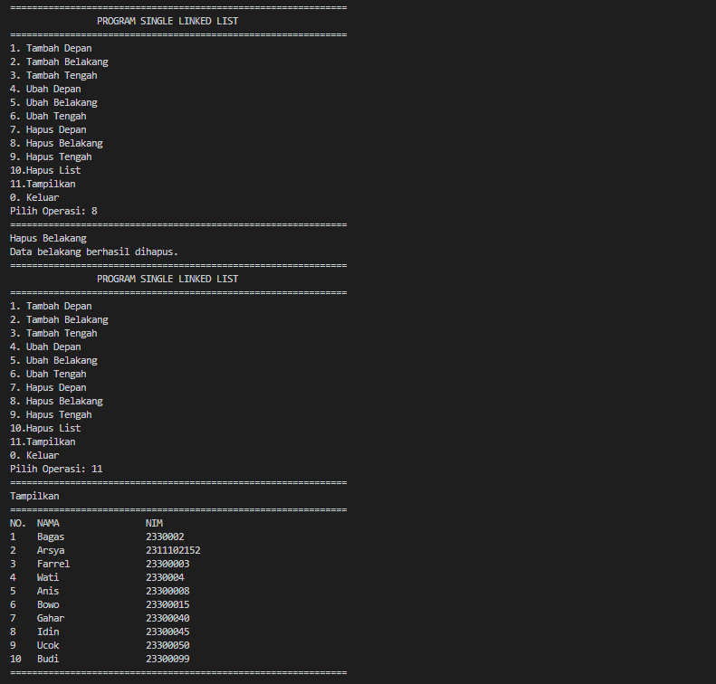
### Tampilkan seluruh data
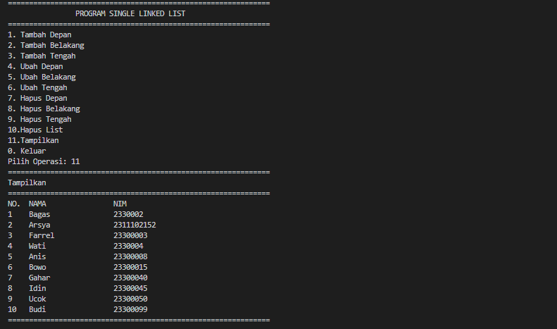

Penjelasan Program Unguided 3 - Program <br/>
Pada perintah unguided3 masih menggunakan script codingan yang sama dengan unguided 1 dan 2, hanya saja pada unguided3 diperintahkan untuk menambahkan menu menu seperti tambah data tengah antara Farrel dan Denis, lalu perintah untuk Hapus (menggunakan hapus tengah) data Denis, Tambah data diawah untuk Owi, Ubah data tengah menjadi Idin dari nama Udin, Ubah data terakhir (ubah belakang) menjadi Lucy, Hapus data awalnya (menggunakan menu hapus depan), Ubah data awal menjadi Bagas menggunakan Menu ubah depan, lalu perintah Hapus data akhir (menggunakan Hapus belakang), dan terakhir perintah menampilkan seluruh data menggunakan menutampilkan.
Untuk melakukan perintah diatas ini menggunakan sebuah linked list untuk menyimpan data mahasiswa. Linked list adalah struktur data yang terdiri dari sejumlah simpul (node) yang terhubung satu sama lain secara berurutan. Setiap simpul memiliki dua bagian utama: data ( nama dan NIM mahasiswa) dan pointer yang menunjuk ke simpul berikutnya.<br/>

Berikut adalah penjelasan dari perintahnya:<br/>

a) Untuk menambahkan data baru di antara "Farrel" dan "Denis", Anda menggunakan fungsi tambah_tengah(posisi, nama, nim). Posisi 3 menunjukkan tempat di mana data baru akan dimasukkan.<br/>

b) Untuk menghapus data "Denis", Anda menggunakan fungsi hapus_tengah(posisi), di mana posisi 4 menunjukkan simpul yang ingin dihapus.<br/>

c) Untuk menambahkan data baru di awal, Anda menggunakan fungsi tambah_depan(nama, nim).<br/>

d) Untuk menambahkan data baru di akhir, Anda menggunakan fungsi tambah_belakang(nama, nim).<br/>

e) Untuk mengubah data "Udin" menjadi "Idin", Anda menggunakan fungsi ubah_tengah(posisi, nama_baru, nim_baru) dengan posisi 2 sebagai parameter.<br/>

f) Untuk mengubah data terakhir, Anda menggunakan fungsi ubah_belakang(nama_baru, nim_baru).<br/>

g) Untuk menghapus data awal, Anda menggunakan fungsi hapus_depan().<br/>

h) Untuk mengubah data awal, Anda menggunakan fungsi ubah_depan(nama_baru, nim_baru).<br/>

i) Untuk menghapus data terakhir, Anda menggunakan fungsi hapus_belakang().<br/>

j) Terakhir, Anda menampilkan seluruh data menggunakan fungsi tampilkan().<br/>

Semua perubahan dan operasi di atas dilakukan melalui menu yang diberikan kepada pengguna. Setiap langkah dieksekusi dalam loop do-while sampai pengguna memilih untuk keluar (pilihan 0).
<br/>

#### Full code Screenshot Unguided 1,2, dan 3:
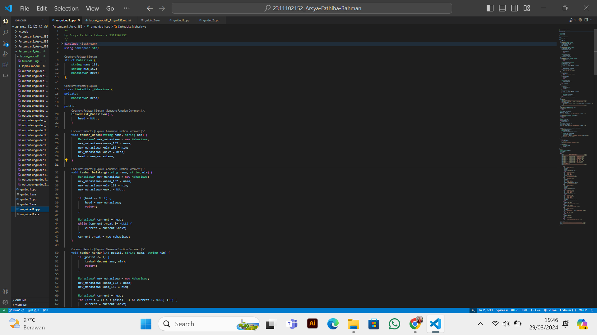
## Kesimpulan
Keseluruhan konsep materi linkedlist beserta guided dan unguided yang telah dibuat dari modul 4 baik guided dan unguidednya tersebut adalah implementasi dari struktur data Linked List baik Linked List Circular dan Non Circular Keseluruhandalam bahasa pemrograman C++. Keseluruhan program baik guided dan unguided mencakup beberapa fitur dasar seperti penambahan, penghapusan, dan pengubahan data dalam Linked List, serta kemampuan untuk menampilkan isi dari Linked List tersebut. Program tersebut juga dilengkapi dengan menu interaktif yang memungkinkan pengguna untuk memilih operasi yang ingin dilakukan terhadap Linked List, seperti menambah, mengubah, atau menghapus data, serta menampilkan isi dari Linked List tersebut. Dengan demikian, program tersebut dapat digunakan sebagai alat untuk memanipulasi dan mengelola data menggunakan struktur data Linked List.Dengan fitur-fitur ini, program tersebut dapat dijadikan sebagai contoh implementasi Linked List dalam bahasa pemrograman C++, serta sebagai alat yang berguna dalam pengelolaan dan manipulasi data.


## Referensi
[1] Anita, Sindar. STRUKTUR DATA DAN ALGORITMA DENGAN C++ : 2019 <br/>
[2] Edi Satrio, Simon Pakpahan. Pemrograman C++ Untuk Pembelajar Mandiri. Penerbit cahaya Informatika : 2019 <br/>

