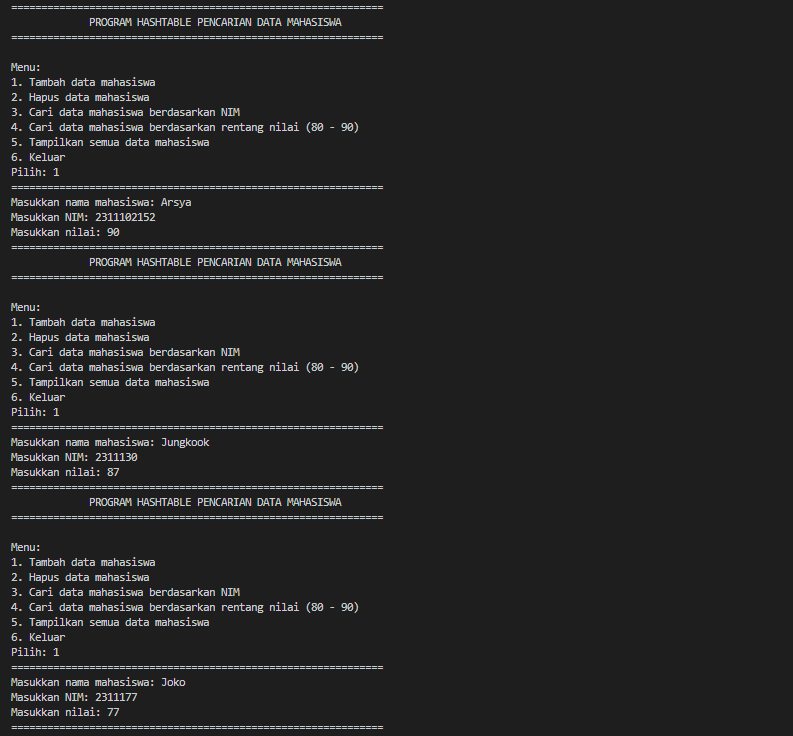
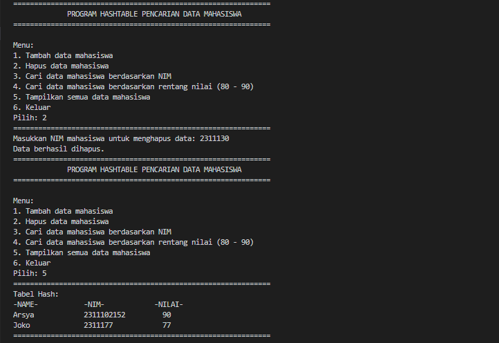
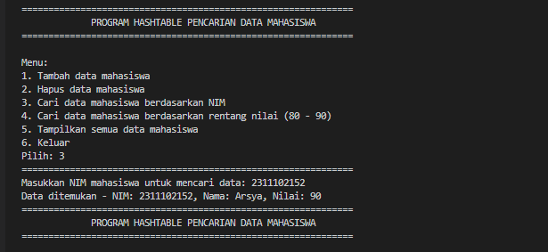
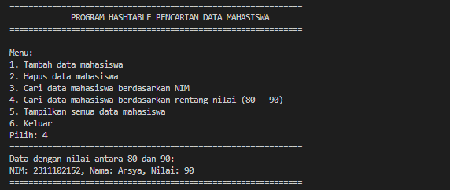
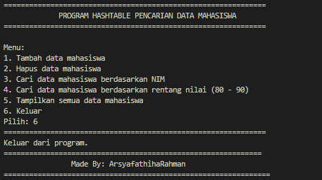
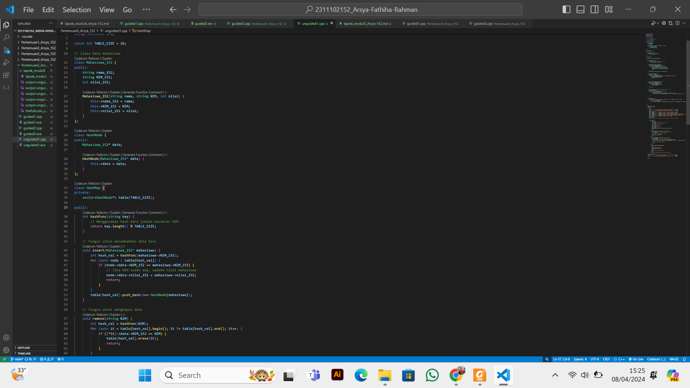

# <h1 align="center">Laporan Praktikum Modul 5 - Hashtable </h1>
<p align="center">Arsya Fathiha Rahman - 2311102152</p>

## Dasar Teori
Penjelasan Hashtable<br/>
Hashtable dalam C++ adalah struktur data yang digunakan untuk menyimpan pasangan nilai kunci. Di C++, tabel hash menggunakan fungsi hash untuk menghitung indeks dalam array yang nilainya perlu disimpan atau dicari. Proses penghitungan indeks ini disebut hashing. Nilai dalam tabel hash tidak disimpan dalam urutan yang diurutkan dan ada kemungkinan besar terjadinya tabrakan dalam tabel hash yang umumnya diselesaikan dengan proses rangkaian (pembuatan daftar tertaut yang memiliki semua nilai dan kunci yang terkait dengannya).<br/>

Operasi Hash Table<br/>
Penghapusan (Deletion): Digunakan untuk menghapus elemen/data dari Hash Table berdasarkan kunci atau indeksnya. Elemen yang dihapus akan dihapus dari indeks yang dihasilkan oleh fungsi hash.<br/>
Update: Operasi ini digunakan untuk mengubah nilai elemen/data yang sudah ada dalam Hash Table. Nilai elemen dapat diubah berdasarkan kunci atau indeksnya.<br/>
Pencarian (Search): Digunakan untuk mencari elemen/data dalam Hash Table berdasarkan kunci atau indeksnya. Pencarian dilakukan dengan menggunakan fungsi hash untuk menghasilkan indeks elemen yang dicari.<br/>
Collision Handling: Collision terjadi ketika dua atau lebih elemen memiliki indeks yang sama setelah melalui fungsi hash. Operasi ini digunakan untuk menangani collision dan memastikan bahwa elemen-elemen dengan indeks yang sama dapat disimpan dan diakses dengan benar.<br/>
Penyisipan (Insertion): Operasi ini digunakan untuk menyisipkan elemen/data baru ke dalam Hash Table. Elemen baru akan ditempatkan pada indeks yang dihasilkan oleh fungsi hash.<br/>
Resize: Operasi ini digunakan untuk mengubah ukuran Hash Table jika jumlah elemen/data yang disimpan melebihi kapasitas yang ditentukan. Resize dilakukan untuk menjaga efisiensi dan kinerja Hash Table.<br/>
Iterasi: Operasi yang digunakan untuk mengakses dan memproses semua elemen/data yang ada dalam Hash Table secara berurutan.<br/>

FUNGSI HASH TABLE PADA DATA<br/>
Fungsi utamanya pada data adalah mempercepat proses akses data. Hal ini berkaitan dengan peningkatan data dalam jumlah besar yang diproses oleh jaringan data global dan lokal. Hash table adalah solusi untuk membuat proses akses data lebih cepat dan memastikan bahwa data dapat dipertukarkan dengan aman. 
Di dalam banyak bidang, hash table dikembangkan dan digunakan karena menawarkan kelebihan dalam efisiensi waktu operasi, mulai dari pengarsipan hingga pencarian data. Contohnya adalah bidang jaringan komputer yang mengembangkannya menjadi hybrid open hash table, yang kemudian dipakai untuk memproses jaringan komputer.<br/>


## Guided1

### 1. [Program Hashtable Sederhana ]

```C++
#include <iostream>
using namespace std;
const int MAX_SIZE = 10;
// Fungsi hash sederhana
int hash_func(int key)
{
    return key % MAX_SIZE;
}
// Struktur data untuk setiap node
struct Node
{
    int key;
    int value;
    Node *next;
    Node(int key, int value) : key(key), value(value),
                               next(nullptr) {}
};
// Class hash table
class HashTable
{
private:
    Node **table;

public:
    HashTable()
    {
        table = new Node *[MAX_SIZE]();
    }
    ~HashTable()
    {
        for (int i = 0; i < MAX_SIZE; i++)
        {
            Node *current = table[i];
            while (current != nullptr)
            {
                Node *temp = current;
                current = current->next;
                delete temp;
            }
        }
        delete[] table;
    }
    // Insertion
    void insert(int key, int value)
    {
        int index = hash_func(key);
        Node *current = table[index];
        while (current != nullptr)
        {
            if (current->key == key)
            {
                current->value = value;
                return;
            }
            current = current->next;
        }
        Node *node = new Node(key, value);
        node->next = table[index];
        table[index] = node;
    }
    // Searching
    int get(int key)
    {
        int index = hash_func(key);
        Node *current = table[index];
        while (current != nullptr)
        {
            if (current->key == key)
            {
                return current->value;
            }
            current = current->next;
        }
        return -1;
    }
    // Deletion
    void remove(int key)
    {
        int index = hash_func(key);
        Node *current = table[index];
        Node *prev = nullptr;
        while (current != nullptr)
        {
            if (current->key == key)
            {
                if (prev == nullptr)
                {
                    table[index] = current->next;
                }
                else
                {
                    prev->next = current->next;
                }
                delete current;
                return;
            }
            prev = current;
            current = current->next;
        }
    }
    // Traversal
    void traverse()
    {
        for (int i = 0; i < MAX_SIZE; i++)
        {
            Node *current = table[i];
            while (current != nullptr)
            {
                cout << current->key << ": " << current->value
                     << endl;
                current = current->next;
            }
        }
    }
};
int main()
{
    HashTable ht;
    // Insertion
    ht.insert(1, 10);
    ht.insert(2, 20);
    ht.insert(3, 30);
    // Searching
    cout << "Get key 1: " << ht.get(1) << endl;
    cout << "Get key 4: " << ht.get(4) << endl;
    // Deletion
    ht.remove(4);
    // Traversal
    ht.traverse();
    return 0;
}


```
Penjelasan Guided1 <br/>
Program di atas adalah implementasi dari hash table menggunakan chaining dalam bahasa C++. Dalam hash table, kunci-nilai disimpan dalam struktur data node yang diindeks menggunakan fungsi hash. Fungsi hash digunakan untuk menentukan lokasi penyimpanan data berdasarkan kunci, sedangkan chaining digunakan untuk menangani tabrakan jika dua kunci menghasilkan indeks yang sama. Program dapat melakukan operasi dasar seperti penambahan, pencarian, dan penghapusan data dalam hash table serta dapat melakukan traversal untuk mencetak semua elemen dalam tabel.
<br/>Konstanta MAX_SIZE: Mendefinisikan konstanta MAX_SIZE yang digunakan untuk menentukan ukuran maksimum dari hash table.<br/>
<br/>Struktur Data Node: Merupakan struktur data untuk setiap node dalam hash table. Setiap node memiliki dua data: key dan value, serta pointer ke node selanjutnya dalam hash table.<br/>
<br/>Fungsi hash_func: Merupakan fungsi hash sederhana yang menerima satu parameter integer (kunci/key) dan mengembalikan nilai hasil modulus dari kunci terhadap MAX_SIZE. Fungsi ini menentukan indeks di mana data akan disimpan dalam array.<br/>


## Guided2
### 2. [Program Hashtable Data Karyawan]

```C++
#include <iostream>
#include <string>
#include <vector>
using namespace std;
const int TABLE_SIZE = 11;
string name;
string phone_number;
class HashNode
{
public:
    string name;
    string phone_number;
    HashNode(string name, string phone_number)
    {
        this->name = name;
        this->phone_number = phone_number;
    }
};
class HashMap
{
private:
    vector<HashNode *> table[TABLE_SIZE];

public:
    int hashFunc(string key)
    {
        int hash_val = 0;
        for (char c : key)
        {
            hash_val += c;
        }
        return hash_val % TABLE_SIZE;
    }
    void insert(string name, string phone_number)
    {
        int hash_val = hashFunc(name);
        for (auto node : table[hash_val])
        {
            if (node->name == name)
            {
                node->phone_number = phone_number;
                return;
            }
        }
        table[hash_val].push_back(new HashNode(name,
                                               phone_number));
    }
    void remove(string name)
    {
        int hash_val = hashFunc(name);
        for (auto it = table[hash_val].begin(); it !=
                                                table[hash_val].end();
             it++)
        {
            if ((*it)->name == name)
            {
                table[hash_val].erase(it);
                return;
            }
        }
    }
    string searchByName(string name)
    {
        int hash_val = hashFunc(name);
        for (auto node : table[hash_val])
        {
            if (node->name == name)
            {
                return node->phone_number;
            }
        }
        return "";
    }
    void print()
    {
        for (int i = 0; i < TABLE_SIZE; i++)
        {
            cout << i << ": ";
            for (auto pair : table[i])
            {
                if (pair != nullptr)
                {
                    cout << "[" << pair->name << ", " << pair->phone_number << "]";
                }
            }
            cout << endl;
        }
    }
};
int main()
{
    HashMap employee_map;
    employee_map.insert("Mistah", "1234");
    employee_map.insert("Pastah", "5678");
    employee_map.insert("Ghana", "91011");
    cout << "Nomer Hp Mistah : "
         << employee_map.searchByName("Mistah") << endl;
    cout << "Phone Hp Pastah : "
         << employee_map.searchByName("Pastah") << endl;
    employee_map.remove("Mistah");
    cout << "Nomer Hp Mistah setelah dihapus : "
         << employee_map.searchByName("Mistah") << endl
         << endl;
    cout << "Hash Table : " << endl;
    employee_map.print();
    return 0;
}
```
Penjelasan Guided2<br/>
Program guided2 diatas yaitu sebuah program implementasi sederhana dari struktur data hash table dalam C++, yang digunakan untuk menyimpan daftar karyawan dengan menggunakan nama mereka sebagai kunci dan nomor telepon sebagai nilainya, dengan penanganan tabrakan hash menggunakan metode chaining. <br/>
hashFunc(): Merupakan fungsi hash yang sederhana. Fungsi ini menjumlahkan nilai ASCII dari setiap karakter dalam string key (nama) dan mengembalikan hasil modulus terhadap TABLE_SIZE.<br/>
insert(): Menyisipkan pasangan kunci-nilai baru ke dalam hash table. Jika kunci sudah ada, nilai yang terkait dengan kunci tersebut akan diperbarui.<br/>
remove(): Menghapus pasangan kunci-nilai yang terkait dengan kunci yang diberikan dari hash table.<br/>
searchByName(): Mencari nilai (nomor telepon) yang terkait dengan kunci (nama) yang diberikan dalam hash table. Jika kunci tidak ditemukan, akan dikembalikan string koson.g<br/>

## Unguided

### 1. [1. Implementasikan hash table untuk menyimpan data mahasiswa. Setiap mahasiswa memiliki NIM dan nilai. Implementasikan fungsi untuk menambahkan data baru, menghapus data, mencari data berdasarkan NIM, dan mencari data berdasarkan nilai. Dengan ketentuan:
a. Setiap mahasiswa memiliki NIM dan nilai.
b. Program memiliki tampilan pilihan menu berisi poin C.
c. Implementasikan fungsi untuk menambahkan data baru, menghapus data, mencari data berdasarkan NIM, dan mencari data berdasarkan rentang nilai (80 – 90).]

```C++ 
/*
by Arsya Fathiha Rahman - 2311102152
*/
#include <iostream>
#include <string>
#include <vector>
#include <iomanip>

using namespace std;

const int TABLE_SIZE = 10;

// Class data mahasiswa
class Mahasiswa_152 {
public:
    string nama_152;
    string NIM_152; 
    int nilai_152;

    Mahasiswa_152(string nama, string NIM, int nilai) {
        this->nama_152 = nama;
        this->NIM_152 = NIM;
        this->nilai_152 = nilai;
    }
};

class HashNode {
public:
    Mahasiswa_152* data;

    HashNode(Mahasiswa_152* data) {
        this->data = data;
    }
};

class HashMap {
private:
    vector<HashNode*> table[TABLE_SIZE];

public:
    int hashFunc(string key) {
        // Menggunakan hash dari jumlah karakter NIM
        return key.length() % TABLE_SIZE;
    }

    // Fungsi untuk menambahkan data baru
    void insert(Mahasiswa_152* mahasiswa) {
        int hash_val = hashFunc(mahasiswa->NIM_152);
        for (auto node : table[hash_val]) {
            if (node->data->NIM_152 == mahasiswa->NIM_152) {
                // Jika NIM sudah ada, update nilai mahasiswa
                node->data->nilai_152 = mahasiswa->nilai_152;
                return;
            }
        }
        table[hash_val].push_back(new HashNode(mahasiswa));
    }

    // Fungsi untuk menghapus data
    void remove(string NIM) {
        int hash_val = hashFunc(NIM);
        for (auto it = table[hash_val].begin(); it != table[hash_val].end(); it++) {
            if ((*it)->data->NIM_152 == NIM) {
                table[hash_val].erase(it);
                return;
            }
        }
    }

    // Fungsi untuk mencari data berdasarkan NIM
    Mahasiswa_152* searchByNIM(string NIM) {
        int hash_val = hashFunc(NIM);
        for (auto node : table[hash_val]) {
            if (node->data->NIM_152 == NIM) {
                return node->data;
            }
        }
        return nullptr;
    }

    // Fungsi untuk mencari data berdasarkan rentang nilai (80 - 90)
    void searchByScoreRange() {
        cout << "Data dengan nilai antara 80 dan 90:\n";
        for (int i = 0; i < TABLE_SIZE; i++) {
            for (auto node : table[i]) {
                if (node->data->nilai_152 >= 80 && node->data->nilai_152 <= 90) {
                    cout << "NIM: " << node->data->NIM_152 << ", Nama: " << node->data->nama_152 << ", Nilai: " << node->data->nilai_152 << endl;
                }
            }
        }
    }

   // Traversal
    void Traverse_152() {
        cout << left << setw(17) << "-NAME-" << setw(17) << "-NIM-" << setw(12) << "-NILAI-" << endl;
        for (int i = 0; i < TABLE_SIZE; i++) { 
            for (auto node : table[i]) { 
                cout << left << setw(17) << node->data->nama_152 << setw(19) << node->data->NIM_152 << setw(12) << node->data->nilai_152 << endl;
            }
        }
    }
};

int main() {
    HashMap mahasiswaMap;
    // Menu
    int choice;
    do {
        cout << "==============================================================" << endl;
        cout << "             PROGRAM HASHTABLE PENCARIAN DATA MAHASISWA       " << endl;
        cout << "==============================================================" << endl;
        cout << "\nMenu:\n";
        cout << setw(3) << "1. " << setw(17) << left << "Tambah data mahasiswa" << endl;
        cout << setw(3) << "2. " << setw(17) << left << "Hapus data mahasiswa" << endl;
        cout << setw(3) << "3. " << setw(17) << left << "Cari data mahasiswa berdasarkan NIM" << endl;
        cout << setw(3) << "4. " << setw(17) << left << "Cari data mahasiswa berdasarkan rentang nilai (80 - 90)" << endl;
        cout << setw(3) << "5. " << setw(17) << left << "Tampilkan semua data mahasiswa" << endl;
        cout << setw(3) << "6. " << setw(17) << left << "Keluar" << endl;
        cout << "Pilih: ";
        cin >> choice;
        cout << "==============================================================" << endl;


        switch (choice) {
            case 1: {
                string nama;
                string NIM; // Menggunakan string untuk NIM
                int nilai;
                cout << "Masukkan nama mahasiswa: ";
                cin >> nama;
                cout << "Masukkan NIM: ";
                cin >> NIM;
                cout << "Masukkan nilai: ";
                cin >> nilai;
                mahasiswaMap.insert(new Mahasiswa_152(nama, NIM, nilai));
                break;
            }
            case 2: {
                string delNIM; // Menggunakan string untuk NIM
                cout << "Masukkan NIM mahasiswa untuk menghapus data: ";
                cin >> delNIM;
                cout << "Data berhasil dihapus." << endl;

                mahasiswaMap.remove(delNIM);
                break;
            }
            case 3: {
                string searchNIM; // Menggunakan string untuk NIM
                cout << "Masukkan NIM mahasiswa untuk mencari data: ";
                cin >> searchNIM;
                if (Mahasiswa_152* result = mahasiswaMap.searchByNIM(searchNIM)) {
                    cout << "Data ditemukan - NIM: " << result->NIM_152 << ", Nama: " << result->nama_152 << ", Nilai: " << result->nilai_152 << endl;
                } else {
                    cout << "Data tidak ditemukan.\n";
                }
                break;
            }
            case 4:
                mahasiswaMap.searchByScoreRange();
                break;
            case 5:
                cout << "Tabel Hash:\n";
                mahasiswaMap.Traverse_152();
                break;
            case 6:
                cout << "Keluar dari program.\n";
                break;
            default:
                cout << "Pilihan tidak valid. Silakan coba lagi.\n";
        }
    } while (choice != 6);
       cout << "=============================================================" << endl;
    cout << "                Made By: ArsyafathihaRahman                     " << endl;
    cout << "=============================================================== " << endl;


    return 0;
}
```

#### Output Unguided1
### Output Program Hashtable menu mencari dan menyimpan data mahasiswa dengan menggunakan input dari user

### Menu tambahkan data baru mahasiswa

### Menu tambahkan hapus data mahasiswa dan menampilkan datanya (menghapus data Jungkook)

### Menu mencari data mahasiswa berdasarkan NIM

### Menu mencari data mahasiswa berdasarkan rentang nilai (80-90)

### Menu keluar dari program


Penjelasan Program Unguided1 <br/>
Program yang telah saya buat pada Unguided1 adalah program menu hashtable untuk menyimpan data mahasiswa. Setiap mahasiswa direpresentasikan oleh kelas Mahasiswa_152, dan data disimpan menggunakan teknik chaining di dalam kelas HashMap. Program menyediakan menu interaktif untuk menambah, menghapus, dan mencari data mahasiswa berdasarkan NIM atau rentang nilai (80 – 90), serta ambahan dari saya sendiri yaitu mencetak semua data yang disimpan dalam hash table.  Terdapat banyak class salah satunya yakni, Kelas HashMap adalah Kelas yang mengelola hash table. Ini memiliki vektor dari pointer ke HashNode, di mana setiap vektor mewakili slot dalam hash table, salah satunya insert: Metode ini digunakan untuk menambahkan data mahasiswa ke dalam hash table. Jika terjadi tabrakan hash (dua mahasiswa memiliki nilai hash yang sama), metode ini menggunakan teknik chaining dengan menambahkan data mahasiswa baru ke dalam vektor yang berbagi indeks hash.<br/>


Sebagai Program yang memungkinkan pengguna untuk melakukan beberapa operasi seperti menambahkan data mahasiswa, menghapus data mahasiswa berdasarkan NIM, mencari data mahasiswa berdasarkan NIM, mencari data mahasiswa berdasarkan rentang nilai, dan menampilkan seluruh data mahasiswa yang tersimpan.<br/>
Penjelasan singkat mengenai bagian-bagian program ini yakni:<br/>

Header dan Namespace: Program dimulai dengan inklusi pustaka iostream, string, vector, dan iomanip. Kemudian menggunakan namespace std untuk menghilangkan kebutuhan menuliskan "std::" sebelum menggunakan fungsi dan objek dari pustaka-pustaka tersebut.<br/>

Konstanta TABLE_SIZE: Mendefinisikan konstanta TABLE_SIZE yang digunakan untuk menentukan ukuran maksimum dari hash table.<br/>
Class Mahasiswa_152: Merupakan representasi data mahasiswa dengan atribut nama, NIM, dan nilai. Terdapat constructor yang digunakan untuk inisialisasi atribut-atribut tersebut.<br/>
Class HashNode: Merupakan representasi dari setiap node dalam hash table. Setiap node menyimpan pointer ke objek Mahasiswa_152.<br/>

Class HashMap: Merupakan implementasi dari hash table. Berikut penjelasan fungsi-fungsinya:<br/>

hashFunc(): Merupakan fungsi hash yang sederhana. Fungsi ini menggunakan jumlah karakter dalam NIM untuk menentukan indeks di mana data akan disimpan dalam array.<br/>
insert(): Menyisipkan data mahasiswa baru ke dalam hash table. Jika NIM sudah ada, nilai mahasiswa akan diperbarui.<br/>
remove(): Menghapus data mahasiswa yang terkait dengan NIM yang diberikan dari hash table.<br/>
searchByNIM(): Mencari data mahasiswa berdasarkan NIM yang diberikan dalam hash table.<br/>
searchByScoreRange(): Mencari data mahasiswa yang memiliki nilai antara 80 dan 90, lalu menampilkannya.<br/>
Traverse_152(): Menampilkan seluruh data mahasiswa yang tersimpan dalam hash table.<br/>

 <br/>Penjelasan untuk setiap opsi menu dalam program:<br/>
1. Tambah data mahasiswa: Opsi ini memungkinkan pengguna untuk memasukkan data mahasiswa baru, termasuk nama, NIM, dan nilai. Data tersebut kemudian dimasukkan ke dalam hash table.<br/>
2. Hapus data mahasiswa: Pengguna diminta untuk memasukkan NIM mahasiswa yang ingin dihapus. Jika mahasiswa dengan NIM tersebut ditemukan, data mahasiswa tersebut akan dihapus dari hash table.<br/>
3. Cari data mahasiswa berdasarkan NIM: Pengguna diminta untuk memasukkan NIM mahasiswa yang ingin dicari. Jika ditemukan, program akan menampilkan nama dan nilai mahasiswa tersebut. Jika tidak, pesan "Data tidak ditemukan" akan ditampilkan.<br/>
4. Cari data mahasiswa berdasarkan rentang nilai (80 - 90): Opsi ini mencari dan menampilkan data mahasiswa yang memiliki nilai antara 80 hingga 90.<br/>
5. Tampilkan semua data mahasiswa: Menampilkan seluruh data mahasiswa yang tersimpan dalam hash table, termasuk NIM, nama, dan nilai.<br/>
 

#### Full code Screenshot Unguided 1:

## Kesimpulan
Keseluruhan konsep materi hashtable beserta guided dan unguided yang telah dibuat dari modul 5 baik guided dan unguidednya tersebut adalah implementasi dari struktur data hashtable, hashtable merupakan struktur data yang efisien untuk menyimpan pasangan kunci-nilai dengan memanfaatkan fungsi hash untuk menghitung indeks penyimpanan. Implementasi Hashtable dapat mempercepat proses pencarian, penyisipan, dan penghapusan data, serta mengatasi tabrakan (collision) dengan teknik chaining atau open addressing. Melalui latihan guided dan unguided, kita dapat memahami konsep dasar Hashtable, termasuk fungsi hash, chaining, dan operasi dasar yang terkait. Hashtable memungkinkan pengaksesan data yang cepat dan efisien, terutama dalam kasus di mana jumlah data besar harus diakses dan dikelola. Dalam modul ini, kita telah melihat implementasi Hashtable dalam berbagai konteks, seperti menyimpan data mahasiswa dan data karyawan. Pada setiap implementasi, kita dapat mengamati penggunaan fungsi hash untuk menentukan lokasi penyimpanan data, teknik penanganan tabrakan, dan operasi dasar seperti penambahan, pencarian, dan penghapusan data.<br/>

## Referensi
[1] Vivian Siahaan, Rismon. SIX BOOKS IN ONE: Belajar Pemrograman C/C++/Java/MATLAB/Visual Basic/Visual C# : 2019 <br/>
[2] Anita, Sindar. STRUKTUR DATA DAN ALGORITMA DENGAN C++ : 2019 <br/>


