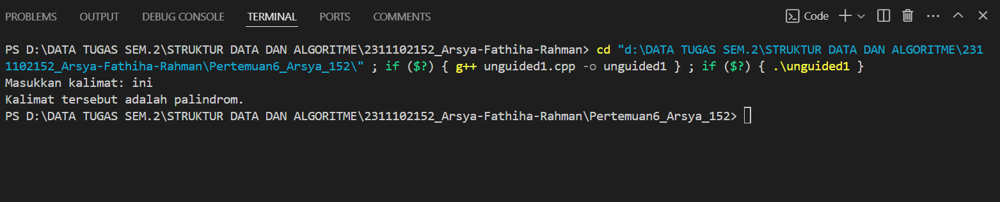
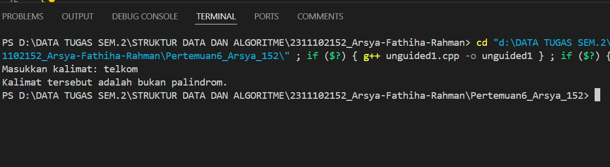
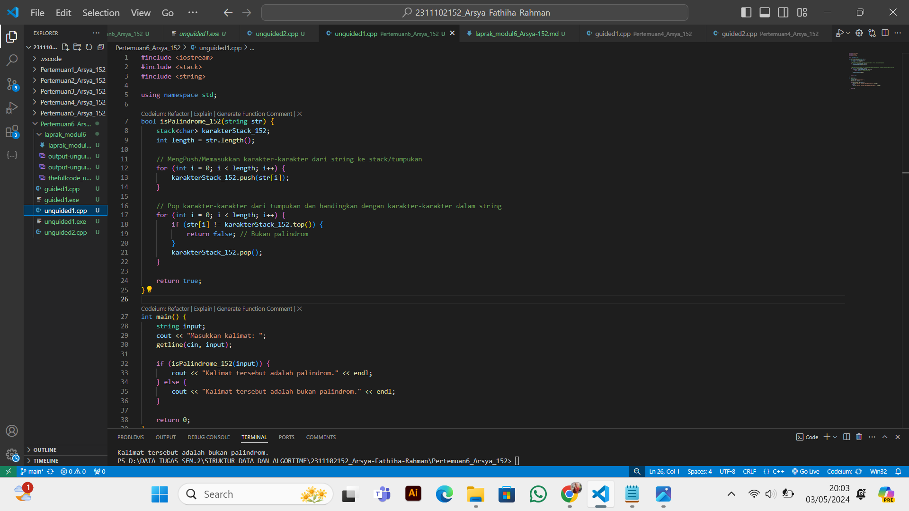
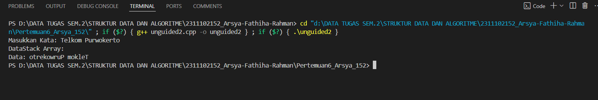
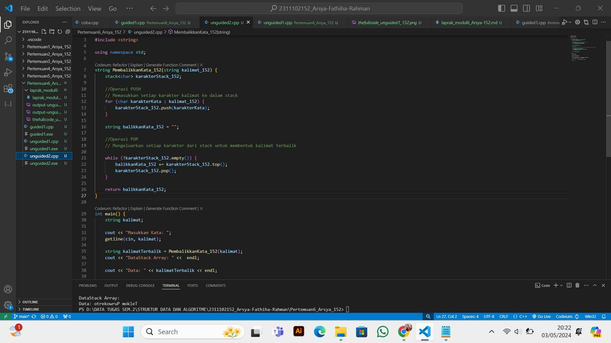

# <h1 align="center">Laporan Praktikum Modul 6 - Stack </h1>
<p align="center">Arsya Fathiha Rahman - 2311102152</p>

## Dasar Teori
Penjelasan Stack<br/>
Stack dalam C++ adalah kumpulan-kumpulan data yang menggunakan konsep LIFO (Last In First Out) atau FILO (First In Last Out), yaitu data yang paling terakhir dimasukan ke dalam stack merupakan data yang pertama kali keluar dari stack. Stack ini Kumpulan elemen-elemen data yang disimpan dalam satu lajur linier. Kumpulan elemen-elemen data hanya boleh diakses pada satu lokasi saja yaitu pada posisi ATAS (TOP) tumpukan. Jika dibayangkan, stack ini seperti sebuah tumpukan buku yang diletakkan dengan urutan atas ke bawah. Buku yang paling atas dan mudah diambil adalah buku yang akan diambil terlebih dahulu. Dalam proses komputasi, untuk meletakkan sebuah elemen pada bagian atas dari stack, maka dilakukan operasi push. Dan untuk memindahkan dari tempat yang atas tersebut, maka dilakukan operasi pop.  <br/>

Operasi Stack<br/>
Push: Menambahkan elemen baru ke dalam stack.<br/>
Pop: Menghapus elemen teratas dari stack.<br/>
Top (Atas): Mendapatkan nilai atau melihat elemen teratas pada stack tanpa menghapusnya.<br/>
IsEmpty (Kosong): Memeriksa apakah stack kosong atau tidak.<br/>
IsFull (Penuh): Memeriksa apakah stack penuh atau tidak (terutama pada implementasi stack dengan kapasitas terbatas).<br/>
Size (Ukuran): Mengembalikan jumlah elemen yang ada dalam stack.<br/>
Clear (Hapus Semua): Mengosongkan atau menghapus semua elemen dari stack.<br/>
Search (Cari): Mencari keberadaan elemen tertentu dalam stack.<br/>

Jenis-Jenis Stack<br/>
1. Stack Diimplementasikan dengan Array<br/>
Jenis pertama ini merupakan metode yang paling sederhana. Sebuah data disimpan dalam sebuah
array dengan akses ke data yang terakhir dimasukkan ke stack. Keuntungan dari implementasi ini
yaitu sederhana dan mudah dipahami. Namun kelemahannya yaitu kapasitas stack yang dibatasi oleh
ukuran array.<br/>
2. Stack Diimplementasikan dengan Linked<br/>
Kedua, implementasi stack dengan menggunakan linked list dapat menambah atau mengurangi data
dalam stack tanpa terbatas oleh ukuran tertentu. Keuntungannya adalah tidak ada batasan kapasitas
dan dapat diatur sesuai kebutuhan, sementara kelemahannya yaitu kompleksitas implementasinya
lebih tinggi daripada implementasi stack dengan array.<br/>
3. Double-Ended Stack<br/>
Double-Ended stack dapat membuat operasi push dan pop dilakukan pada kedua ujung depan dan
belakang stack. Keuntungannya adalah memungkinkan akses data dari kedua ujung stack, sehingga
menjadi lebih fleksibel, sementara kelemahannya yaitu kompleksitas implementasi yang lebih tinggi
dibanding dengan implementasi stack biasa.<br/>
4. Circular Stack<br/>
Jenis stack yang kedua adalah stack yang berbentuk sirkuler. Sirkular stack umumnya
diimplementasikan dengan menggunakan array. Keuntungan dari circular stack adalah memori yang
tidak boros dan lebih efisien. Sementara kelemahannya adalah penerapan yang lebih kompleks.<br/>
5. Dynamic Stack<br/>
Dynamic stack merupakan stack yang dapat disesuaikan ukurannya selama program berjalan.
Implementasi stack ini biasanya menggunakan linked list. Keuntungan dari implementasi dynamic
stack adalah ukuran stack yang dapat disesuaikan dengan kebutuhan, sementara kelemahannya
adalah terlalu kompleks.<br/>
6. Undo-Redo Stack<br/>
Undo Redo stack adalah stack yang dipakai untuk melakukan operasi undo dan redo pada sebuah
aplikasi. Implementasinya menggunakan linked list. Keuntungannya adalah memungkinkan untuk
mengembalikan perubahan yang sudah dilakukan dengan cepat, sementara kelemahannya adalah
kompleksitas implementasinya yang tinggi.<br/>

## Guided1

### 1. [Program Stack pada Buku ]

```C++
#include <iostream>
using namespace std;
string arrayBuku[5];
int maksimal = 5, top = 0;
bool isFull()
{
    return (top == maksimal);
}
bool isEmpty()
{
    return (top == 0);
}
void pushArrayBuku(string data)
{
    if (isFull())
    {
        cout << "Data telah penuh" << endl;
    }
    else
    {
        arrayBuku[top] = data;
        top++;
    }
}
void popArrayBuku()
{
    if (isEmpty())
    {
        cout << "Tidak ada data yang dihapus" << endl;
    }
    else
    {
        arrayBuku[top - 1] = "";
        top--;
    }
}
void peekArrayBuku(int posisi)
{
    if (isEmpty())
    {
        cout << "Tidak ada data yang bisa dilihat" << endl;
    }
    else
    {
        int index = top;
        for (int i = 1; i <= posisi; i++)
        {
            index--;
        }
        cout << "Posisi ke " << posisi << " adalah " << arrayBuku[index] << endl;
    }
}
int countStack()
{
    return top;
}
void changeArrayBuku(int posisi, string data)
{
    if (posisi > top)
    {
        cout << "Posisi melebihi data yang ada" << endl;
    }
    else
    {
        int index = top;
        for (int i = 1; i <= posisi; i++)
        {
            index--;
        }
        arrayBuku[index] = data;
    }
}
void destroyArraybuku()
{
    for (int i = top; i >= 0; i--)
    {
        arrayBuku[i] = "";
    }
    top = 0;
}
void cetakArrayBuku()
{
    if (isEmpty())
    {
        cout << "Tidak ada data yang dicetak" << endl;
    }
    else
    {
        for (int i = top - 1; i >= 0; i--)
        {
            cout << arrayBuku[i] << endl;
        }
    }
}
int main()
{
    pushArrayBuku("Kalkulus");
    pushArrayBuku("Struktur Data");
    pushArrayBuku("Matematika Diskrit");
    pushArrayBuku("Dasar Multimedia");
    pushArrayBuku("Inggris");
    cetakArrayBuku();
    cout << "\n";
    cout << "Apakah data stack penuh? " << isFull() << endl;
    cout << "Apakah data stack kosong? " << isEmpty() << endl;
    peekArrayBuku(2);
    popArrayBuku();
    cout << "Banyaknya data = " << countStack() << endl;
    changeArrayBuku(2, "Bahasa Jerman");
    cetakArrayBuku();
    cout << "\n";
    destroyArraybuku();
    cout << "Jumlah data setelah dihapus: " << top << endl;
    cetakArrayBuku();
    return 0;
}

```
Penjelasan Guided1 <br/>
<br/>Program di atas adalah implementasi dari Stack yang memungkinkan pengguna untuk menambah, menghapus, mengubah, dan melihat data dalam tumpukan buku. Selain itu, program juga memeriksa apakah tumpukan penuh atau kosong, menghitung jumlah data dalam tumpukan, serta menghapus semua data dari tumpukan.  <br/>
Fungsi-fungsi operasi stack yang digunakan: <br/>
isFull(): Memeriksa apakah tumpukan penuh atau tidak. <br/>
isEmpty(): Memeriksa apakah tumpukan kosong atau tidak. <br/>
pushArrayBuku(): Menambahkan data ke dalam tumpukan jika tumpukan belum penuh. <br/>
popArrayBuku(): Menghapus data dari tumpukan jika tumpukan tidak kosong. <br/>
peekArrayBuku(): Melihat data pada posisi tertentu dalam tumpukan tanpa menghapusnya. <br/>
countStack(): Mengembalikan jumlah data yang ada dalam tumpukan. <br/>
changeArrayBuku(): Mengubah data pada posisi tertentu dalam tumpukan. <br/>
destroyArraybuku(): Menghapus semua data dari tumpukan. <br/>
cetakArrayBuku(): Mencetak semua data yang ada dalam tumpukan.<br/>

## Unguided1

 <br/>1. Buatlah program untuk menentukan apakah kalimat tersebut yang diinputkan dalam program stack adalah palindrom/tidak. Palindrom kalimat yang dibaca dari depan dan belakang sama. Jelaskan bagaimana cara kerja programnya.<br/>

```C++ 
/*
by Arsya Fathiha Rahman - 2311102152
*/
#include <iostream>
#include <stack>
#include <string>

using namespace std;

bool isPalindrome_152(string str) {
    stack<char> karakterStack_152;
    int length = str.length();

    // MengPush/Memasukkan karakter-karakter dari string ke stack/tumpukan
    for (int i = 0; i < length; i++) {
        karakterStack_152.push(str[i]);
    }

    // Pop karakter-karakter dari tumpukan dan bandingkan dengan karakter-karakter dalam string
    for (int i = 0; i < length; i++) {
        if (str[i] != karakterStack_152.top()) {
            return false; // Bukan palindrom
        }
        karakterStack_152.pop();
    }

    return true; 
}

int main() {
    string input;
    cout << "Masukkan kalimat: ";
    getline(cin, input);

    if (isPalindrome_152(input)) {
        cout << "Kalimat tersebut adalah palindrom." << endl;
    } else {
        cout << "Kalimat tersebut adalah bukan palindrom." << endl;
    }

    return 0;
}

```

#### Output Unguided1



Penjelasan Program Unguided1 <br/>
Program yang telah saya buat pada Unguided1 adalah program menu pada stack yaitu menentukan apakah sebuah kalimat merupakan palindrom atau bukan.Pada function isPalindrome_152, setiap karakter dari string input dimasukkan ke dalam stack menggunakan operasi push. Kemudian, karakter-karakter tersebut dikeluarkan dari stack satu per satu menggunakan operasi pop, dan dibandingkan dengan karakter-karakter dalam string input. Jika semua karakter dalam string input sama dengan karakter-karakter yang dikeluarkan dari stack dalam urutan yang terbalik, maka kalimat tersebut adalah palindrom. Jika tidak, maka kalimat tersebut bukan palindrom. Maka output yang dihasilkan Jika kalimat merupakan palindrom, program akan menampilkan pesan "Kalimat tersebut adalah palindrom."Sebaliknya, Jika kalimat bukan palindrom, program akan menampilkan pesan "Kalimat tersebut adalah bukan palindrom."<br/>
Dengan pada dasarnya Stack digunakan untuk menyimpan karakter-karakter dari kata atau kalimat agar dapat diakses dalam urutan terbalik.<br/>
<br/>Maka Penjelasan Operasi Program Menu Menentukan Kalimat Palindrom atau bukan:
<br/>Operasi PUSH: Setiap karakter dari string str dimasukkan ke dalam stack menggunakan loop for.<br/>
<br/>Operasi POP dan Pengecekan Palindrom: Setelah semua karakter dimasukkan ke dalam stack, loop for digunakan untuk mengeluarkan karakter-karakter dari stack satu per satu. Karakter yang dikeluarkan dibandingkan dengan karakter-karakter dalam string input str. Jika karakter-karakter tersebut tidak sama, maka kalimat bukanlah palindrom, dan fungsi mengembalikan false. Jika semua karakter cocok, maka kalimat adalah palindrom, dan fungsi mengembalikan true.<br/>


#### Full code Screenshot Unguided 1:


## Unguided2
<br/> 2. Buatlah program untuk melakukan pembalikan terhadap kalimat menggunakan stack dengan minimal 3 kata. Jelaskan output program dan source codenya beserta operasi/fungsi yang dibuat?<br/>

```C++ 
/*
by Arsya Fathiha Rahman - 2311102152
*/
#include <iostream>
#include <stack>
#include <string>

using namespace std;

string MembalikkanKata_152(string kalimat_152) {
    stack<char> karakterStack_152;

    //Operasi PUSH
    // Memasukkan setiap karakter kalimat ke dalam stack
    for (char karakterKata : kalimat_152) {
        karakterStack_152.push(karakterKata);
    }

    string balikkanKata_152 = "";

    //Operasi POP
    // Mengeluarkan setiap karakter dari stack untuk membentuk kalimat terbalik
    
    while (!karakterStack_152.empty()) {
        balikkanKata_152 += karakterStack_152.top();
        karakterStack_152.pop();
    }

    return balikkanKata_152;
}

int main() {
    string kalimat;

    cout << "Masukkan Kata: ";
    getline(cin, kalimat);

    string kalimatTerbalik = MembalikkanKata_152(kalimat);
    cout << "DataStack Array: " <<  endl;

    cout << "Data: " << kalimatTerbalik << endl;

    return 0;
}

```

#### Output Unguided2


Penjelasan Program Unguided2 <br/>
Program yang telah saya buat pada Unguided1 adalah program menu pada stack untuk membalikkan urutan karakter-karakter dalam sebuah kata atau kalimat. Pada fungsi MembalikkanKata_152, setiap karakter dari string input dimasukkan ke dalam stack menggunakan operasi push. Kemudian, karakter-karakter tersebut dikeluarkan dari stack satu per satu menggunakan operasi pop, dan disusun dalam urutan terbalik untuk membentuk kata atau kalimat terbalik. Dengan pada dasarnya Stack digunakan untuk menyimpan karakter-karakter dari kata atau kalimat agar dapat diakses dalam urutan terbalik.<br/>
<br/>Penjelasan Operasi Program Menu Membalikkan urutan karakter:<br/>
Operasi PUSH: Setiap karakter dari string kalimat_152 dimasukkan ke dalam stack menggunakan loop for each. Setiap karakter dimasukkan ke dalam stack dengan operasi push.<br/>
Operasi POP: Setelah semua karakter dimasukkan ke dalam stack, loop while digunakan untuk mengeluarkan karakter-karakter dari stack dan menyusunnya dalam urutan terbalik. Karakter teratas dari stack diambil menggunakan top() dan kemudian dihapus dari stack menggunakan pop(). Karakter tersebut ditambahkan ke dalam string balikkanKata_152.<br/>


#### Full code Screenshot Unguided 2:


## Kesimpulan
Keseluruhan konsep materi Stack beserta guided dan unguided yang telah dibuat dari modul 6 baik guided dan unguidednya merupakan implementasi dari struktur data stack, Pada program Guided1, kita melihat implementasi stack dalam menyimpan data buku dan melakukan operasi-operasi dasar seperti push, pop, peek, dan lainnya. Sementara itu, pada program Unguided1, kita melihat bagaimana stack dapat digunakan untuk menentukan apakah sebuah kalimat adalah palindrom atau bukan. Dengan memanfaatkan operasi push dan pop, kita dapat membandingkan karakter-karakter dalam kalimat tersebut untuk menentukan palindromnya. Selanjutnya, pada program Unguided2, kita menggunakan stack untuk membalikkan urutan karakter-karakter dalam sebuah kata atau kalimat. Hal ini menunjukkan fleksibilitas stack dalam memanipulasi data secara terbalik, yang seringkali diperlukan dalam berbagai aplikasi.
Secara keseluruhan, stack merupakan struktur data yang sangat berguna dalam pemrograman untuk menangani berbagai jenis tugas, mulai dari manajemen data sederhana hingga pemrosesan teks yang lebih kompleks. Dengan pemahaman yang baik tentang konsep dan penggunaan stack, kita dapat mengembangkan berbagai aplikasi yang lebih efisien. Dengan menggunakan struktur data stack, kita dapat mengimplementasikan berbagai macam fitur dan fungsionalitas yang berguna dalam pemrograman, seperti penyimpanan dan pengolahan data dalam urutan tertentu. <br/>

## Referensi
[1] Vivian Siahaan, Rismon. Mudah Menguasai C++ Untuk Programmer: 2020 <br/>
[2] Anita, Sindar. STRUKTUR DATA DAN ALGORITMA DENGAN C++ : 2019 <br/>


