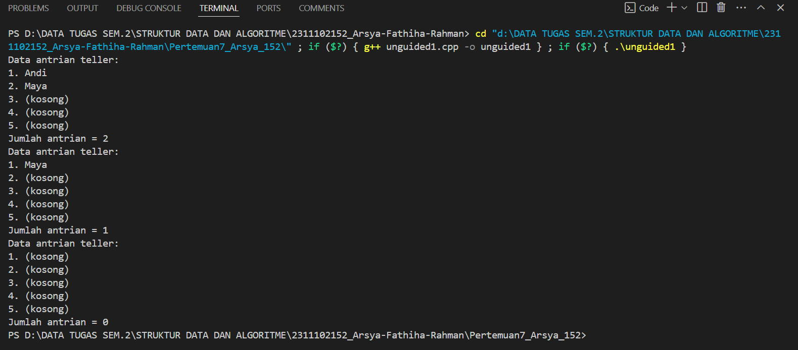
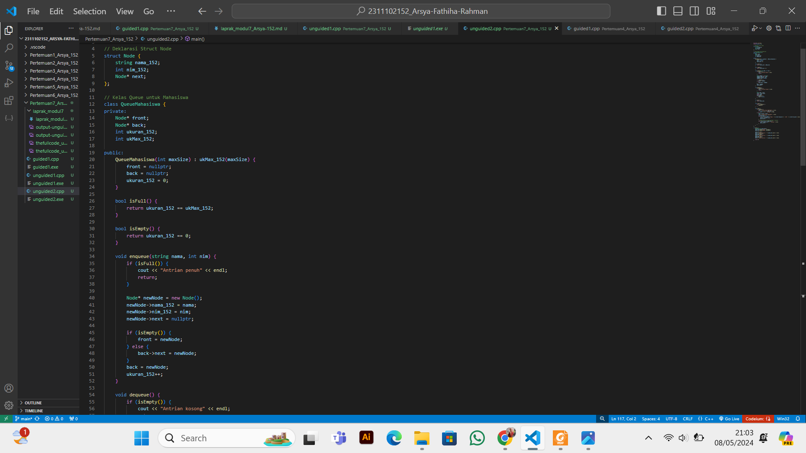
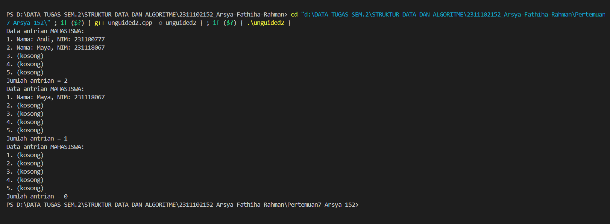
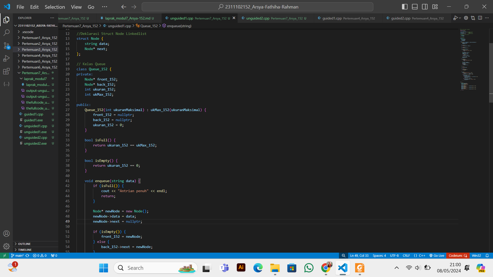

# <h1 align="center">Laporan Praktikum Modul 8 - Queue </h1>
<p align="center">Arsya Fathiha Rahman - 2311102152</p>

## Dasar Teori
Penjelasan Queue<br/>
  Queue atau antrian adalah sekumpulan data yang mana  penambahan elemen hanya bisa dilakukan pada suatu ujung disebut dengan sisi belakang (rear), dan penghapusan (pengambilan elemen) dilakukan lewat ujung lain (disebut dengan sisi depan atau front). Pada Stack atau tumpukan menggunakan prinsip “Masuk terakhir keluar pertama”atau LIFO (Last In First Out), Maka pada Queue atau antrian prinsip yang digunakan adalah “Masuk Pertama Keluar Pertama” atau FIFO (First In First Out). Queue atau antrian banyak kita jumpai dalam kehidupan sehari-hari, ex: antrian Mobil diloket Tol, Antrian mahasiswa Mendaftar, dll. Contoh lain dalam bidang komputer adalah pemakaian sistem komputer berbagi waktu(time-sharing computer system) dimana ada sejumlah pemakai yang akan menggunakan sistem tersebut secara serempak. Pada Queue atau antrian Terdapat satu buah pintu masuk di suatu ujung dan satu buah pintu keluar di ujung satunya dimana membutuhkan variabel Head dan Tail (depan/front, belakang/rear). Sebagai gambaran, cara kerja queue dapat disamakan pada sebuah antrean di suatu loket dimana berlaku prinsip ‘Siapa yang duluan antre dia yang akan pertama kali dilayani‘, sehingga dapat dikatakan prinsip kerja queue sama dengan prinsip sebuah antrean.
 <br/>
  
  Operasi-operasi Queue : <br/>
  1. Create() Untuk menciptakan dan menginisialisasi Queue <br/>
  2. IsEmpty() Untuk memeriksa apakah Antrian masih kosong<br/>
  3. IsFull() Untuk mengecek apakah Antrian sudah penuh atau belum <br/>
  4. Enqueue () Untuk menambahkan elemen ke dalam Antrian, penambahan elemen selalu ditambahkan di elemen paling belakang<br/> 
  5. Dequeue() Digunakan untuk menghapus elemen terdepan/pertama (head) dari Antrian <br/>
  6. Clear() Untuk menghapus elemen-elemen Antrian dengan cara membuat Tail dan Head = -1 <br/>

 <br/> Karakteristik penting antrian sebagai berikut:<br/>

1. Elemen antrian yaitu item-item data yang terdapat di elemen antrian.<br/>
2. Head/Front (elemen terdepan dari antrian). Head (Front) menunjuk ke awal antrian Q (elemen terdepan), sedangkan tail (rear)menunjuk akhir antrian Q (elemen paling belakang). Disiplin FIFO pada Queue berimplikasi jika elemen A, B, C, D, E dimasukkan ke Queue, maka penghapusan/ pengambilan elemen akan terjadi dengan urutan A, B, C, D, E.<br/>
3. Tail/Tear (elemen terakhir dari antrian).<br/>
4. Jumlah elemen pada antrian (count).<br/>


## Guided1

### 1. [Program Queue Teller ]

```C++
#include <iostream>
using namespace std;

const int maksimalQueue = 5; // Maksimal antrian
int front = 0;               // Penanda antrian
int back = 0;                // Penanda
string queueTeller[5];       // Fungsi pengecekan
bool isFull()
{ // Pengecekan antrian penuh atau tidak
    if (back == maksimalQueue)
    {
        return true; // =1
    }
    else
    {
        return false;
    }
}
bool isEmpty()
{ // Antriannya kosong atau tidak
    if (back == 0)
    {
        return true;
    }
    else
    {
        return false;
    }
}
void enqueueAntrian(string data)
{ // Fungsi menambahkan antrian
    if (isFull())
    {
        cout << "Antrian penuh" << endl;
    }
    else
    {
        if (isEmpty())
        { // Kondisi ketika queue kosong

            queueTeller[0] = data;
            front++;
            back++;
        }
        else
        { // Antrianya ada isi
            queueTeller[back] = data;
            back++;
        }
    }
}
void dequeueAntrian()
{ // Fungsi mengurangi antrian
    if (isEmpty())
    {
        cout << "Antrian kosong" << endl;
    }
    else
    {
        for (int i = 0; i < back; i++)
        {
            queueTeller[i] = queueTeller[i + 1];
        }
        back--;
    }
}
int countQueue()
{ // Fungsi menghitung banyak antrian
    return back;
}
void clearQueue()
{ // Fungsi menghapus semua antrian
    if (isEmpty())
    {
        cout << "Antrian kosong" << endl;
    }
    else
    {
        for (int i = 0; i < back; i++)
        {
            queueTeller[i] = "";
        }
        back = 0;
        front = 0;
    }
}
void viewQueue()
{ // Fungsi melihat antrian
    cout << "Data antrian teller:" << endl;
    for (int i = 0; i < maksimalQueue; i++)
    {
        if (queueTeller[i] != "")
        {
            cout << i + 1 << ". " << queueTeller[i] << endl;
        }
        else
        {
            cout << i + 1 << ". (kosong)" << endl;
        }
    }
}
int main()
{
    enqueueAntrian("Andi");
    enqueueAntrian("Maya");
    viewQueue();
    cout << "Jumlah antrian = " << countQueue() << endl;
    dequeueAntrian();
    viewQueue();
    cout << "Jumlah antrian = " << countQueue() << endl;
    clearQueue();
    viewQueue();
    cout << "Jumlah antrian = " << countQueue() << endl;
    return 0;
}

```
Penjelasan Guided1 <br/>
<br/>Program di atas adalah implementasi dari Queue/Antrian. Antrian disimpan dalam larik (array) dengan ukuran maksimum yang ditentukan. Fungsi-fungsi yang disediakan meliputi pengecekan apakah antrian penuh atau kosong, penambahan antrian (enqueue), pengurangan antrian (dequeue), penghitungan jumlah antrian, penghapusan semua antrian, dan penampilan (view) seluruh antrian beserta statusnya. Program ini memanfaatkan penanda front dan back untuk mengatur penambahan dan pengurangan antrian. Antrian disimpan dalam bentuk array queueTeller dengan ukuran maksimum yang telah ditentukan (maksimalQueue).  <br/>
 <br/>Dengan beberapa fungsi yang digunakan dalam program ini: <br/>

1. isFull(): Fungsi ini digunakan untuk memeriksa apakah antrian sudah penuh. Antrian dikatakan penuh jika variabel back sudah sama dengan maksimalQueue. <br/>
2. isEmpty(): Fungsi ini memeriksa apakah antrian kosong. Antrian dikatakan kosong jika variabel back bernilai 0. <br/>
3. enqueueAntrian(string data): Fungsi ini digunakan untuk menambahkan data ke dalam antrian. Jika antrian belum penuh, data akan ditambahkan ke posisi back dalam array queueTeller, lalu nilai back akan ditingkatkan. <br/>
4. dequeueAntrian(): Fungsi ini menghapus elemen pertama dari antrian. Data di dalam antrian akan digeser ke depan untuk mengisi posisi yang kosong setelah penghapusan elemen pertama. <br/>
5. countQueue(): Fungsi ini mengembalikan jumlah elemen yang ada dalam antrian, yang merupakan nilai dari variabel back. <br/>
6. clearQueue(): Fungsi ini menghapus semua elemen dari antrian dengan mengatur ulang nilai back dan front menjadi 0, serta mengosongkan semua elemen dalam array queueTeller. <br/>
7. viewQueue(): Fungsi ini menampilkan data dalam antrian beserta statusnya (kosong atau tidak) dengan nomor urut <br/>


## Unguided1

 <br/>1. Ubahlah penerapan konsep queue pada bagian guided dari array menjadi linked list <br/>

```C++ 
/*
by Arsya Fathiha Rahman - 2311102152
*/
#include <iostream>
using namespace std;

const int maksimalQueue = 5; // Maksimal antrian
int front = 0;               // Penanda antrian
int back = 0;                // Penanda
string queueTeller[5];       // Fungsi pengecekan

//Deklarasi Struct Node Linkedlist
struct Node {
    string data;
    Node* next;
};

// Kelas Queue 
class Queue_152 {
private:
    Node* front_152;
    Node* back_152;
    int ukuran_152;
    int ukMax_152;

public:
    Queue_152(int ukuranMaksimal) : ukMax_152(ukuranMaksimal) {
        front_152 = nullptr;
        back_152 = nullptr;
        ukuran_152 = 0;
    }

    bool isFull() {
        return ukuran_152 == ukMax_152;
    }

    bool isEmpty() {
        return ukuran_152 == 0;
    }

    void enqueue(string data) {
        if (isFull()) {
            cout << "Antrian penuh" << endl;
            return;
        }

        Node* newNode = new Node();
        newNode->data = data;
        newNode->next = nullptr;

        if (isEmpty()) {
            front_152 = newNode;
        } else {
            back_152->next = newNode;
        }
        back_152 = newNode;
        ukuran_152++;
    }

    void dequeue() {
        if (isEmpty()) {
            cout << "Antrian kosong" << endl;
            return;
        }

        Node* temp = front_152;
        front_152 = front_152->next;
        delete temp;
        ukuran_152--;
        if (isEmpty()) {
            back_152 = nullptr;
        }
    }

    int count() {
        return ukuran_152;
    }

    void clear() {
        while (!isEmpty()) {
            dequeue();
        }
    }

    void view() {
        cout << "Data antrian teller:" << endl;
        if (isEmpty()) {
            for (int i = 1; i <= ukMax_152; ++i)
                cout << i << ". (kosong)" << endl;
        } else {
            Node* current = front_152;
            int posisi_152 = 1;
            while (current != nullptr) {
                cout << posisi_152 << ". " << current->data << endl;
                current = current->next;
                posisi_152++;
            }
            while (posisi_152 <= ukMax_152) {
                cout << posisi_152 << ". (kosong)" << endl;
                posisi_152++;
            }
        }
    }
}; 

int main() {
    Queue_152 queue_152(5);
    queue_152.enqueue("Andi");
    queue_152.enqueue("Maya");

    queue_152.view();
    cout << "Jumlah antrian = " << queue_152.count() << endl;
    queue_152.dequeue();
    queue_152.view();
    cout << "Jumlah antrian = " << queue_152.count() << endl;
    queue_152.clear();
    queue_152.view();
    cout << "Jumlah antrian = " << queue_152.count() << endl;

    return 0;
}

```

#### Output Unguided1


Penjelasan Program Unguided1 <br/>
Program yang telah saya buat pada Unguided1 adalah program struktur data antrian (queue) yaitu antrian teller menggunakan linked list dalam bahasa C++.<br/>
dideklarasikan kelas Queue_152 yang merupakan implementasi dari struktur data antrian. <br/>
<br/>Kelas ini berisi:<br/>
front_152: pointer ke node pertama dalam antrian.<br/>
back_152: pointer ke node terakhir dalam antrian.<br/>
ukuran_152: menyimpan jumlah elemen dalam antrian.<br/>
ukMax_152: menyimpan ukuran maksimal antrian yang telah ditentukan.<br/>

Terdapat fungsi-fungsi dalam kelas Queue_152 antara lain:<br/>
isFull(): memeriksa apakah antrian sudah penuh.<br/>
isEmpty(): memeriksa apakah antrian kosong.<br/>
enqueue(string data): menambahkan elemen baru ke dalam antrian.<br/>
dequeue(): menghapus elemen pertama dari antrian.<br/>
count(): mengembalikan jumlah elemen dalam antrian.<br/>
clear(): menghapus semua elemen dari antrian.<br/>
view(): menampilkan isi dari antrian.<br/>

<br/>Sehingga untuk data nama dari "Andi" dan "Maya" dimasukkan ke dalam antrian menggunakan fungsi enqueue(), kemudian isi antrian ditampilkan menggunakan fungsi view(). Setelah itu, dilakukan operasi dequeue() untuk menghapus elemen pertama dari antrian, dan kembali menampilkan isi antrian. Terakhir, dilakukan operasi clear() untuk menghapus semua elemen dari antrian, dan lagi-lagi menampilkan isi antrian. Setiap kali menampilkan isi antrian, jumlah elemen dalam antrian juga ditampilkan menggunakan fungsi count().<br/>

#### Full code Screenshot Unguided 1:


## Unguided2
<br/> 2. Dari nomor 1 buatlah konsep antri dengan atribut Nama mahasiswa dan NIM Mahasiswa<br/>

```C++ 
/*
by Arsya Fathiha Rahman - 2311102152
*/
#include <iostream>
using namespace std;

// Deklarasi Struct Node
struct Node {
    string nama_152;
    int nim_152;
    Node* next;
};

// Kelas Queue untuk Mahasiswa
class QueueMahasiswa {
private:
    Node* front;
    Node* back;
    int ukuran_152;
    int ukMax_152;

public:
    QueueMahasiswa(int maxSize) : ukMax_152(maxSize) {
        front = nullptr;
        back = nullptr;
        ukuran_152 = 0;
    }

    bool isFull() {
        return ukuran_152 == ukMax_152;
    }

    bool isEmpty() {
        return ukuran_152 == 0;
    }

    void enqueue(string nama, int nim) {
        if (isFull()) {
            cout << "Antrian penuh" << endl;
            return;
        }

        Node* newNode = new Node();
        newNode->nama_152 = nama;
        newNode->nim_152 = nim;
        newNode->next = nullptr;

        if (isEmpty()) {
            front = newNode;
        } else {
            back->next = newNode;
        }
        back = newNode;
        ukuran_152++;
    }

    void dequeue() {
        if (isEmpty()) {
            cout << "Antrian kosong" << endl;
            return;
        }

        Node* temp = front;
        front = front->next;
        delete temp;
        ukuran_152--;
        if (isEmpty()) {
            back = nullptr;
        }
    }

    int count() {
        return ukuran_152;
    }

    void clear() {
        while (!isEmpty()) {
            dequeue();
        }
    }

    void view() {
        if (isEmpty()) {
            cout << "Data antrian MAHASISWA:" << endl;
            for (int i = 1; i <= ukMax_152; ++i)
                cout << i << ". (kosong)" << endl;
        } else {
            Node* current = front;
            cout << "Data antrian MAHASISWA:" << endl;
            int posisi_152 = 1;
            while (current != nullptr) {
                cout << posisi_152 << ". Nama: " << current->nama_152 << ", NIM: " << current->nim_152 << endl;
                current = current->next;
                posisi_152++;
            }
            // Mengisi posisi yang kosong dengan "(kosong)"
            while (posisi_152 <= ukMax_152) {
                cout << posisi_152 << ". (kosong)" << endl;
                posisi_152++;
            }
        }
    }
};

int main() {
    QueueMahasiswa queue_152(5);
    queue_152.enqueue("Andi", 231100777);
    queue_152.enqueue("Maya", 231118067);

    queue_152.view();
    cout << "Jumlah antrian = " << queue_152.count() << endl;
    queue_152.dequeue();
    queue_152.view();
    cout << "Jumlah antrian = " << queue_152.count() << endl;
    queue_152.clear();
    queue_152.view();
    cout << "Jumlah antrian = " << queue_152.count() << endl;

    return 0;
}

```

#### Output Unguided2


Penjelasan Program Unguided2 <br/>
Program yang telah saya buat pada Unguided2 adalah program struktur data antrian (queue) menggunakan linked list untuk menyimpan data mahasiswa. <br/> Didalam program terdapat Node Struct yakni bagian dari linkedList ini adalah struktur data yang digunakan untuk merepresentasikan setiap elemen dalam antrian. Node disini memiliki dua data: nama (nama_152) dan NIM (nim_152), serta pointer (next) yang menunjuk ke node berikutnya dalam antrian.<br/>  
Setiap antrian diprogram ini memiliki pointer ke node depan (front) dan node belakang (back), serta variabel untuk menyimpan ukuran antrian (ukuran_152) dan ukuran maksimum (ukMax_152).<br/>
Constructor: Menerima ukuran maksimum antrian dan menginisialisasi front, back, dan ukuran antrian.<br/>
isFull(): Memeriksa apakah antrian penuh.<br/>
isEmpty(): Memeriksa apakah antrian kosong.<br/>
enqueue(): Menambahkan elemen baru ke belakang antrian jika antrian belum penuh.<br/>
dequeue(): Menghapus elemen dari depan antrian jika antrian tidak kosong.<br/>
count(): Mengembalikan jumlah elemen dalam antrian.<br/>
clear(): Menghapus semua elemen dari antrian.<br/>
view(): Menampilkan seluruh elemen dalam antrian beserta nama dan NIM mahasiswa. Jika ada posisi yang kosong dalam antrian, ditampilkan "(kosong)".<br/>
Pada Main Function disini membuat objek QueueMahasiswa dengan ukuran maksimum 5. Melakukan operasi enqueue untuk menambahkan dua mahasiswa ke dalam antrian. Menampilkan isi antrian, jumlah antrian, melakukan dequeue, menampilkan isi antrian kembali, melakukan clear, dan menampilkan jumlah antrian lagi.<br/>

#### Full code Screenshot Unguided 2:


## Kesimpulan
Keseluruhan konsep materi Queue beserta guided dan unguided yang telah dibuat dari modul 7 baik guided dan unguidednya merupakan implementasi dari struktur data Queue, Kita melihat implementasi Queue pada Program Guided1 yakni implementasi sederhana dari struktur data antrian (queue) menggunakan array dalam bahasa C++. Pada Unguided1, program telah diubah dari implementasi queue menggunakan array menjadi implementasi menggunakan linked list. Hal ini memungkinkan untuk penambahan dan penghapusan elemen dari antrian dengan lebih efisien, karena tidak perlu menggeser elemen-elemen lain saat operasi enqueue atau dequeue dilakukan. Selain itu, program juga lebih fleksibel dalam menangani ukuran antrian yang berubah-ubah. <br/>

Unguided2 melanjutkan dengan konsep antrian yang diterapkan pada program menggunakan linked list, namun kali ini dengan tambahan atribut nama dan NIM mahasiswa. Dengan demikian, program mampu menyimpan data mahasiswa dalam antrian dengan lebih terstruktur dan informatif. <br/>

Dalam ketiga program ini, penggunaan Queue dengan linked list maupun array memungkinkan untuk pengelolaan antrian yang lebih dinamis dan efisien, terutama dalam hal penambahan dan penghapusan elemen. Selain itu, penggunaan struktur data yang sesuai dengan kebutuhan (seperti menyimpan nama dan NIM dalam antrian mahasiswa) meningkatkan kegunaan program dan memberikan informasi yang lebih lengkap kepada pengguna. <br/>

## Referensi
[1] Bonar Panjaitan, Budi Sudjatm. Pemprograman C++ Untuk Universitas: 2019 <br/>
[2] Anita, Sindar. STRUKTUR DATA DAN ALGORITMA DENGAN C++ : 2019 <br/>


