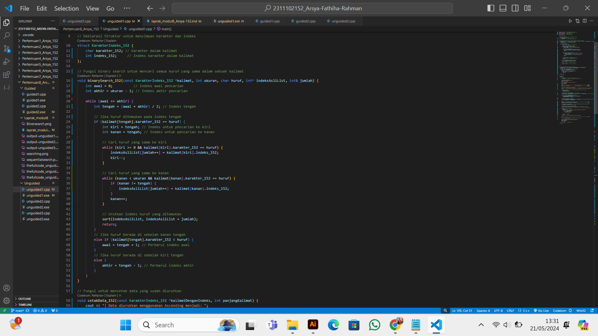
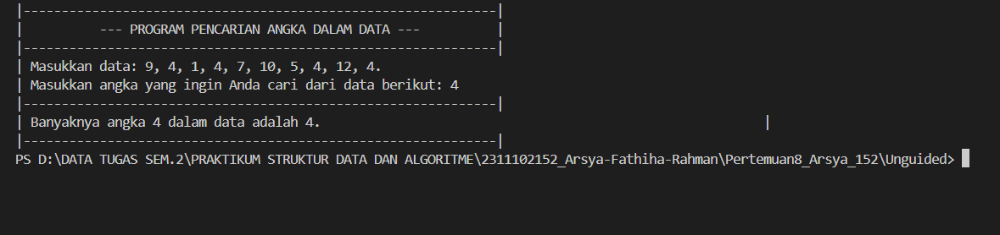

# <h1 align="center">Laporan Praktikum Modul 8 - Searching </h1>
<p align="center">Arsya Fathiha Rahman - 2311102152</p>

## Dasar Teori
Penjelasan Searching<br/>
Algoritma pencarian `(searching algorithm)` adalah algoritma yang menerima sebuah argumen kunci dan dengan langkah-langkah tertentu akan mencari rekaman dengan kunci tersebut. Setelah proses pencarian dilaksanakan, akan diperoleh salah satu dari dua kemungkinan, yaitu data yang dicari ditemukan (successful) atau tidak ditemukan (unsuccessful).<br/>
<br/>
`Algoritma Searching` yakni tahapan sistematis yang digunakan pada program untuk menelusuri suatu data yang dicari. Algoritma ini akan menerima sebuah argumen atau kata kunci yang akan dicari. Kemudian algoritma akan menjalankan langkah langkah tertentu untuk mendapatkan hasil berdasarkan kata kunci. Setelah proses pencarian selesai, maka akan diperoleh hasil dari salah satu dua kemungkinan, yaitu data yang dicari berdasarkan kata kunci telah ditemukan atau data tidak dapat ditemukan. <br/>

 Terdapat 2 metode searching dalam c++, yaitu `sequential search` dan `binary search`, Dengan penjelasan sebagai berikut:<br/>

1. `Sequential Search` : <br/>
 Mencari data secara urut dari data pertama sampai data terakhir.<br/>
 Jadi Metode ini Metode ini memiliki tujuan yang sama pada umumnya yaitu, menemukan data pada `array`. Hanya saja, `sequential search` ini sangat mudah implementasinya dalam pemrograman di banding `binary search`.<br/>
Dibawah ini beberapa proses cara kerja metode `sequential search`:<br/>
- Menentukan data yang akan dicari terlebih dahulu.<br/>
- Mencari data yang dicari pada array satu persatu dengan cara sekuensial.<br/>
- Dari data pertama hingga data terakhir yang terdapat pada array dibandingkan dengan data yang dicari.<br/>
- Apabila data ditemukan maka akan muncul statement sukses ditemukan.<br/>
- Apabila data tidak ditemukan maka juga akan muncul statement data tidak ditemukan.<br/>

2. `Binary Search` : <br/>
`Binary Search` merupakan sebuah teknik pencarian data dengancara berulang kali membagi separuh dari jumlah data yang dicari sampai sehingga memperkecil lokasi pencarian menjadi `satu data`.  Algotihma ini biasanya banyak digunakan untuk mencari di program dengan jumlah data yang banyak, dimana kompleksitas dari algorithma ini adalah Ο(log n) di mana n adalah jumlah item. Pada saat menggunakan binary search, data yang berada di dalam `array` harus diurutkan terlebih dahulu.mencari data pada posisi ekstrem (awal, akhir dan tengah deretan). Syaratnya : data harus sudah dalam keadaan terurut.<br/>
Proses `searching` akan dihentikan jika terpenuhi 2 (dua) kondisi:<br/>
Jika data yang dicari sudah ditemukan.<br/>
Jika sudah tidak ada lagi data yang harus diperiksa.<br/>
<br/>

Gambaran contoh cara kerja `Sequential Search`:<br/>
<br/>
Pada ilustrasi di atas terdapat sebuah array yang menampung 8 elemen. Nilai yang ingin kita cari adalah angka 7, oleh karena itu kita tambahkan angka 7 kebagian akhir array. Karena pada elemen terakhir terdapat nilai yaitu 2, maka kita simpan nilai tersebut ke variabel sementara yang dinamakan simpan.<br/>

Konsep Sequential Search Search:<br/>
* Nilai yang dicari ditambahkan ke array pada indeks terakhir sebagai elemen Sentinel<br/>
* Membandingkan setiap elemen pada array satu per satu secara berurut<br/>
* Proses pencarian dimulai dari indeks pertama hingga indeks elemen Sentinel<br/>
* Apabila nilai yang dicari ditemukan sebelum indeks elemen sentinel, maka nilai tersebut ADA dan berhasil ditemukan.<br/>
* Namun apabila nilai ditemukan pada indeks elemen sentinel terdapat 2 kemungkinan. Pertama nilai yang ditemukan adalah elemen sentinel (fiktif hanya tambahan) atau singkatnya nilai tidak ditemukan. Kedua yaitu elemen yang dicari memang bernar berada pada indeks terakhir.<br/>

Gambaran contoh cara kerja Binary Search:<br/>
Langkah kerja binary search yakni mengurutkan elemen array terlebih dahulu jika tidak dalam urutan yang terurut, karena pencarian biner hanya diterapkan pada elemen yang diurutkan. Seperti pada contoh gambar berikut:<br/>
<br/>
1. Pertama temukan elemen tengah array.<br/>
2. Bandingkan elemen tengah dengan itemnya. Setelah langkah ini ada tiga kasus<br/>
3. Jika elemen tengah adalah item yang diinginkan maka pencarian berhasil<br/>
4. Jika elemen tengah kurang dari item yang diinginkan, maka carilah paruh pertama array saja.<br/>
5. Jika elemen tengah lebih besar dari item yang diinginkan, cari di paruh kedua array.<br/>
6. Ulangi langkah yang sama sampai elemen ditemukan.<br/>

  
## Guided1

### 1. [Program Sequential Search Sederhana ]

```C++
#include <iostream>
using namespace std;
int main()
{
    int n = 10; // Mendefinisikan jumlah elemen dalam array
    int data[n] = {9, 4, 1, 7, 5, 12, 4, 13, 4, 10};// Mendefinisikan array dengan 10 elemen
    int cari = 10; // Nilai yang ingin dicari dalam array
    bool ketemu = false;// Variabel untuk menandakan apakah nilai ditemukan
    int i; // Variabel untuk iterasi

    // Algoritma Sequential Search
    for (i = 0; i < n; i++) // Looping melalui setiap elemen array
    {
        if (data[i] == cari) // Jika elemen saat ini sama dengan nilai yang dicari
        {
            ketemu = true; // Set ketemu menjadi true
            break;
        }
    }
    // Menampilkan pesan hasil pencarian

    cout << "\tProgram Sequential Search Sederhana\n"
         << endl;
    cout << "data: {9, 4, 1, 7, 5, 12, 4, 13, 4, 10}" << endl;
    if (ketemu)
    {
        cout << "\nAngka " << cari << " ditemukan pada indeks ke-"
             << i << endl;
    }
    else
    {
        cout << cari << " tidak dapat ditemukan pada data." << endl;
    }
    return 0; // Mengembalikan nilai 0 menandakan program selesai dengan sukses
}

```
Penjelasan Guided1 <br/>
<br/>Program di atas adalah implementasi dari algoritma pencarian sekuensial `(Sequential Search)` dalam bahasa pemrograman C++. Algoritma pencarian sekuensial ini sederhana, di mana kita memeriksa setiap elemen dalam array satu per satu, secara berurutan, untuk mencari nilai yang dicari.  Pertama, program mendeklarasikan variabel dan array yang diperlukan, seperti jumlah elemen dalam array, array itu sendiri, nilai yang akan dicari, dan variabel boolean untuk menandai apakah nilai tersebut ditemukan atau tidak. Kemudian, algoritma pencarian sekuensial diimplementasikan melalui perulangan for yang memeriksa setiap elemen dalam array. Jika nilai yang dicari ditemukan, variabel boolean diatur menjadi true, dan perulangan dihentikan dengan menggunakan break. Akhirnya, hasil pencarian ditampilkan melalui output ke layar. Program menampilkan pesan yang sesuai tergantung pada apakah nilai yang dicari ditemukan atau tidak. Terakhir, program mengembalikan nilai 0, menandakan bahwa program telah berjalan.<br/>
dimana didalam program itu berisi:<br/>
`n` adalah jumlah elemen dalam array data.<br/>
`data` adalah array yang berisi 10 elemen dengan nilai yang ditentukan.<br/>
`cari` adalah nilai yang akan dicari dalam array data.<br/>
`ketemu` adalah variabel boolean yang akan menjadi true jika nilai cari ditemukan dalam array data.<br/>
`i` adalah variabel yang akan digunakan sebagai penghitung dalam perulangan.<br/>

Dengan penjelasan lengkap program sebagai berikut:<br/>

- int n = 10;: Mendeklarasikan variabel n yang menyimpan jumlah elemen dalam array data.<br/>
- int data[n] = {9, 4, 1, 7, 5, 12, 4, 13, 4, 10};: Mendeklarasikan dan menginisialisasi array data dengan 10 elemen.<br/>
- int cari = 10;: Mendeklarasikan variabel cari yang menyimpan nilai yang akan dicari dalam array.<br/>
- bool ketemu = false;: Mendeklarasikan variabel ketemu sebagai boolean untuk menandai apakah nilai yang dicari ditemukan.<br/>
- int i;: Mendeklarasikan variabel i untuk digunakan dalam loop.<br/>

Algoritma Sequential Search<br/>
- for (i = 0; i < n; i++): Loop yang akan berjalan dari i = 0 hingga i < n (dalam hal ini, 0 sampai 9).<br/>
- if (data[i] == cari): Memeriksa apakah elemen array data pada indeks i sama dengan nilai cari.<br/>
- ketemu = true;: Jika elemen yang dicari ditemukan, variabel ketemu di-set menjadi true.<br/>

Output Hasil Pencarian<br/>
- cout << "\tProgram Sequential Search Sederhana\n" << endl;: Mencetak judul program.<br/>
- cout << "data: {9, 4, 1, 7, 5, 12, 4, 13, 4, 10}" << endl;: Mencetak data array.<br/>
- if (ketemu): Memeriksa apakah nilai cari ditemukan.<br/>
- cout << "\nAngka " << cari << " ditemukan pada indeks ke-" << i << endl;: Jika ditemukan, mencetak indeks di mana nilai cari ditemukan.<br/>
- else: Jika tidak ditemukan.<br/>
- cout << cari << " tidak dapat ditemukan pada data." << endl;: Mencetak bahwa nilai cari tidak ditemukan dalam array.<br/>


Kesimpulannya Program ini menggunakan algoritma pencarian berurutan untuk mencari elemen tertentu dalam array. Ini adalah metode sederhana yang memeriksa setiap elemen dalam array satu per satu sampai elemen yang dicari ditemukan atau seluruh array telah diperiksa.<br/>

## Guided2

### 1. [Program Binary Search Sederhana ]

```C++
#include <iostream>
#include <conio.h>
#include <iomanip>
using namespace std;

int dataArray[7] = {1, 8, 2, 5, 4, 9, 7}; // Array data awal yang akan diurutkan dan dicari
int cari; // Variabel untuk menyimpan nilai yang akan dicari

// Fungsi untuk mengurutkan array dengan algoritma selection sort
void selection_sort() {
    int temp, min, i, j;
    for (i = 0; i < 7; i++) { // Loop untuk setiap elemen dalam array
        min = i; // Anggap elemen pertama sebagai yang terkecil
        for (j = i + 1; j < 7; j++) { // Loop untuk menemukan elemen terkecil di sisa array
            if (dataArray[j] < dataArray[min]) {
                min = j; // Jika ditemukan elemen yang lebih kecil, update indeks min
            }
        }
        // Tukar elemen terkecil yang ditemukan dengan elemen pada indeks i
        temp = dataArray[i];
        dataArray[i] = dataArray[min];
        dataArray[min] = temp;
    }
}

// Fungsi untuk mencari nilai dalam array dengan algoritma binary search
void binarysearch() {
    int awal, akhir, tengah;
    bool b_flag = false;
    awal = 0; // Indeks awal array
    akhir = 6; // Indeks akhir array (karena ada 7 elemen, indeks terakhir adalah 6)
    while (!b_flag && awal <= akhir) {
        tengah = (awal + akhir) / 2; // Hitung indeks tengah
        if (dataArray[tengah] == cari) { // Jika elemen tengah adalah elemen yang dicari
            b_flag = true;
        } else if (dataArray[tengah] < cari) { // Jika elemen tengah lebih kecil dari elemen yang dicari
            awal = tengah + 1; // Pindahkan awal ke kanan tengah
        } else { // Jika elemen tengah lebih besar dari elemen yang dicari
            akhir = tengah - 1; // Pindahkan akhir ke kiri tengah
        }
    }
    if (b_flag) {
        cout << "\nData ditemukan pada index ke- " << tengah << endl; // Jika ditemukan, cetak indeks
    } else {
        cout << "\nData tidak ditemukan\n"; // Jika tidak ditemukan, cetak pesan tidak ditemukan
    }
}

int main() {
    cout << "\tBINARY SEARCH" << endl;
    cout << "\nData: ";
    // Tampilkan data awal
    for (int x = 0; x < 7; x++) {
        cout << setw(3) << dataArray[x];
    }
    cout << endl;
    cout << "\nMasukkan data yang ingin Anda cari: ";
    cin >> cari; // Ambil input dari pengguna untuk nilai yang dicari
    cout << "\nData diurutkan: ";
    // Urutkan data dengan selection sort
    selection_sort();
    // Tampilkan data setelah diurutkan
    for (int x = 0; x < 7; x++) {
        cout << setw(3) << dataArray[x];
    }
    cout << endl;
    // Lakukan pencarian biner pada data yang sudah diurutkan
    binarysearch();
    _getche(); // Tunggu pengguna menekan tombol sebelum program selesai
    return 0;
}

```
Penjelasan Guided2 <br/>
<br/> Program guided2 adalah implementasi dari algoritma pencarian Binary Search dalam bahasa C++ yakni Program mencari angka yang dimasukkan pengguna dalam angka array yang telah diurutkan. Pertama, program menggunakan fungsi selection_sort() untuk mengurutkan array dataArray secara ascending. Kemudian, pengguna diminta untuk memasukkan angka yang ingin dicari. Setelah pengguna memasukkan angka, program menggunakan algoritma Binary Search untuk mencari apakah angka tersebut ada dalam array yang telah diurutkan sebelumnya. Jika angka ditemukan, program akan mencetak indeks di mana angka tersebut ditemukan. Jika tidak ditemukan, program akan mencetak pesan bahwa angka tidak ditemukan. Program ini kemudian menunggu masukan dari pengguna sebelum menutup.<br/>
dimana didalam program itu berisi: <br/>
`dataArray`: Array yang berisi data yang akan dicari.<br/>
`cari`: Variabel untuk menyimpan angka yang akan dicari dalam array.<br/>
- Fungsi `binarysearch()` digunakan untuk melakukan pencarian Binary Search pada array yang telah diurutkan.<br/>
- Fungsi `_getche()` yang membaca satu karakter dari konsol tanpa menunggu penekanan tombol "Enter".

Dimana hasil Input datanya yakni:<br/>
1. Mengurutkan data menggunakan Selection Sort.<br/>
2. Melakukan pencarian menggunakan Binary Search.<br/>
3. Menampilkan hasil pencarian.<br/>
4. Output Hasil dan Program Selesai<br/>

Dengan penjelasan lengkap program sebagai berikut:<br/>

* Deklarasi Variabel Global
- int dataArray[7] = {1, 8, 2, 5, 4, 9, 7};: Mendeklarasikan dan menginisialisasi array dataArray dengan 7 elemen.<br/>
- int cari;: Variabel untuk menyimpan nilai yang akan dicari.<br/>

* Fungsi Selection Sort<br/>
- void selection_sort(): Mendefinisikan fungsi untuk mengurutkan array menggunakan algoritma selection sort.<br/>
- for (i = 0; i < 7; i++): Loop untuk setiap elemen dalam array.<br/>
- min = i;: Menganggap elemen pertama sebagai yang terkecil.<br/>
- for (j = i + 1; j < 7; j++): Loop untuk menemukan elemen terkecil di sisa array.<br/>
- if (dataArray[j] < dataArray[min]): Jika ditemukan elemen yang lebih kecil, update indeks min.<br/>
- temp = dataArray[i]; dataArray[i] = dataArray[min]; dataArray[min] = temp;: Tukar elemen terkecil yang ditemukan dengan elemen pada indeks i.<br/>

* Fungsi Binary Search<br/>
- void binarysearch(): Mendefinisikan fungsi untuk mencari nilai dalam array menggunakan algoritma binary search.<br/>
- awal = 0; akhir = 6;: Inisialisasi indeks awal dan akhir.<br/>
- while (!b_flag && awal <= akhir): Loop untuk mencari nilai selama nilai belum ditemukan dan indeks awal tidak melebihi indeks akhir.<br/>
- tengah = (awal + akhir) / 2;: Hitung indeks tengah.<br/>
- if (dataArray[tengah] == cari): Jika elemen tengah adalah elemen yang dicari, set b_flag menjadi true.<br/>
- else if (dataArray[tengah] < cari): Jika elemen tengah lebih kecil dari elemen yang dicari, pindahkan awal ke kanan tengah.<br/>
- else: Jika elemen tengah lebih besar dari elemen yang dicari, pindahkan akhir ke kiri tengah.<br/>
- if (b_flag): Jika nilai ditemukan, cetak indeks.<br/>
- else: Jika nilai tidak ditemukan, cetak pesan tidak ditemukan.<br/>

* Fungsi main()<br/>

- selection_sort();: Panggil fungsi untuk mengurutkan array.<br/>
- for (int x = 0; x < 7; x++) { cout << setw(3) << dataArray[x]; }: Loop untuk mencetak setiap elemen dalam array setelah diurutkan. <br/>
- binarysearch();: Panggil fungsi untuk melakukan pencarian biner. <br/>
- _getche();: Tunggu pengguna menekan tombol sebelum program selesai. <br/>
- return 0;: Mengakhiri program dengan status sukses. <br/>

* Alur Program: <br/>
1. Program dimulai dan mencetak judul "BINARY SEARCH".<br/>
2. Data awal ditampilkan.<br/>
3. Pengguna memasukkan nilai yang ingin dicari.<br/>
4. Program mengurutkan data menggunakan selection sort.<br/>
5. Data yang sudah diurutkan ditampilkan.<br/>
6. Program melakukan pencarian biner untuk menemukan nilai yang dimasukkan pengguna.<br/>
7. Hasil pencarian ditampilkan.<br/>
8. Program menunggu pengguna menekan tombol sebelum selesai.<br/>

## Unguided1

 <br/>1. Buatlah sebuah program untuk mencari sebuah huruf pada sebuah kalimat yang sudah di input dengan menggunakan Binary Search! <br/>

```C++ 
/*
by Arsya Fathiha Rahman - 2311102152
*/
#include <iostream>
#include <string>
#include <algorithm> // Untuk sort
#include <iomanip>   // Untuk setw
#include <conio.h>   // Untuk _getche

using namespace std;

// Deklarasi Struktur untuk menyimpan karakter dan indeks 
struct KarakterIndeks_152 {
    char karakter_152;
    int indeks_152;
};

// Fungsi binary search untuk mencari sebuah huruf dalam sebuah kalimat
bool binarySearch(const KarakterIndeks_152 *kalimat, int ukuran, char huruf, int &indeksAsli) {
    // Inisialisasi indeks awal dan akhir pencarian
    int awal = 0;
    int akhir = ukuran - 1;

    // Perulangan terus berjalan selama program pencarian masih valid
    while (awal <= akhir) {
        // Hitung indeks tengah interval saat ini
        int tengah = (awal + akhir) / 2;

        // Jika elemen tengah adalah elemen yang dicari, kembalikan true
        if (kalimat[tengah].karakter_152 == huruf) {
            indeksAsli = kalimat[tengah].indeks_152;
            return true;

        // Jika elemen tengah kurang dari elemen yang dicari
        } else if (kalimat[tengah].karakter_152 < huruf) {
            awal = tengah + 1;
        // Jika elemen tengah lebih besar dari elemen yang dicari
        } else {
            akhir = tengah - 1;
        }
    }
// Jika elemen tidak ditemukan dalam perulangan, kembalikan false
    return false;
}

int main() {
    // Loop untuk mengulangi pencarian huruf dalam kalimat
    char ulang;
    do {
        // Input kalimat dan huruf yang akan dicari
        string kalimat;
        char huruf;

        cout << "|--------------------------------------------------------------|" << endl;

    
        const int lebarKonsol = 62;
        string header = "--- PROGRAM PENCARIAN HURUF PADA KALIMAT ---";
        int paddingKiri = (lebarKonsol - header.length()) / 2;

        cout << setw(paddingKiri + header.length()) << header << endl;

        cout << "|--------------------------------------------------------------|" << endl;
        cout << "Masukkan sebuah kalimat: ";
        getline(cin, kalimat);

        cout << "Masukkan huruf yang ingin Anda cari: ";
        
        huruf = _getche(); // Menggunakan _getche untuk mendapatkan input tanpa menekan tombol enter
        cout << endl;


        // Ubah huruf menjadi huruf kecil jika huruf besar
        if (isupper(huruf)) {
            huruf = tolower(huruf);
        }

        // Buat array dinamis untuk pasangan karakter dan indeks aslinya
        int panjangKalimat = kalimat.length();
        KarakterIndeks_152 *kalimatDenganIndeks = new KarakterIndeks_152[panjangKalimat];

      // Mengubah setiap karakter dalam kalimat menjadi huruf kecil dan menyimpannya beserta indeksnya
        for (int i = 0; i < panjangKalimat; i++) {
            kalimatDenganIndeks[i].karakter_152 = tolower(kalimat[i]);
            kalimatDenganIndeks[i].indeks_152 = i;
        }
        // Urutkan array kalimatDenganIndeks berdasarkan karakter
        sort(kalimatDenganIndeks, kalimatDenganIndeks + panjangKalimat, [](const KarakterIndeks_152 &a, const KarakterIndeks_152 &b) {
            // Bandingkan dua karakter, mengembalikan true jika a kurang dari b
            return a.karakter_152 < b.karakter_152;
        });
        // Deklarasi variabel untuk menyimpan indeks asli dari karakter yang dicari
        int indeksAsli;
        // Cari huruf dalam kalimat menggunakan binary search
        bool ditemukan = binarySearch(kalimatDenganIndeks, panjangKalimat, huruf, indeksAsli);

        if (ditemukan) {
            cout << "Huruf (" << huruf << ") ditemukan dalam kalimat pada indeks ke-" << indeksAsli << "." << endl;
        } else {
            cout << "Huruf tidak ditemukan dalam kalimat." << endl;
        }

        delete[] kalimatDenganIndeks;
        cout << "|--------------------------------------------------------------|" << endl;


        // Untuk ngecek apakah user ingin mengulang
        cout << "Apakah Anda ingin mencari huruf lagi? (y/n): ";
        ulang = _getche();
        cout << endl;

    } while (ulang == 'y' || ulang == 'Y');

    return 0;
}
```

#### Output Unguided1


Penjelasan Program Unguided1 <br/>
Program yang telah saya buat pada Unguided1 adalah program pencari sebuah huruf pada sebuah kalimat yang sudah di input dengan menggunakan Binary Search.<br/>
Fungsi Utama Program pada Unguided1 yakni:<br/>
1. Input Kalimat dan Huruf: Pengguna diminta untuk memasukkan sebuah kalimat dan sebuah huruf yang ingin dicari dalam kalimat tersebut.
Pengubahan Huruf Besar ke Huruf Kecil: Program mengubah semua huruf dalam kalimat dan huruf yang dicari menjadi huruf kecil untuk memastikan pencarian tidak peka terhadap huruf besar dan kecil.<br/>
2. Penyimpanan Karakter dan Indeks Asli: Program menyimpan setiap karakter dari kalimat beserta indeks asli mereka dalam sebuah array dinamis dari struktur KarakterIndeks_152.<br/>
3. Pengurutan Karakter: Array yang berisi karakter dan indeks diurutkan berdasarkan karakter menggunakan fungsi sort.<br/>
4. Pencarian Huruf dengan Binary Search: Program menggunakan algoritma binary search untuk mencari huruf yang dimasukkan oleh pengguna dalam array yang telah diurutkan.<br/>
5. Menampilkan Hasil Pencarian: Jika huruf ditemukan, program menampilkan pesan yang menunjukkan posisi indeks asli dari huruf tersebut dalam kalimat. Jika tidak ditemukan, program menampilkan pesan bahwa huruf tidak ditemukan.<br/>
6. Pengulangan Pencarian: Pengguna diberi opsi untuk mengulangi proses pencarian dengan memasukkan 'y' atau 'Y'. Program akan terus mengulang pencarian sampai pengguna memutuskan untuk berhenti.<br/>

Alur Programnya yakni:<br/>
1. Membaca Input: Program meminta pengguna untuk memasukkan kalimat dan huruf yang ingin dicari.<br/>
2. Pencarian Huruf: Huruf yang dicari dan karakter dalam kalimat diubah menjadi huruf kecil.<br/>
3. Inisialisasi dan Pengurutan: Program menyimpan karakter dan indeks asli dalam array, kemudian mengurutkan array berdasarkan karakter.<br/>
4. Pencarian: Program mencari huruf menggunakan binary search dalam array yang sudah diurutkan.<br/>
5. Menampilkan Hasil: Program menampilkan hasil pencarian.<br/>
6. Pengulangan atau Selesai: Program bertanya kepada pengguna apakah ingin mengulangi proses pencarian. Jika ya, proses diulangi; jika tidak, program berhenti.<br/>

Pada Binary search terdapat beberapa function yakni:<br/>
- Fungsi binarySearch melakukan pencarian biner pada array yang berisi struktur KarakterIndeks_152. Fungsi ini menerima pointer ke array kalimat, ukuran array ukuran, karakter yang akan dicari huruf, dan referensi ke indeksAsli untuk menyimpan indeks asli dari karakter yang ditemukan. Fungsi ini mengembalikan true jika karakter ditemukan dan false jika tidak.<br/>
- awal diinisialisasi ke 0, yang merupakan indeks awal dari array.<br/>
- akhir diinisialisasi ke ukuran - 1, yang merupakan indeks akhir dari array.<br/>
- Perulangan while ini berjalan selama awal kurang dari atau sama dengan akhir. Ini memastikan bahwa masih ada elemen yang perlu diperiksa dalam array.<br/>
- tengah dihitung sebagai rata-rata dari awal dan akhir, yang memberikan indeks tengah dari interval saat ini dalam array.<br/>
- Fungsi _getche digunakan untuk mendapatkan input pengguna tanpa perlu menekan tombol enter.<br/>

Penjelasan Binary Search Function <br/>
bool binarySearch(const KarakterIndeks_152 *kalimat, int ukuran, char huruf, int &indeksAsli): Fungsi untuk mencari huruf dalam array yang sudah diurutkan menggunakan binary search.<br/>
- int awal = 0; int akhir = ukuran - 1;: Inisialisasi indeks awal dan akhir.<br/>
- while (awal <= akhir): Loop selama interval masih valid.<br/>
- int tengah = (awal + akhir) / 2;: Hitung indeks tengah.<br/>
- if (kalimat[tengah].karakter_152 == huruf): Jika huruf ditemukan, simpan indeks asli dan kembalikan true.<br/>
- else if (kalimat[tengah].karakter_152 < huruf): Jika huruf yang dicari lebih besar, ubah awal ke tengah + 1.<br/>
- else: Jika huruf yang dicari lebih kecil, ubah akhir ke tengah - 1.<br/>
- return false;: Jika huruf tidak ditemukan, kembalikan false.<br/>
Main Function<br/>
- int main(): Fungsi utama tempat eksekusi program dimulai.<br/>
- char ulang;: Variabel untuk menyimpan pilihan pengguna apakah akan mengulang program.<br/>
 -do { ... } while (ulang == 'y' || ulang == 'Y');: Loop untuk mengulangi proses pencarian huruf jika pengguna memilih 'y' atau 'Y'.<br/>

Berikut penjelasan contoh program yang telah saya jalankan yakni:<br/>
1. Masukkan sebuah Kalimat yang akan dicari: { 't', 'e', 'l', 'k', 'o', 'm'}.<br/>
2. Masukkan huruf yang akan dicari: (o).<br/>
3. akhir = 5 (karena panjang array adalah 6, indeks terakhir adalah 5, karena index dimulai dari 0)<br/>

- Perulangan Search Pertama:<br/>
1. Hitung tengah = 2.<br/>
2. andingkan kalimat[2] ('l') dengan 'o'.<br/>
3. Karena 'l' < 'o', ubah awal menjadi 3.<br/>

- Perulangan Search Kedua:<br/>
1. Hitung tengah = 4.<br/>
2. Bandingkan kalimat[4] ('o') dengan 'o'.<br/>
3. Karena 'o' == 'o', huruf ditemukan di indeks ke -4.<br/>


#### Full code Screenshot Unguided 1:


## Unguided2
<br/> 2. Buatlah sebuah program yang dapat menghitung banyaknya huruf vocal dalam sebuah kalimat!<br/>

```C++ 
/*
by Arsya Fathiha Rahman - 2311102152
*/
#include <iostream>
#include <string>
#include <iomanip> // Untuk setw

using namespace std;

// Sequential search untuk memeriksa apakah huruf adalah vokal
bool MenentukanVokal_152(char huruf_152) {
    return (huruf_152 == 'a' || huruf_152 == 'A' ||
            huruf_152 == 'i' || huruf_152 == 'I' ||
            huruf_152 == 'u' || huruf_152 == 'U' ||
            huruf_152 == 'e' || huruf_152 == 'E' ||
            huruf_152 == 'o' || huruf_152 == 'O');
}

// Fungsi untuk menghitung jumlah huruf vokal dalam sebuah kalimat
int hitungVokal_152(const string &kalimat) {
    // Inisialisasi jumlah huruf vokal
    int jumlahVokal = 0;

    // Sequential search: Loop untuk setiap karakter dalam kalimat
    for (int i = 0; i < kalimat.length(); i++) {
        char huruf = kalimat[i];
        
        // fungsi MenentukanVokal untuk memeriksa apakah karakter adalah huruf vokal
        if (MenentukanVokal_152(huruf)) {
            jumlahVokal++;
        }
    }

    return jumlahVokal;// Mengembalikan jumlah huruf vokal
}

int main() {
    char ulang; // Variabel untuk menyimpan pilihan pengguna apakah akan mengulang program
    do {
        // Input dari pengguna
        string kalimat;  // Variabel untuk menyimpan kalimat dari pengguna
        
        cout << "|--------------------------------------------------------------|" << endl;

        const int lebarKonsol = 62; 
        string header = "--- PROGRAM MENGHITUNG HURUF VOKAL DALAM KALIMAT ---";
        int paddingKiri = (lebarKonsol - header.length()) / 2;

        cout << setw(paddingKiri + header.length()) << header << endl;

        cout << "|--------------------------------------------------------------|" << endl;
        
        cout << "Masukkan sebuah kalimat: ";
        getline(cin, kalimat);// Mengambil input kalimat dari pengguna

        cout << "|--------------------------------------------------------------|" << endl;
        
        // Panggil fungsi dan cetak hasil
        int jumlah = hitungVokal_152(kalimat);
        cout << "Jumlah huruf vokal dalam kalimat adalah: " << jumlah << endl;

        cout << "|--------------------------------------------------------------|" << endl;

        // Untuk ngecek apakah user ingin mengulang
        cout << "Apakah Anda ingin menghitung huruf vokal lagi? (y/n): "; 
        cin >> ulang;
        cin.ignore(); // Mengabaikan karakter newline setelah input
        cout << endl;

    } while (ulang == 'y' || ulang == 'Y'); // Loop jika pengguna memilih 'y' atau 'Y'

    return 0;
}
```

#### Output Unguided2


Penjelasan Program Unguided2 <br/>
Program yang telah saya buat pada Unguided2 adalah program menghitung jumlah huruf vokal dalam sebuah kalimat yang diinput oleh pengguna menggunakan Sequential search.  Dalam program tersebut, dilakukan perulangan melalui setiap karakter dalam kalimat untuk memeriksa apakah karakter tersebut adalah huruf vokal atau tidak. Kemudian, hasil perhitungan jumlah huruf vokal ditampilkan kepada pengguna, dan mereka diberikan opsi untuk mengulangi proses dengan memasukkan kalimat baru atau tidak. Program menggunakan fungsi-fungsi terpisah untuk memeriksa huruf vokal dan menghitung jumlah huruf vokal dalam sebuah kalimat.<br/>

Dimana program ini menggunakan Sequential search yang digunakan untuk memeriksa apakah sebuah karakter adalah huruf vokal. Ini dilakukan dengan membandingkan karakter tersebut dengan setiap huruf vokal (baik huruf kecil maupun besar) menggunakan operator logika OR (||). Jika karakter sama dengan salah satu huruf vokal, maka fungsi ini mengembalikan true, jika tidak, mengembalikan false.<br/>
Dimana memanggil pustaka yang diimport:
- iostream: Digunakan untuk input dan output standar.<br/>
- string: Digunakan untuk manipulasi string.<br/>
- iomanip: Digunakan untuk memformat output (khususnya setw untuk pengaturan lebar output).<br/>

Beberapa operasi yang digunakan pada Sequential search pada program<br/>
- bool MenentukanVokal_152<br/>
Fungsi ini memeriksa apakah karakter yang diberikan adalah huruf vokal (baik huruf kecil maupun besar).
Mengembalikan true jika karakter tersebut adalah salah satu dari 'a', 'i', 'u', 'e', atau 'o' (baik huruf kecil maupun besar).<br/>

- int hitungVokal_152<br/>
Fungsi ini menghitung jumlah huruf vokal dalam sebuah string yang diberikan.<br/>
Menggunakan loop untuk memeriksa setiap karakter dalam string.<br/>
Jika karakter tersebut adalah vokal (diperiksa dengan fungsi MenentukanVokal_152), maka jumlahVokal ditambah satu.
Mengembalikan total jumlah huruf vokal yang ditemukan.<br/>

- Fungsi hitungVokal_152<br/>
1. int hitungVokal_152(const string &kalimat): Fungsi untuk menghitung jumlah huruf vokal dalam sebuah kalimat.<br/>
2. int jumlahVokal = 0;: Inisialisasi jumlah huruf vokal menjadi 0.<br/>
3. for (int i = 0; i < kalimat.length(); i++): Loop untuk setiap karakter dalam kalimat.<br/>
4. char huruf = kalimat[i];: Ambil karakter dari kalimat pada indeks i.<br/>
5. if (MenentukanVokal_152(huruf)): Jika karakter tersebut adalah vokal (memanggil fungsi MenentukanVokal_152), tambahkan jumlahVokal.<br/>
6. return jumlahVokal;: Mengembalikan jumlah huruf vokal yang ditemukan dalam kalimat.<br/>

* Int main: <br/>
- Looping do-while: Program berada dalam loop do-while yang memungkinkan pengguna untuk mengulangi proses penghitungan huruf vokal dalam beberapa - kalimat tanpa harus menjalankan ulang program.<br/>
- Header dan Input: Menampilkan header program dan meminta pengguna untuk memasukkan sebuah kalimat.<br/>
- Hitung dan Tampilkan: Menghitung jumlah huruf vokal dalam kalimat menggunakan fungsi hitungVokal_152 dan menampilkan hasilnya.<br/>
- Konfirmasi Ulangi: Menanyakan kepada pengguna apakah mereka ingin mengulangi proses. Jika input adalah 'y' atau 'Y', program akan kembali ke awal loop.<br/>

* Proses Program:<br/>
1. Program meminta pengguna untuk memasukkan sebuah kalimat.<br/>
2. Program membaca kalimat tersebut.<br/>
3. Program menghitung jumlah huruf vokal dalam kalimat menggunakan fungsi hitungVokal_152.<br/>
4. Program menampilkan jumlah huruf vokal yang ditemukan.<br/>
5. Program menanyakan kepada pengguna apakah ingin menghitung lagi. Jika ya, program mengulang dari langkah pertama.<br/>
6. Jika pengguna memilih tidak, program berhenti.<br/>

#### Full code Screenshot Unguided 2:


## Unguided3
<br/> 3. Diketahui data = 9, 4, 1, 4, 7, 10, 5, 4, 12, 4. Hitunglah berapa banyak angka 4 dengan menggunakan algoritma Sequential Search!<br/>

```C++ 
/*
by Arsya Fathiha Rahman - 2311102152
*/
#include <iostream>

using namespace std;

int main() {
    // Data banyaknya angka yang diminta
    int data_152[] = {9, 4, 1, 4, 7, 10, 5, 4, 12, 4};
    int n_152 = sizeof(data_152) / sizeof(data_152[0]); // Jumlah elemen data

    // Inisialisasi counter untuk jumlah angka 4
    int jumlah4 = 0;

    // Algoritma Sequential Search
    for (int i = 0; i < n_152; i++) {
        if (data_152[i] == 4) {
            jumlah4++;
        }
    }

    // Tampilkan data
    cout << "Data = ";
    for (int i = 0; i < n_152; i++) {
        cout << data_152[i];
        if (i < n_152 - 1) {
            cout << ", ";
        }
    }
    cout << "." << endl;

    // Tampilkan hasil
    cout << "Banyaknya angka 4 dalam data adalah " << jumlah4 << "." << endl;

    return 0;
}
```

#### Output Unguided3


Penjelasan Program Unguided3 <br/>
Program yang telah saya buat pada Unguided3 adalah program Searching menggunakan Sequential Search untuk mencari jumlah kemunculan suatu angka tertentu dalam sebuah array yang telah ditentukan. Pertama, program menginisialisasi array dengan sejumlah angka. Kemudian, menggunakan loop, setiap elemen dalam array diperiksa satu per satu. Jika elemen tersebut sama dengan angka yang dicari (angka 4), maka jumlah kemunculan angka tersebut akan bertambah. Setelah proses pencarian selesai, program menampilkan seluruh data yang ada dalam array, diikuti dengan jumlah kemunculan angka yang dicari. <br/>
Algoritma sequential search atau pencarian berurutan adalah sebuah metode pencarian sederhana yang dilakukan dengan cara menelusuri setiap elemen dalam suatu kumpulan data secara berurutan hingga menemukan elemen yang dicari atau sampai akhir kumpulan data tercapai.<br/>

Dalam program ini, algoritma sequential search digunakan untuk mencari jumlah kemunculan angka 4 dalam array data_152[]. Proses pencarian dilakukan dengan cara:<br/>

- Inisialisasi: Sebuah variabel jumlah4 diinisialisasi dengan nilai awal 0. Variabel ini akan digunakan untuk menghitung jumlah kemunculan angka 4 dalam array.<br/>

- Perulangan Melalui Array: Dilakukan Perulangan menggunakan loop for yang berjalan dari indeks 0 hingga indeks terakhir array.<br/>

- Pemeriksaan Setiap Elemen: Pada setiap Perulangan, dilakukan pemeriksaan apakah nilai elemen saat ini sama dengan angka 4.<br/>

- Penambahan angka: Jika nilai elemen saat ini sama dengan angka 4, maka nilai variabel jumlah4 akan ditambah satu. <br/>
- Hasil Akhir: Setelah Perulangan selesai, nilai variabel jumlah4 akan merepresentasikan jumlah kemunculan angka 4 dalam array.<br/>
- data_152[] adalah array yang berisi kumpulan angka.<br/>
- n_152 adalah variabel yang menampung jumlah elemen dalam array data_152.<br/>
- jumlah4 adalah variabel yang digunakan untuk menghitung jumlah kemunculan angka 4 dalam array. <br/>
- n: Data array data_152 diinisialisasi dengan sejumlah angka. Kemudian, n_152 dihitung untuk mengetahui jumlah elemen dalam array data_152.<br/>

Berikut penjelasan contoh program yang telah saya jalankan yakni:<br/>
1. Masukkan data: {  9, 4, 1, 4, 7, 10, 5, 4, 12, 4}.<br/>
2. Hitung Angka: (4).<br/>
3. Setelah data dimasukkan, program akan menjalankan algoritma pencarian berurutan (sequential search) untuk mencari berapa kali angka yang diminta muncul dalam data.
4. Dalam contoh ini, program akan mencari berapa kali angka 4 muncul dalam data tersebut.<br/>
5. Setelah proses pencarian selesai, program akan menampilkan hasil pencariannya.<br/>
6. Kemudian, program akan menampilkan berapa kali angka yang dicari muncul dalam data tersebut.<br/>
7. Dalam contoh ini, program akan menampilkan berapa kali angka 4 muncul dalam data yang masukkan.<br/>

#### Full code Screenshot Unguided 3:


## Kesimpulan
Keseluruhan konsep materi Searching yang telah dibuat dari modul 8 baik guided dan unguidednya merupakan implementasi dari struktur data Searching, Kita melihat implementasi Searching pada Program Guided1 yakni mencari nilai tertentu dalam sebuah array dengan memeriksa setiap elemen satu per satu. Jika elemen yang dicari ditemukan, program menghentikan pencarian dan mencetak posisi elemen tersebut. Jika tidak, program mencetak pesan bahwa elemen tidak ditemukan. Pada Program Guided2 Program ini mengimplementasikan algoritma pencarian biner (Binary Search) dalam bahasa C++ Program ini mencari nilai dalam sebuah array yang sudah diurutkan.<br/>
Unguided 1 Program ini mencari sebuah huruf dalam sebuah kalimat menggunakan algoritma binary search. Pertama, kalimat dan huruf yang akan dicari diinput oleh pengguna. Huruf dalam kalimat diubah menjadi huruf kecil, kemudian setiap karakter beserta indeks aslinya disimpan dalam sebuah array struktur. Pada Unguided2 ini menghitung jumlah huruf vokal dalam sebuah kalimat yang diinput oleh pengguna menggunakan pencarian berurutan (Sequential Search). Lalu pada Unguided3 mencari jumlah kemunculan suatu angka tertentu dalam sebuah array yang telah ditentukan. 
 Sequential Search digunakan pada program pertama untuk mencari nilai tertentu dalam array dengan cara memeriksa setiap elemen secara berurutan. Meskipun sederhana, metode ini memerlukan waktu yang lebih lama untuk mencari dalam jumlah data yang besar karena memerlukan perulangan linear.<br/>
Sementara itu, program kedua menggunakan Binary Search untuk mencari nilai dalam array yang sudah diurutkan. Algoritma ini membagi array menjadi dua bagian pada setiap langkah, sehingga pencarian dapat dilakukan lebih efisien, terutama pada data yang besar.<br/>
Kesimpulannya, Sequential Search cocok untuk data yang tidak terurut atau jumlah data yang kecil, sementara Binary Search efektif untuk data yang sudah terurut dan memungkinkan pencarian yang lebih cepat. Pemilihan algoritma pencarian harus didasarkan pada karakteristik data yang akan diproses.<br/>

## Referensi
[1] Anita, Sindar. STRUKTUR DATA DAN ALGORITMA DENGAN C++ : 2019 <br/>
[2] Bonar Panjaitan, Budi Sudjatm. Pemprograman C++ Untuk Universitas: 2019 <br/>


