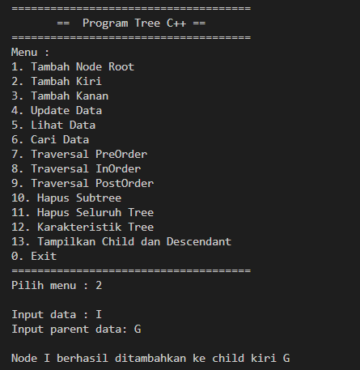

# <h1 align="center">Laporan Praktikum Modul 9 - Graph and Tree </h1>
<p align="center">Arsya Fathiha Rahman - 2311102152</p>

## Dasar Teori
Penjelasan Graph and Tree<br/>

A. ```GRAPH``` <br/>
Graf adalah kumpulan noktah (simpul) di dalam bidang dua dimensi yang dihubungkan dengan sekumpulan garis (sisi). Graph dapat digunakan untuk merepresentasikan objek-objek diskrit dan hubungan antara objek-objek tersebut. Representasi visual dari graph adalah dengan menyatakan objek sebagai noktah, bulatan atau titik (Vertex), sedangkan hubungan antara objek dinyatakan dengan garis (Edge).<br/>
Graf merupakan suatu cabang ilmu yang memiliki banyak terapan. Banyak sekali struktur yang bisa direpresentasikan dengan graf, dan banyak masalah yang bisa diselesaikan dengan bantuan graf. Seringkali graf digunakan untuk merepresentasikan suaru jaringan. Misalkan jaringan jalan raya dimodelkan graf dengan kota sebagai simpul (vertex/node) dan jalan yang menghubungkan setiap kotanya sebagai sisi (edge) yang bobotnya (weight) adalah panjang dari jalan tersebut.<br/>
Ada beberapa cara untuk menyimpan graph di dalam sitem komputer. Struktur data bergantung pada struktur graph dan algoritma yang digunakan untuk memanipulasi graph. Secara teori salah satu dari keduanya dapat dibedakan antara struktur list dan matriks, tetapi dalam penggunaannya struktur terbaik yang sering digunakan adalah kombinasi keduanya.<br/>
Jenis Jenis Graph: <br/>
a. Graph tak berarah (undirected graph atau non-directed graph) :<br/>
-  Urutan simpul dalam sebuah busur tidak dipentingkan. Misal busur e1 dapat disebut busur AB atau BA<br/>
b. Graph berarah (directed graph) :<br/>
-  Urutan simpul mempunyai arti. Misal busur AB adalah e1 sedangkan busur BA adalah e8.<br/>
c. Graph Berbobot (Weighted Graph)<br/>
- Jika setiap busur mempunyai nilai yang menyatakan hubungan antara 2 buah simpul, maka busur tersebut dinyatakan memiliki bobot.<br/>
- Bobot sebuah busur dapat menyatakan panjang sebuah jalan dari 2 buah titik, jumlah rata-rata kendaraan perhari yang melalui sebuah jalan, dll.<br/>

Dalam pemrograman, agar data yang ada dalam graph dapat diolah, maka graph harus dinyatakan dalam suatu struktur data yang dapat mewakili graph tersebut. Dalam hal ini graph perlu direpresentasikan kedalam bentuk array dan dimensi yang sering disebut matrix atau direpresentasikan dalam bentuk linked list. Bentuk mana yang dipilih biasanya tergantung kepada efisiensi dan kemudahan dalam membuat program. <br/>
Berikut ini beberapa bentuk representasi graph :<br/>
a.    Adjacency Matrix Graph tak berarah<br/>

Matrik yang digambarkan pada gambar 1b merupakan representasi dalam bentuk Adjacency Matrik dari graf. Beberapa hal yang dapat dilihat atau dapat diterangkan pada Adjacency Matrik tersebut adalah sebagai berikut :<br/>
<br/>1.      Matrik yang terbentuk adalah matrik bujur sangkar n x n, dimana n = jumlah simpul yang ada dalam graf tersebut. Matrik ini menyatakan hubungan antara simpul satu dengan simpul lainnya.<br/>
<br/>2.      Matrik yang terbentuk adalah matrik simetris dengan sumbu simetris adalah diagonal dari titik kiri atas ke titik kanan bawah.<br/>
<br/>3.      Data yang tedapat baik dalam baris maupun kolom, dapat menyatakan degree sebuah simpul. Contoh : baik pada baris D maupun kolom D jumlah angka 1 nya adalah 3 buah, dimana jumlah ini menyatakan degree simpul D.<br/>

b.    Adjacency Matrix Graf Berarah<br/>
Matrik yang digambarkan pada gambar 2b merupakan representasi dalam bentuk Adjacency Matrik dari graf yang digambarkan pada gambar 2a. Beberapa hal yang dapat dilihat atau dapat diterangkan pada Adjacency Matrik tersebut adalah sebagai berikut :<br/>
<br/>1.      Matrik yang terbentuk adalah matrik bujur sangkar n x n, dimana n = jumlah simpul yang ada dalam graf tersebut. Matrik ini menyatakan hubungan antara simpul satu dengan simpul lainnya.<br/>
2.      Matrik yang terbentuk mungkin simetris mungkin juga tidak simetris. Menjadi Simetris bila hubungan antara dua buah simpul (v1 dan v2) terdapat busur dari v1 ke v2 dan juga sebaliknya.<br/>
3.      Hal pokok yang dinyatakan oleh matrik ini adalah : busur yang ’keluar’ dari suatu simpul. Dengan demikian, data yang terdapat dalam suatu baris, dapat menyatakan outdegree simpul yang bersangkutan.<br/>
Contoh : Jumlah elemen yang nilainya = 1 pada baris B ada 3 elemen,ini menyatakan jumlah outdegree simpul B adalah 3 buah.<br/>
4.      Data yang terdapat dalam suatu kolom, dapat menyatakan indegree simpul bersangkutan.<br/>
Contoh : Jumlah elemen yang nilainya 1 pada kolom B ada 2 elemen, ini menyatakan indegree simpul B adalah 2 buah.<br/>

c.     Adjacency Matrix Graph berbobot tak Berarah<br/>
Nilai yang ada dalam tiap elemen matrik, menyatakan bobot busur yang menghubungkan dua buah simpul yang bersangkutan. Untuk dua buah simpul yang tidak berhubungan langsung oleh sebuah busur, maka dianggap dihubungkan oleh sebuah busur yang nilai bobotnya tidak terhingga. Dalam pemograman, karena keperluan algoritma, maka dari total bobot seluruh busur yang ada atau yang mungkin ada.
Contoh: pada gambar 3a simpul A dan C tidak berhubungan langsung melalui sebuah busur, maka untuk elemen matrik yang bersangkutan diisi dengan nilai 999 karena nilai 999 dalam kasus ini cukup mewakili nilai tidak terhingga.<br/>

<br/>
Kita dapat melihat bahwa representasi sekuensial dari graf berbobot berbeda dengan jenis graf lainnya. Di sini, nilai bukan nol dalam matriks ketetanggaan diganti dengan bobot sebenarnya dari tepi tersebut.<br/>
Sisi AB mempunyai bobot = 4, maka pada matriks ketetanggaan kita atur perpotongan A dan B menjadi 4. Demikian pula, semua nilai bukan nol lainnya diubah ke bobotnya masing-masing.<br/>
Daftar kedekatan lebih mudah diterapkan dan diikuti. Traversal yaitu untuk memeriksa apakah ada sisi dari satu titik ke titik lainnya memerlukan waktu O(1) dan menghilangkan suatu sisi juga memerlukan waktu O(1).<br/>
Baik grafiknya renggang (sisinya lebih sedikit) atau padat, grafiknya selalu membutuhkan lebih banyak ruang.<br/>

B. ```TREE``` <br/>
Tree merupakan salah satu bentuk struktur data tidak linear yang menggambarkan hubungan yang bersifat hirarkis (hubungan one to many) antara elemen-elemen. Tree bisa didefinisikan sebagai kumpulan simpul/node dengan satu elemen khusus yang disebut Root dan node lainnya. Tree juga adalah suatu graph yang acyclic, simple, connected yang tidak mengandung loop.<br/>
Sebuah binary search tree (bst) adalah sebuah pohon biner yang boleh kosong, dan setiap nodenya harus memiliki identifier/value. Value pada semua node subpohon sebelah kiiri adalah selalu lebih kecil dari value dari root, sedangkan value subpohon di sebelah kanan adalah sama atau lebih besar dari value pada root, masing-masing subpohon tersebut (kiri dan kanan) itu sendiri adalah juga binary search tree.<br/>
Struktur data bst sangat penting dalam struktur pencarian, misalkan dalam kasus pencarian dalam sebuah list, jika list sudah dalam keadaan terurut maka proses pencarian akan semakin cepat, jika kita menggunakan  list contigue dan melakukan pencarian biner, akan tetapi  jika kita ingin melakukan perubahan isi list (insert atau delete), menggunakan list contigue akan sangat lambat, karena prose insert dan delete dalam list contigue butuh memindahkan linked-list, yang untuk operasi insert atau delete tinggal mengatur- atur pointer, akan tetapi pada n-linked list, kita tidak bisa melakukan pointer sembarangan setiap saat, kecuali hanya satu kali dengan kata lain hanya secara squential.
<br/>
Pohon ( tree) adalah graph terhubung yang tidak mengandung sirkuit. Pohon (tree) merupakan stuktur data yang tidak linier yang digambarkan dengan hubungan yang bersifat hirarkis antar satu elemen (Teddy Marcus; 2005). <br/>
Jenis pohon dalam sturktur data sebagai berikut : <br/>
a. Full binary tree <br/>
   MerupakanBinary tree yang tiap nodenya memiliki satu root dan dua child dan harus memiliki panjang yang saman <br/>
b. Complete binary tree <br/>
   Pohon ini mirip dengan Full Bianry Tree, namun pada tiap sub tree boleh memiliki panjang path yang berbeda node kecuali leaf yang meiliki 0 atau 2 anak <br/>
c. Skewed binary tree <br/>
   Pohon yang semua nodenya kecuali daun hanya memiliki satu anak (child) pertama yang dijadikan sebagai acuan sebuah list yang kosong atau isi, namun implementasi list masih memiliki kekurangan untuk operasi, pencarian, penambahan, dan penghapusan data yang harus ditelusuri per-elemen mulai dari elemen pertama.<br/>

Operasi pada Tree:<br/>
 *Create: membentuk sebuah tree baru yang kosong. <br/>
 *Insert: menambah node ke dalam Tree. Jika data yang akan dimasukkan lebih besar daripada elemen root, maka akan diletakkan di node sebelah      kanan, sebaliknya jika lebih kecil maka akan diletakkan di node sebelah kiri. Untuk data pertama akan menjadi elemen root. <br/>
 *PreOrder: cetak node yang dikunjungi, kunjungi left, kunjungi right <br/>
 *InOrder: kunjungi left, cetak node yang dikunjungi, kunjungi right <br/>
 *PostOrder: kunjungi left, kunjungi right, cetak node yang dikunjungi<br/>
 *Clear: digunakan untuk mengosongkan binary tree yang sudah ada atau menghapus semua node pada binary tree.<br/>
 *isEmpty: digunakan untuk memeriksa apakah binary tree masih kosong atau tidak.<br/>
 *Insert: digunakan untuk memasukkan sebuah node kedalam tree.<br/>
 *Find: digunakan untuk mencari root, parent, left child, atau right child dari suatu node dengan syarat tree tidak boleh kosong.<br/>
 *Update: digunakan untuk mengubah isi dari node yang ditunjuk oleh pointe current dengan syarat tree tidak boleh kosong<br/>
 *Retrive: digunakan untuk mengetahui isi dari node yang ditunjuk pointer current dengan syarat tree tidak boleh kosong.<br/>
 *Delete Sub: digunakan untuk menghapus sebuah subtree (node beserta seluruh descendant-nya) yang ditunjuk pointer current dengan syarat tree tidak boleh kosong.<br/>
 *Characteristic: digunakan untuk mengetahui karakteristik dari suatu tree. Yakni size, height, serta average lenght-nya.<br/>

## Guided1

### 1. [Program Graph Sederhana ]

```C++
#include <iostream> // Memasukkan library iostream untuk input-output
#include <iomanip>  // Memasukkan library iomanip untuk manipulasi input-output
using namespace std;

// Mendeklarasikan array string yang berisi nama-nama kota
string simpul[7] = {"Ciamis", "Bandung", "Bekasi",
                    "Tasikmalaya", "Cianjur", "Purwokerto", "Yogyakarta"};

// Mendeklarasikan matriks busur yang berisi bobot dari setiap busur antar simpul (nama kota)
int busur[7][7] = {
    {0, 7, 8, 0, 0, 0, 0},
    {0, 0, 5, 0, 0, 15, 0},
    {0, 6, 0, 0, 5, 0, 0},
    {0, 5, 0, 0, 2, 4, 0},
    {23, 0, 0, 10, 0, 0, 8},
    {0, 0, 0, 0, 7, 0, 3},
    {0, 0, 0, 0, 9, 4, 0}};

// Fungsi untuk menampilkan graf
void tampilGraph()
{
    // Loop untuk setiap baris (simpul)
    for (int baris = 0; baris < 7; baris++)
    {
        // Menampilkan nama simpul dan mengatur lebar kolom dengan manipulasi output
        cout << " " << setiosflags(ios::left) << setw(15) << simpul[baris] << " : ";
        
        // Loop untuk setiap kolom dalam baris tersebut
        for (int kolom = 0; kolom < 7; kolom++)
        {
            // Jika ada busur (bobot tidak nol) antara simpul baris dan kolom
            if (busur[baris][kolom] != 0)
            {
                // Menampilkan nama simpul tujuan dan bobot busur
                cout << " " << simpul[kolom] << "(" << busur[baris][kolom] << ")";
            }
        }
        // Pindah ke baris baru setelah selesai dengan simpul saat ini
        cout << endl;
    }
}

// Fungsi utama program
int main()
{
    // Memanggil fungsi untuk menampilkan graf
    tampilGraph();
    return 0; // Mengembalikan nilai 0 yang menunjukkan program berakhir dengan sukses
}
```
Penjelasan Guided1 <br/>
<br/>Program di atas adalah implementasi dari Graph menggunakan matriks ketetanggaan yakni matriks busur yang berisi bobot dari setiap busur antar simpul (nama kota) lalu Menampilkan nama simpul tujuan dan bobot busur.Dengan menggunakan manipulasi output, program menampilkan setiap kota dan koneksi (busur) yang ada antara kota tersebut dengan kota lain beserta bobotnya. Graf direpresentasikan dalam bentuk matriks dua dimensi, di mana setiap elemen matriks menyatakan bobot busur yang menghubungkan dua simpul (node) dalam graf.<br/>

<br/>*Deklarasi variabel:<br/>

1. simpul[7]: Array string yang berisi nama-nama kota atau simpul dalam graf.<br/>
2. busur[7][7]: Matriks dua dimensi yang menyimpan bobot dari setiap busur yang menghubungkan dua simpul. Baris dan kolom matriks ini mewakili simpul-simpul dalam graf, dan setiap elemen [i][j] menyatakan bobot busur yang menghubungkan simpul i dan j. <br/>
3. void tampilGraph(): Mendefinisikan fungsi yang tidak mengembalikan nilai, bertujuan untuk menampilkan graf. <br/>
4. for (int baris = 0; baris < 7; baris++): Looping melalui setiap baris dalam matriks busur, yang mewakili setiap simpul (kota).<br/>
5. cout << " " << setiosflags(ios::left) << setw(15) << simpul[baris] << " : ": Menampilkan nama simpul (kota) pada baris saat ini dengan lebar kolom yang diatur menjadi 15 karakter untuk rata kiri.<br/>
6. for (int kolom = 0; kolom < 7; kolom++): Looping melalui setiap kolom dalam baris saat ini.<br/>
7. if (busur[baris][kolom] != 0): Memeriksa apakah ada busur (bobot tidak nol) antara simpul baris dan kolom.<br/>
8. cout << " " << simpul[kolom] << "(" << busur[baris][kolom] << ")";: Menampilkan nama simpul tujuan dan bobot busur jika ada busur.<br/>
9. cout << endl;: Berpindah ke baris baru setelah selesai dengan simpul saat ini.<br/>

*Fungsi tampilGraph():<br/>
Fungsi ini bertanggung jawab untuk menampilkan representasi graf dalam bentuk matriks ketetanggaan.
Melalui dua perulangan for, fungsi ini menelusuri setiap baris dan kolom dalam matriks busur.<br/>
Pada setiap iterasi, jika ada busur yang menghubungkan simpul i dan j (ditandai dengan nilai matriks busur[i][j] tidak sama dengan 0), fungsi ini menampilkan nama simpul tujuan (simpul[j]) beserta bobot busur tersebut (busur[i][j]).
Outputnya diatur sedemikian rupa sehingga masing-masing baris menampilkan simpul beserta semua simpul tujuan dan bobot busur yang terhubung dengan simpul tersebut.<br/>

*Fungsi main():<br/>
Fungsi utama program yakni Memanggil fungsi tampilGraph() untuk menampilkan representasi graf.
Mengembalikan nilai 0 sebagai indikasi bahwa program berakhir dengan sukses.<br/>

## Guided2

### 1. [Program Tree]

```C++
#include <iostream> // Memasukkan library iostream untuk input-output
#include <iomanip>  // Memasukkan library iomanip untuk manipulasi input-output
using namespace std;

// Struktur data Pohon untuk merepresentasikan node dalam tree
struct Pohon
{
    char data;        // Data yang disimpan di node
    Pohon *left;      // Pointer ke anak kiri
    Pohon *right;     // Pointer ke anak kanan
    Pohon *parent;    // Pointer ke parent (induk)
};

// Deklarasi pointer root dan baru untuk tree
Pohon *root, *baru;

// Fungsi untuk menginisialisasi tree
void init()
{
    root = NULL; // Mengatur root menjadi NULL
}

// Fungsi untuk memeriksa apakah tree kosong
bool isEmpty()
{
    return root == NULL; // Mengembalikan true jika root NULL (tree kosong)
}

// Fungsi untuk membuat node baru sebagai root
void buatNode(char data)
{
    if (isEmpty())
    {
        root = new Pohon();      // Membuat node baru
        root->data = data;       // Mengisi data node
        root->left = NULL;       // Mengatur anak kiri menjadi NULL
        root->right = NULL;      // Mengatur anak kanan menjadi NULL
        root->parent = NULL;     // Mengatur parent menjadi NULL
        cout << "\n Node " << data << " berhasil dibuat sebagai root." << endl;
    }
    else
    {
        cout << "\n Tree sudah ada!" << endl; // Pesan jika tree sudah ada
    }
}

// Fungsi untuk menambahkan node di anak kiri
Pohon *insertLeft(char data, Pohon *node)
{
    if (isEmpty())
    {
        cout << "\n Buat tree terlebih dahulu!" << endl;
        return NULL; // Mengembalikan NULL jika tree kosong
    }
    else
    {
        if (node->left != NULL)
        {
            cout << "\n Node " << node->data << " sudah ada child kiri !" << endl;
            return NULL; // Mengembalikan NULL jika anak kiri sudah ada
        }
        else
        {
            Pohon *baru = new Pohon(); // Membuat node baru
            baru->data = data;         // Mengisi data node
            baru->left = NULL;         // Mengatur anak kiri menjadi NULL
            baru->right = NULL;        // Mengatur anak kanan menjadi NULL
            baru->parent = node;       // Mengatur parent menjadi node
            node->left = baru;         // Mengatur anak kiri dari node
            cout << "\n Node " << data << " berhasil ditambahkan ke child kiri " << baru->parent->data << endl;
            return baru; // Mengembalikan pointer ke node baru
        }
    }
}

// Fungsi untuk menambahkan node di anak kanan
Pohon *insertRight(char data, Pohon *node)
{
    if (isEmpty())
    {
        cout << "\n Buat tree terlebih dahulu!" << endl;
        return NULL; // Mengembalikan NULL jika tree kosong
    }
    else
    {
        if (node->right != NULL)
        {
            cout << "\n Node " << node->data << " sudah ada child kanan !" << endl;
            return NULL; // Mengembalikan NULL jika anak kanan sudah ada
        }
        else
        {
            Pohon *baru = new Pohon(); // Membuat node baru
            baru->data = data;         // Mengisi data node
            baru->left = NULL;         // Mengatur anak kiri menjadi NULL
            baru->right = NULL;        // Mengatur anak kanan menjadi NULL
            baru->parent = node;       // Mengatur parent menjadi node
            node->right = baru;        // Mengatur anak kanan dari node
            cout << "\n Node " << data << " berhasil ditambahkan ke child kanan " << baru->parent->data << endl;
            return baru; // Mengembalikan pointer ke node baru
        }
    }
}

// Fungsi untuk mengupdate data di node
void update(char data, Pohon *node)
{
    if (isEmpty()) // Memeriksa apakah tree kosong/tersedia
    {
        cout << "\n Buat tree terlebih dahulu!" << endl; // Menampilkan pesan jika tree kosong
    }
    else // Jika tree tidak kosong
    {
        if (!node) // Memeriksa apakah node yang ditunjuk ada
        {
            cout << "\n Node yang ingin diganti tidak ada!!" << endl; // Menampilkan pesan jika node tidak ada
        }
        else // Jika node ada
        {
            char temp = node->data; // Menyimpan data lama
            node->data = data;      // Mengganti data dengan data baru
            cout << "\n Node " << temp << " berhasil diubah menjadi " << data << endl; // Menampilkan pesan sukses
        }
    }
}

// Fungsi untuk menampilkan data di node
void retrieve(Pohon *node) // Fungsi retrieve dengan parameter pointer ke node dari Pohon
{
    if (isEmpty()) // Mengecek apakah tree kosong
    {
        cout << "\n Buat tree terlebih dahulu!" << endl; // Jika tree kosong, tampilkan pesan
    }
    else // Jika tree tidak kosong
    {
        if (!node) // Mengecek apakah node yang ditunjuk tidak ada (NULL)
        {
            cout << "\n Node yang ditunjuk tidak ada!" << endl; // Jika node tidak ada, tampilkan pesan
        }
        else // Jika node ada
        {
            cout << "\n Data node : " << node->data << endl; // Tampilkan data node yang ditunjuk
        }
    }
}


// Fungsi untuk menemukan informasi tentang node
void find(Pohon *node) // Fungsi find dengan parameter pointer ke node dari Pohon
{
    if (isEmpty()) // Mengecek apakah tree kosong
    {
        cout << "\n Buat tree terlebih dahulu!" << endl; // Jika tree kosong, tampilkan pesan
    }
    else // Jika tree tidak kosong
    {
        if (!node) // Mengecek apakah node yang ditunjuk tidak ada (NULL)
        {
            cout << "\n Node yang ditunjuk tidak ada!" << endl; // Jika node tidak ada, tampilkan pesan
        }
        else // Jika node ada
        {
            cout << "\n Data Node : " << node->data << endl; // Tampilkan data node yang ditunjuk
            cout << " Root : " << root->data << endl; // Tampilkan data root dari tree
            
            if (!node->parent) // Mengecek apakah node tidak punya parent
                cout << " Parent : (tidak punya parent)" << endl; // Jika tidak punya parent, tampilkan pesan
            else
                cout << " Parent : " << node->parent->data << endl; // Jika punya parent, tampilkan data parent
            
            if (node->parent != NULL && node->parent->left != node && node->parent->right == node) // Mengecek apakah node adalah anak kanan dari parent dan parent punya anak kiri
                cout << " Sibling : " << node->parent->left->data << endl; // Jika ya, tampilkan data sibling (anak kiri dari parent)
            else if (node->parent != NULL && node->parent->right != node && node->parent->left == node) // Mengecek apakah node adalah anak kiri dari parent dan parent punya anak kanan
                cout << " Sibling : " << node->parent->right->data << endl; // Jika ya, tampilkan data sibling (anak kanan dari parent)
            else
                cout << " Sibling : (tidak punya sibling)" << endl; // Jika tidak punya sibling, tampilkan pesan
            
            if (!node->left) // Mengecek apakah node tidak punya anak kiri
                cout << " Child Kiri : (tidak punya Child kiri)" << endl; // Jika tidak punya anak kiri, tampilkan pesan
            else
                cout << " Child Kiri : " << node->left->data << endl; // Jika punya anak kiri, tampilkan data anak kiri
            
            if (!node->right) // Mengecek apakah node tidak punya anak kanan
                cout << " Child Kanan : (tidak punya Child kanan)" << endl; // Jika tidak punya anak kanan, tampilkan pesan
            else
                cout << " Child Kanan : " << node->right->data << endl; // Jika punya anak kanan, tampilkan data anak kanan
        }
    }
}


// Fungsi untuk traversal preOrder
void preOrder(Pohon *node = root) // Fungsi preOrder dengan parameter default node yang menunjuk ke root
{
    if (isEmpty()) // Mengecek apakah tree kosong
    {
        cout << "\n Buat tree terlebih dahulu!" << endl; // Jika tree kosong, tampilkan pesan
    }
    else // Jika tree tidak kosong
    {
        if (node != NULL) // Mengecek apakah node tidak NULL
        {
            cout << " " << node->data << ", "; // Tampilkan data node
            preOrder(node->left); // Traversal preOrder ke subtree kiri
            preOrder(node->right); // Traversal preOrder ke subtree kanan
        }
    }
}

// Fungsi untuk traversal inOrder
void inOrder(Pohon *node = root) // Fungsi inOrder dengan parameter default node yang menunjuk ke root
{
    if (isEmpty()) // Mengecek apakah tree kosong
    {
        cout << "\n Buat tree terlebih dahulu!" << endl; // Jika tree kosong, tampilkan pesan
    }
    else // Jika tree tidak kosong
    {
        if (node != NULL) // Mengecek apakah node tidak NULL
        {
            inOrder(node->left); // Traversal inOrder ke subtree kiri
            cout << " " << node->data << ", "; // Tampilkan data node
            inOrder(node->right); // Traversal inOrder ke subtree kanan
        }
    }
}


// Fungsi untuk traversal postOrder
void postOrder(Pohon *node = root) // Fungsi postOrder dengan parameter default node yang menunjuk ke root
{
    if (isEmpty()) // Mengecek apakah tree kosong
    {
        cout << "\n Buat tree terlebih dahulu!" << endl; // Jika tree kosong, tampilkan pesan
    }
    else // Jika tree tidak kosong
    {
        if (node != NULL) // Mengecek apakah node tidak NULL
        {
            postOrder(node->left); // Traversal postOrder ke subtree kiri
            postOrder(node->right); // Traversal postOrder ke subtree kanan
            cout << " " << node->data << ", "; // Tampilkan data node
        }
    }
}


/// Fungsi untuk menghapus seluruh tree
void deleteTree(Pohon *node) // Fungsi deleteTree dengan parameter node
{
    if (isEmpty()) // Mengecek apakah tree kosong
    {
        cout << "\n Buat tree terlebih dahulu!" << endl; // Jika tree kosong, tampilkan pesan
    }
    else // Jika tree tidak kosong
    {
        if (node != NULL) // Mengecek apakah node tidak NULL
        {
            if (node != root) // Mengecek apakah node bukan root
            {
                node->parent->left = NULL; // Menghapus hubungan dengan parent dari anak kiri
                node->parent->right = NULL; // Menghapus hubungan dengan parent dari anak kanan
            }
            deleteTree(node->left); // Rekursif: Hapus subtree kiri
            deleteTree(node->right); // Rekursif: Hapus subtree kanan
            if (node == root) // Jika node adalah root
            {
                delete root; // Hapus root
                root = NULL; // Atur root menjadi NULL
            }
            else // Jika node bukan root
            {
                delete node; // Hapus node
            }
        }
    }
}
// Fungsi untuk menghapus subtree
void deleteSub(Pohon *node) // Fungsi deleteSub dengan parameter node
{
    if (isEmpty()) // Mengecek apakah tree kosong
    {
        cout << "\n Buat tree terlebih dahulu!" << endl; // Jika tree kosong, tampilkan pesan
    }
    else // Jika tree tidak kosong
    {
        deleteTree(node->left); // Hapus subtree kiri dari node
        deleteTree(node->right); // Hapus subtree kanan dari node
        cout << "\n Node subtree " << node->data << " berhasil dihapus." << endl; // Tampilkan pesan bahwa subtree berhasil dihapus
    }
}


// Fungsi untuk menghapus seluruh tree
void clear() // Fungsi clear tanpa parameter
{
    if (isEmpty()) // Mengecek apakah tree kosong
    {
        cout << "\n Buat tree terlebih dahulu!!" << endl; // Jika tree kosong, tampilkan pesan
    }
    else // Jika tree tidak kosong
    {
        deleteTree(root); // Panggil fungsi deleteTree untuk menghapus seluruh tree dengan root sebagai parameter
        cout << "\n Pohon berhasil dihapus." << endl; // Tampilkan pesan bahwa pohon berhasil dihapus
    }
}


// Fungsi untuk menghitung ukuran tree
int size(Pohon *node = root) // Fungsi size dengan parameter default node yang menunjuk ke root
{
    if (isEmpty()) // Mengecek apakah tree kosong
    {
        cout << "\n Buat tree terlebih dahulu!!" << endl; // Jika tree kosong, tampilkan pesan dan kembalikan ukuran 0
        return 0;
    }
    else // Jika tree tidak kosong
    {
        if (!node) // Mengecek apakah node NULL
        {
            return 0; // Jika node NULL, kembalikan ukuran 0
        }
        else // Jika node tidak NULL
        {
            return 1 + size(node->left) + size(node->right); // Kembalikan jumlah node, termasuk node saat ini dan semua node di subtree kiri dan kanan
        }
    }
}


// Fungsi untuk menghitung tinggi tree
int height(Pohon *node = root) // Fungsi height dengan parameter default node yang menunjuk ke root
{
    if (isEmpty()) // Mengecek apakah tree kosong
    {
        cout << "\n Buat tree terlebih dahulu!" << endl; // Jika tree kosong, tampilkan pesan dan kembalikan tinggi 0
        return 0;
    }
    else // Jika tree tidak kosong
    {
        if (!node) // Mengecek apakah node NULL
        {
            return 0; // Jika node NULL, kembalikan tinggi 0
        }
        else // Jika node tidak NULL
        {
            int heightKiri = height(node->left); // Hitung tinggi subtree kiri
            int heightKanan = height(node->right); // Hitung tinggi subtree kanan
            if (heightKiri >= heightKanan) // Bandingkan tinggi subtree kiri dan kanan
            {
                return heightKiri + 1; // Kembalikan tinggi subtree kiri ditambah 1
            }
            else
            {
                return heightKanan + 1; // Kembalikan tinggi subtree kanan ditambah 1
            }
        }
    }
}

// Fungsi untuk menampilkan karakteristik tree
void characteristic() // Fungsi characteristic tanpa parameter
{
    cout << "\n Size Tree : " << size() << endl; // Tampilkan ukuran tree menggunakan fungsi size()
    cout << " Height Tree : " << height() << endl; // Tampilkan tinggi tree menggunakan fungsi height()
    cout << " Average Node of Tree : " << size() / height() << endl; // Tampilkan rata-rata node dari tree
}

// Fungsi utama program
int main()
{
    // Membuat node root
    buatNode('A');

    // Deklarasi pointer untuk node-node lain
    Pohon *nodeB, *nodeC, *nodeD, *nodeE, *nodeF, *nodeG, *nodeH, *nodeI, *nodeJ;

    nodeB = insertLeft('B', root); // Menambahkan node B sebagai anak kiri dari root
    nodeC = insertRight('C', root); // Menambahkan node C sebagai anak kanan dari root
    nodeD = insertLeft('D', nodeB); // Menambahkan node D sebagai anak kiri dari node B
    nodeE = insertRight('E', nodeB); // Menambahkan node E sebagai anak kanan dari node B
    nodeF = insertLeft('F', nodeC); // Menambahkan node F sebagai anak kiri dari node C
    nodeG = insertLeft('G', nodeE); // Menambahkan node G sebagai anak kiri dari node E
    nodeH = insertRight('H', nodeE); // Menambahkan node H sebagai anak kanan dari node E
    nodeI = insertLeft('I', nodeG); // Menambahkan node I sebagai anak kiri dari node G
    nodeJ = insertRight('J', nodeG); // Menambahkan node J sebagai anak kanan dari node G

    update('Z', nodeC); // Mengupdate data di node C menjadi 'Z'
    update('C', nodeC); // Mengupdate data di node C kembali menjadi 'C'

    retrieve(nodeC); // Menampilkan data dari node C

    find(nodeC); // Menemukan informasi dari node C

     // Menampilkan karakteristik dari tree
    characteristic(); // Memanggil fungsi characteristic()

    // Menampilkan traversal preOrder
    cout << "\n PreOrder :" << endl;
    preOrder(root);
    cout << "\n" << endl;

    // Menampilkan traversal inOrder
    cout << " InOrder :" << endl;
    inOrder(root);
    cout << "\n" << endl;

    // Menampilkan traversal postOrder
    cout << " PostOrder :" << endl;
    postOrder(root);
    cout << "\n" << endl;


    return 0; // Mengembalikan nilai 0 yang menunjukkan program berakhir dengan sukses
}
```

Penjelasan Guided2 <br/>
<br/> Program guided2 adalah implementasi dari struktur data tree dalam bahasa pemrograman C++. Program ini mencakup berbagai fungsi untuk membuat, memanipulasi, dan menampilkan data dari tree.  <br/>

- Tujuan Program <br/>
Program ini dirancang untuk: <br/>
1. Membuat dan menginisialisasi sebuah tree. <br/>
2. Menambahkan node pada tree. <br/>
3. Mengupdate data pada node. <br/>
4. Menampilkan informasi dan data dari node tertentu. <br/>
5. Melakukan traversal tree dalam urutan pre-order, in-order, dan post-order. <br/>
6. Menghapus node atau seluruh tree. <br/>
7. Menampilkan karakteristik dari tree seperti ukuran dan tinggi. <br/>

- Struktur Data Tree <br/>
Tree adalah struktur data hierarkis yang terdiri dari node-node, di mana setiap node dapat memiliki anak kiri dan/atau anak kanan. Tree memiliki node root sebagai titik awal, dan setiap node dalam tree memiliki satu parent kecuali root yang tidak memiliki parent. <br/>

- Fitur-Fitur Program <br/>
 1. Inisialisasi Tree: <br/>
Fungsi init() mengatur root tree menjadi NULL, menunjukkan bahwa tree kosong pada awalnya.<br/>

2. Memeriksa Apakah Tree Kosong: <br/>
Fungsi isEmpty() mengembalikan true jika tree tidak memiliki node (root adalah NULL).<br/>

3. Membuat Node Baru sebagai Root: <br/>
Fungsi buatNode(char data) membuat node baru sebagai root dari tree jika tree kosong.<br/>

4. Menambahkan Node:
Fungsi insertLeft(char data, Pohon *node) menambahkan node baru sebagai anak kiri dari node yang diberikan.<br/>
Fungsi insertRight(char data, Pohon *node) menambahkan node baru sebagai anak kanan dari node yang diberikan.<br/>

5. Mengupdate Data pada Node:<br/>
Fungsi update(char data, Pohon *node) mengubah data pada node yang diberikan dengan nilai baru.<br/>

6. Menampilkan Data dari Node:<br/>
Fungsi retrieve(Pohon *node) menampilkan data dari node yang diberikan.<br/>
Fungsi find(Pohon *node) menampilkan informasi lengkap tentang node yang diberikan, termasuk data dari root, parent, sibling, dan anak-anaknya.<br/>

7. Traversal Tree:<br/>
Fungsi preOrder(Pohon *node) untuk traversal pre-order (mengunjungi root, anak kiri, anak kanan).<br/>
Fungsi inOrder(Pohon *node) untuk traversal in-order (mengunjungi anak kiri, root, anak kanan).<br/>
Fungsi postOrder(Pohon *node) untuk traversal post-order (mengunjungi anak kiri, anak kanan, root).<br/>

8. Menghapus Node atau Tree:<br/>
Fungsi deleteTree(Pohon *node) menghapus seluruh tree mulai dari node yang diberikan.<br/>
Fungsi clear() menghapus seluruh tree dengan memanggil deleteTree() untuk root.<br/>

9. Menampilkan Karakteristik Tree:<br/>
Fungsi size(Pohon *node) menghitung dan mengembalikan jumlah node dalam tree.<br/>
Fungsi height(Pohon *node) menghitung dan mengembalikan tinggi tree.<br/>
Fungsi characteristic() menampilkan ukuran tree, tinggi tree, dan rata-rata jumlah node dalam tree.<br/>

- Contoh Running Programnya:<br/>
Membuat node root dengan data 'A'.<br/>
Menambahkan node 'B' sebagai anak kiri dari root.<br/>
Menambahkan node 'C' sebagai anak kanan dari root.<br/>
Melakukan traversal pre-order, in-order, dan post-order untuk menampilkan urutan kunjungan node.<br/>
Mengupdate data pada node.<br/>
Menghapus subtree atau seluruh tree.<br/>

## Unguided1 <br/>

1. Buatlah program graph dengan menggunakan inputan user untuk menghitung jarak dari sebuah kota ke kota lainnya.<br/>
<br/>

```C++ 
/*
by Arsya Fathiha Rahman - 2311102152
*/
#include <iostream> // Library untuk input-output standar
#include <iomanip> // Library untuk manipulasi output
#include <string> // Library untuk menggunakan tipe data string
using namespace std;

const int Maksimal_Simpul_2311102152_Arsya = 2; // Konstanta untuk jumlah maksimal simpul

// Deklarasi array string yang berisi nama-nama kota
string simpul_152[Maksimal_Simpul_2311102152_Arsya];

// Deklarasi matriks busur yang berisi bobot dari setiap busur antar simpul (nama kota)
int busur[Maksimal_Simpul_2311102152_Arsya][Maksimal_Simpul_2311102152_Arsya];

// Fungsi untuk menampilkan graf
void tampilGraph_2311102152_Arsya()
{
    cout << setw(12) << " "; // Menampilkan spasi kosong dengan lebar 12 kolom
    for (int i = 0; i < Maksimal_Simpul_2311102152_Arsya; i++)
    {
        cout << setw(12) << simpul_152[i]; // Menampilkan nama simpul dengan lebar 12 kolom
    }
    cout << endl; // Pindah ke baris baru

    // Menampilkan isi graf
    for (int i = 0; i < Maksimal_Simpul_2311102152_Arsya; i++)
    {
        cout << setw(12) << simpul_152[i] << " "; // Menampilkan nama simpul dengan lebar 12 kolom
        for (int j = 0; j < Maksimal_Simpul_2311102152_Arsya; j++)
        {
            cout << setw(12) << busur[i][j]; // Menampilkan bobot busur dengan lebar 12 kolom
        }
        cout << endl; // Pindah ke baris baru
    }
}

int main()
{
    cout << "Silakan masukkan jumlah simpul: "; // Meminta pengguna untuk memasukkan jumlah simpul
    int numVertices;
    cin >> numVertices; // Membaca jumlah simpul dari input pengguna

    if (numVertices != Maksimal_Simpul_2311102152_Arsya)
    {
        cout << "Jumlah simpul tidak sesuai dengan konstanta MAX_VERTICES." << endl; // Memberi pesan jika jumlah simpul tidak sesuai dengan konstanta
        return 1; // Menghentikan program dengan kode kesalahan
    }

    cout << "Silakan masukkan nama simpul:\n"; // Meminta pengguna untuk memasukkan nama simpul
    for (int i = 0; i < numVertices; ++i)
    {
        cout << "Simpul " << i + 1 << ": "; // Menampilkan pesan untuk memasukkan nama simpul
        cin >> simpul_152[i]; // Membaca nama simpul dari input pengguna
    }

    cout << "Silakan masukkan bobot antar simpul:\n"; // Meminta pengguna untuk memasukkan bobot antar simpul
    for (int i = 0; i < numVertices; ++i)
    {
        for (int j = 0; j < numVertices; ++j)
        {
            cout << simpul_152[i] << " --> " << simpul_152[j] << " = "; // Menampilkan pesan untuk memasukkan bobot busur
            cin >> busur[i][j]; // Membaca bobot busur dari input pengguna
        }
    }

    cout << endl; // Pindah ke baris baru
    tampilGraph_2311102152_Arsya(); // Memanggil fungsi untuk menampilkan graf

    return 0; // Mengembalikan nilai 0 yang menandakan program berakhir dengan sukses
}
```

#### Output Unguided1


#### Penjelasan Program Unguided1 <br/>

Program yang telah saya buat pada Unguided1 adalah program graph dengan menggunakan inputan user untuk menghitung jarak dari sebuah kota ke kota lainnya misalnya disini adalah Kota Bali dan Palu. Program ini mencakup fungsi untuk memasukkan dan menampilkan nama-nama kota (simpul) serta bobot antar kota (busur) dalam bentuk matriks ketetanggaan.<br/>

* Tujuan Program<br/>
Program ini dirancang untuk:<br/>
1. Menginisialisasi dan menyimpan simpul-simpul (kota) dalam graph.<br/>
2. Menginisialisasi dan menyimpan bobot dari busur-busur (jalan antar kota) dalam graph.<br/>
3. Menampilkan graph dalam bentuk matriks ketetanggaan.<br/>

* Struktur Data Graph<br/>
Graph adalah struktur data yang terdiri dari simpul (vertices) dan busur (edges) yang menghubungkan simpul-simpul tersebut. Dalam program ini, graph direpresentasikan sebagai matriks ketetanggaan, di mana baris dan kolomnya mewakili simpul, dan nilai di dalam matriks mewakili bobot busur antar simpul.<br/>

* Fitur-Fitur Program<br/>
Deklarasi dan Inisialisasi Konstanta dan Variabel:<br/>
- const int Maksimal_Simpul_2311102152_Arsya = 2;: Konstanta yang mendefinisikan jumlah maksimal simpul dalam graph (2 dalam hal ini).<br/>
- string simpul_152[Maksimal_Simpul_2311102152_Arsya];: Array untuk menyimpan nama-nama simpul.<br/>
- int busur[Maksimal_Simpul_2311102152_Arsya][Maksimal_Simpul_2311102152_Arsya];: Matriks ketetanggaan untuk menyimpan bobot busur antar simpul.<br/>

* Fungsi tampilGraph_2311102152_Arsya():<br/>
Fungsi ini menampilkan graph dalam bentuk matriks ketetanggaan. Simpul-simpul ditampilkan di header kolom dan baris, dan bobot busur ditampilkan di dalam matriks.<br/>

* Fungsi main():<br/>
1. Meminta pengguna untuk memasukkan jumlah simpul. Program akan memberikan pesan kesalahan jika jumlah simpul yang dimasukkan tidak sesuai dengan konstanta Maksimal_Simpul_2311102152_Arsya.<br/>
2. Meminta pengguna untuk memasukkan nama simpul satu per satu.<br/>
3. Meminta pengguna untuk memasukkan bobot busur antar simpul satu per satu.<br/>
4. Memanggil fungsi tampilGraph_2311102152_Arsya() untuk menampilkan graph dalam bentuk matriks ketetanggaan.<br/>

Cara Kerja Program<br/>
1. Memasukkan Jumlah Simpul:<br/>
Program meminta pengguna untuk memasukkan jumlah simpul. Jika jumlah yang dimasukkan tidak sesuai dengan konstanta Maksimal_Simpul_2311102152_Arsya, program akan menampilkan pesan kesalahan dan berhenti.<br/>

2. Memasukkan Nama Simpul:<br/>
Program meminta pengguna untuk memasukkan nama simpul satu per satu. Nama-nama ini disimpan dalam array simpul_152.<br/>

3. Memasukkan Bobot Busur:<br/>
Program meminta pengguna untuk memasukkan bobot busur antar simpul satu per satu. Bobot-bobot ini disimpan dalam matriks busur.<br/>

4. Menampilkan Graph:<br/>
Program memanggil fungsi tampilGraph_2311102152_Arsya() untuk menampilkan graph dalam bentuk matriks ketetanggaan. Simpul-simpul ditampilkan sebagai header kolom dan baris, dan bobot busur ditampilkan di dalam matriks.<br/>

- Langkah langkah program jika sesuai output yang diminta di unguided:<br/>
1. Memasukkan Jumlah Simpul:<br/>
Program meminta pengguna untuk memasukkan jumlah simpul.<br/>
Pengguna memasukkan 2.

2. Memeriksa Jumlah Simpul: <br/>
Program memeriksa apakah jumlah simpul yang dimasukkan sesuai dengan nilai konstanta yang ditetapkan (dalam hal ini, 2).
Jika jumlah simpul tidak sesuai, program berhenti dengan pesan kesalahan.<br/>
Karena jumlah simpul sesuai, program melanjutkan ke langkah berikutnya.<br/>

3. Memasukkan Nama Simpul:<br/>
Program meminta pengguna untuk memasukkan nama untuk setiap simpul.
Pengguna memasukkan nama BALI untuk simpul pertama dan PALU untuk simpul kedua.<br/>
Nama-nama simpul ini disimpan dalam sebuah array.<br/>

4. Memasukkan Bobot Antar Simpul:<br/>
Program meminta pengguna untuk memasukkan bobot antar simpul.
Pengguna memasukkan bobot 0 untuk BALI --> BALI, 3 untuk BALI --> PALU, 4 untuk PALU --> BALI, dan 0 untuk PALU --> PALU.
Bobot-bobot ini disimpan dalam sebuah matriks yang merepresentasikan bobot antar simpul.<br/>

5. Menampilkan Graph dalam Bentuk Matriks Ketetanggaan:<br/>
Program menampilkan header kolom yang berisi nama-nama simpul.
Program kemudian menampilkan nama-nama simpul di baris pertama diikuti oleh baris-baris yang merepresentasikan bobot antar simpul.
Hasilnya adalah tampilan matriks ketetanggaan yang menunjukkan bobot antar simpul seperti yang telah dimasukkan oleh pengguna.<br/>

#### Full code Screenshot Unguided 1:


## Unguided2
<br/> 2. Modifikasi guided tree diatas dengan program menu menggunakan input data tree dari user dan berikan fungsi tambahan untuk menampilkan node child dan descendant dari node yang diinputkan!<br/>

```C++ 
/*
by Arsya Fathiha Rahman - 2311102152
*/
#include <iostream> // Memasukkan library iostream untuk input-output
#include <iomanip>  // Memasukkan library iomanip untuk manipulasi input-output
using namespace std;

// Struktur data Pohon untuk merepresentasikan node dalam tree
struct Pohon
{
    char data_Arsya_2311102152; // Data yang disimpan di node
    Pohon *left;                // Pointer ke anak kiri
    Pohon *right;               // Pointer ke anak kanan
    Pohon *parent;              // Pointer ke parent (induk)
};

// Deklarasi pointer root dan baru untuk tree
Pohon *root, *baru;

// Fungsi untuk menginisialisasi tree
void init()
{
    root = NULL; // Mengatur root menjadi NULL
}

// Fungsi untuk memeriksa apakah tree kosong
bool isEmpty()
{
    return root == NULL; // Mengembalikan true jika root NULL (tree kosong)
}

// Fungsi untuk membuat node baru sebagai root
void buatNode(char data)
{
    if (isEmpty())
    {
        root = new Pohon();                 // Membuat node baru
        root->data_Arsya_2311102152 = data; // Mengisi data node
        root->left = NULL;                  // Mengatur anak kiri menjadi NULL
        root->right = NULL;                 // Mengatur anak kanan menjadi NULL
        root->parent = NULL;                // Mengatur parent menjadi NULL
        cout << "\n Node " << data << " berhasil dibuat sebagai root." << endl;
    }
    else
    {
        cout << "\n Tree sudah ada!" << endl; // Pesan jika tree sudah ada
    }
}

// Fungsi untuk menambahkan node di anak kiri
Pohon *insertLeft(char data, Pohon *node)
{
    if (isEmpty())
    {
        cout << "\n Buat tree terlebih dahulu!" << endl;
        return NULL; // Mengembalikan NULL jika tree kosong
    }
    else
    {
        if (node->left != NULL)
        {
            cout << "\n Node " << node->data_Arsya_2311102152 << " sudah ada child kiri !" << endl;
            return NULL; // Mengembalikan NULL jika anak kiri sudah ada
        }
        else
        {
            Pohon *baru = new Pohon();          // Membuat node baru
            baru->data_Arsya_2311102152 = data; // Mengisi data node
            baru->left = NULL;                  // Mengatur anak kiri menjadi NULL
            baru->right = NULL;                 // Mengatur anak kanan menjadi NULL
            baru->parent = node;                // Mengatur parent menjadi node
            node->left = baru;                  // Mengatur anak kiri dari node
            cout << "\n Node " << data << " berhasil ditambahkan ke child kiri " << baru->parent->data_Arsya_2311102152 << endl;
            return baru; // Mengembalikan pointer ke node baru
        }
    }
}

// Fungsi untuk menambahkan node di anak kanan
Pohon *insertRight(char data, Pohon *node)
{
    if (isEmpty())
    {
        cout << "\n Buat tree terlebih dahulu!" << endl;
        return NULL; // Mengembalikan NULL jika tree kosong
    }
    else
    {
        if (node->right != NULL)
        {
            cout << "\n Node " << node->data_Arsya_2311102152 << " sudah ada child kanan !" << endl;
            return NULL; // Mengembalikan NULL jika anak kanan sudah ada
        }
        else
        {
            Pohon *baru = new Pohon();          // Membuat node baru
            baru->data_Arsya_2311102152 = data; // Mengisi data node
            baru->left = NULL;                  // Mengatur anak kiri menjadi NULL
            baru->right = NULL;                 // Mengatur anak kanan menjadi NULL
            baru->parent = node;                // Mengatur parent menjadi node
            node->right = baru;                 // Mengatur anak kanan dari node
            cout << "\n Node " << data << " berhasil ditambahkan ke child kanan " << baru->parent->data_Arsya_2311102152 << endl;
            return baru; // Mengembalikan pointer ke node baru
        }
    }
}

// Fungsi untuk mengupdate data di node
void update(char data, Pohon *node)
{
    if (isEmpty()) // Memeriksa apakah tree kosong/tersedia
    {
        cout << "\n Buat tree terlebih dahulu!" << endl; // Menampilkan pesan jika tree kosong
    }
    else // Jika tree tidak kosong
    {
        if (!node) // Memeriksa apakah node yang ditunjuk ada
        {
            cout << "\n Node yang ingin diganti tidak ada!!" << endl; // Menampilkan pesan jika node tidak ada
        }
        else // Jika node ada
        {
            char temp = node->data_Arsya_2311102152;                                   // Menyimpan data lama
            node->data_Arsya_2311102152 = data;                                        // Mengganti data dengan data baru
            cout << "\n Node " << temp << " berhasil diubah menjadi " << data << endl; // Menampilkan pesan sukses
        }
    }
}

// Fungsi untuk menampilkan data di node
void retrieve(Pohon *node) // Fungsi retrieve dengan parameter pointer ke node dari Pohon
{
    if (isEmpty()) // Mengecek apakah tree kosong
    {
        cout << "\n Buat tree terlebih dahulu!" << endl; // Jika tree kosong, tampilkan pesan
    }
    else // Jika tree tidak kosong
    {
        if (!node) // Mengecek apakah node yang ditunjuk tidak ada (NULL)
        {
            cout << "\n Node yang ditunjuk tidak ada!" << endl; // Jika node tidak ada, tampilkan pesan
        }
        else // Jika node ada
        {
            cout << "\n Data node : " << node->data_Arsya_2311102152 << endl; // Tampilkan data node yang ditunjuk
        }
    }
}

void find(Pohon *node) // Fungsi untuk menemukan dan menampilkan informasi tentang node dalam pohon
{
    if (isEmpty()) // Periksa apakah pohon kosong
    {
        cout << "\n Buat tree terlebih dahulu!" << endl; // Tampilkan pesan jika pohon kosong
    }
    else
    {
        if (!node) // Jika node yang ditunjuk NULL
        {
            cout << "\n Node yang ditunjuk tidak ada!" << endl; // Tampilkan pesan bahwa node tidak ada
        }
        else
        {
            cout << "\n Data Node : " << node->data_Arsya_2311102152 << endl; // Tampilkan data dari node yang ditunjuk
            cout << " Root : " << root->data_Arsya_2311102152 << endl;        // Tampilkan data dari root node

            // Tampilkan informasi tentang sibling node
            if (node->parent != NULL && node->parent->left != node && node->parent->right == node)
                cout << " Sibling : " << node->parent->left->data_Arsya_2311102152 << endl;
            else if (node->parent != NULL && node->parent->right != node && node->parent->left == node)
                cout << " Sibling : " << node->parent->right->data_Arsya_2311102152 << endl;
            else
                cout << " Sibling : (tidak punya sibling)" << endl;

            // Tampilkan informasi tentang child node kiri
            if (!node->left)
                cout << " Child Kiri : (tidak punya Child kiri)" << endl;
            else
                cout << " Child Kiri : " << node->left->data_Arsya_2311102152 << endl;

            // Tampilkan informasi tentang child node kanan
            if (!node->right)
                cout << " Child Kanan : (tidak punya Child kanan)" << endl;
            else
                cout << " Child Kanan : " << node->right->data_Arsya_2311102152 << endl;
        }
    }
}

void preOrder(Pohon *node = root) // Fungsi untuk melakukan traversal PreOrder pada pohon
{
    if (isEmpty()) // Periksa apakah pohon kosong
    {
        cout << "\n Buat tree terlebih dahulu!" << endl; // Tampilkan pesan jika pohon kosong
    }
    else
    {
        if (node != NULL) // Jika node tidak NULL
        {
            cout << node->data_Arsya_2311102152 << ", "; // Tampilkan data dari node
            preOrder(node->left);                        // Lakukan traversal PreOrder pada subtree kiri
            preOrder(node->right);                       // Lakukan traversal PreOrder pada subtree kanan
        }
    }
}

void inOrder(Pohon *node = root) // Fungsi untuk melakukan traversal InOrder pada pohon
{
    if (isEmpty()) // Periksa apakah pohon kosong
    {
        cout << "\n Buat tree terlebih dahulu!" << endl; // Tampilkan pesan jika pohon kosong
    }
    else
    {
        if (node != NULL) // Jika node tidak NULL
        {
            inOrder(node->left);                         // Lakukan traversal InOrder pada subtree kiri
            cout << node->data_Arsya_2311102152 << ", "; // Tampilkan data dari node
            inOrder(node->right);                        // Lakukan traversal InOrder pada subtree kanan
        }
    }
}

void postOrder(Pohon *node = root) // Fungsi untuk melakukan traversal PostOrder pada pohon
{
    if (isEmpty()) // Periksa apakah pohon kosong
    {
        cout << "\n Buat tree terlebih dahulu!" << endl; // Tampilkan pesan jika pohon kosong
    }
    else
    {
        if (node != NULL) // Jika node tidak NULL
        {
            postOrder(node->left);                       // Lakukan traversal PostOrder pada subtree kiri
            postOrder(node->right);                      // Lakukan traversal PostOrder pada subtree kanan
            cout << node->data_Arsya_2311102152 << ", "; // Tampilkan data dari node
        }
    }
}

void deleteSubtree(Pohon *node) // Fungsi untuk menghapus subtree yang dimulai dari node yang diberikan
{
    if (node == NULL) // Jika node NULL, kembalikan
        return;

    // Hapus subtree secara rekursif
    deleteSubtree(node->left);
    deleteSubtree(node->right);

    // Hapus hubungan parent dengan node
    if (node->parent != NULL && node->parent->left == node)
    {
        node->parent->left = NULL;
    }
    else if (node->parent != NULL && node->parent->right == node)
    {
        node->parent->right = NULL;
    }

    // Tampilkan pesan bahwa node berhasil dihapus
    cout << "\n Node " << node->data_Arsya_2311102152 << " berhasil dihapus." << endl;

    // Hapus node dari memory
    delete node;
}

// Fungsi untuk menampilkan informasi tentang child dan descendant
void showChildAndDescendant(Pohon *node) // Fungsi untuk menampilkan informasi tentang child dan descendant dari suatu node
{
    if (isEmpty()) // Periksa apakah pohon kosong
    {
        cout << "\n Buat tree terlebih dahulu!" << endl; // Tampilkan pesan jika pohon kosong
    }
    else
    {
        if (!node) // Jika node yang ditunjuk NULL
        {
            cout << "\n Node yang ditunjuk tidak ada!" << endl; // Tampilkan pesan bahwa node tidak ada
        }
        else
        {
            cout << "\n Data Node : " << node->data_Arsya_2311102152 << endl; // Tampilkan data dari node yang ditunjuk
            if (!node->left)                                                  // Jika tidak ada child kiri
            {
                cout << " Child Kiri : (tidak punya Child kiri)" << endl; // Tampilkan pesan bahwa tidak ada child kiri
            }
            else
            {
                cout << " Child Kiri : " << node->left->data_Arsya_2311102152 << endl; // Tampilkan data dari child kiri
                cout << " Descendant dari Child Kiri : ";
                inOrder(node->left); // Tampilkan descendant dari child kiri dengan traversal InOrder
                cout << endl;
            }

            if (!node->right) // Jika tidak ada child kanan
            {
                cout << " Child Kanan : (tidak punya Child kanan)" << endl; // Tampilkan pesan bahwa tidak ada child kanan
            }
            else
            {
                cout << " Child Kanan : " << node->right->data_Arsya_2311102152 << endl; // Tampilkan data dari child kanan
                cout << " Descendant dari Child Kanan : ";
                inOrder(node->right); // Tampilkan descendant dari child kanan dengan traversal InOrder
                cout << endl;
            }
        }
    }
}

// Deklarasi fungsi findParent
void findParent(Pohon *node, char parentData, Pohon *&parentNode) // Fungsi untuk mencari parent dari node dengan data tertentu
{
    if (node == NULL) // Jika node NULL, kembalikan
        return;

    if (node->data_Arsya_2311102152 == parentData) // Jika data node sama dengan data parent yang dicari
    {
        parentNode = node; // Simpan node sebagai parent yang ditemukan
        return;
    }

    // Telusuri subtree secara rekursif
    findParent(node->left, parentData, parentNode);
    findParent(node->right, parentData, parentNode);
}

// Fungsi untuk menghitung ukuran tree
int size(Pohon *node = root) // Fungsi size dengan parameter default node yang menunjuk ke root
{
    if (isEmpty()) // Mengecek apakah tree kosong
    {
        cout << "\n Buat tree terlebih dahulu!!" << endl; // Jika tree kosong, tampilkan pesan dan kembalikan ukuran 0
        return 0;
    }
    else // Jika tree tidak kosong
    {
        if (!node) // Mengecek apakah node NULL
        {
            return 0; // Jika node NULL, kembalikan ukuran 0
        }
        else // Jika node tidak NULL
        {
            return 1 + size(node->left) + size(node->right); // Kembalikan jumlah node, termasuk node saat ini dan semua node di subtree kiri dan kanan
        }
    }
}


// Fungsi untuk menghitung tinggi tree
int height(Pohon *node = root) // Fungsi height dengan parameter default node yang menunjuk ke root
{
    if (isEmpty()) // Mengecek apakah tree kosong
    {
        cout << "\n Buat tree terlebih dahulu!" << endl; // Jika tree kosong, tampilkan pesan dan kembalikan tinggi 0
        return 0;
    }
    else // Jika tree tidak kosong
    {
        if (!node) // Mengecek apakah node NULL
        {
            return 0; // Jika node NULL, kembalikan tinggi 0
        }
        else // Jika node tidak NULL
        {
            int heightKiri = height(node->left); // Hitung tinggi subtree kiri
            int heightKanan = height(node->right); // Hitung tinggi subtree kanan
            if (heightKiri >= heightKanan) // Bandingkan tinggi subtree kiri dan kanan
            {
                return heightKiri + 1; // Kembalikan tinggi subtree kiri ditambah 1
            }
            else
            {
                return heightKanan + 1; // Kembalikan tinggi subtree kanan ditambah 1
            }
        }
    }
}
// Fungsi untuk menampilkan karakteristik tree
void characteristic() // Fungsi characteristic tanpa parameter
{
    cout << "\n Size Tree : " << size() << endl; // Tampilkan ukuran tree menggunakan fungsi size()
    cout << " Height Tree : " << height() << endl; // Tampilkan tinggi tree menggunakan fungsi height()
    cout << " Average Node of Tree : " << size() / height() << endl; // Tampilkan rata-rata node dari tree
}

int main()
{
    int pil;   // Variabel untuk menyimpan pilihan menu
    char data; // Variabel untuk menyimpan data node atau parent node

    // Loop utama program
    do
    {
        cout << "\n =====================================";
        cout << "\n        ==  Program Tree C++ ==       ";
        cout << "\n =====================================";
        cout << "\n Menu :                     ";
        cout << "\n 1. Tambah Node Root";
        cout << "\n 2. Tambah Kiri";
        cout << "\n 3. Tambah Kanan";
        cout << "\n 4. Update Data";
        cout << "\n 5. Lihat/Retrive Data";
        cout << "\n 6. Cari Data";
        cout << "\n 7. Traversal PreOrder";
        cout << "\n 8. Traversal InOrder";
        cout << "\n 9. Traversal PostOrder";
        cout << "\n 10. Hapus Subtree";
        cout << "\n 11. Hapus Seluruh Tree";
        cout << "\n 12. Karakteristik Tree";
        cout << "\n 13. Tampilkan Child dan Descendant";
        cout << "\n 0. Exit";
        cout << "\n =====================================";
        cout << "\n Pilih menu : ";

        cin >> pil; // Masukkan pilihan menu

        switch (pil)
        {
        case 1: // Menu untuk menambahkan node root
            cout << "\n Input data : ";
            cin >> data;
            buatNode(data);
            break;

        case 2: // Menu untuk menambahkan node sebelah kiri
        {
            cout << "\n Input data : ";
            cin >> data;
            char parentData;
            cout << " Input parent data: ";
            cin >> parentData;
            Pohon *parentNode = NULL;

            // Cari parent node berdasarkan parentData
            findParent(root, parentData, parentNode);

            if (parentNode)
            {
                insertLeft(data, parentNode);
            }
            else
            {
                cout << "\n Parent node tidak ditemukan!" << endl;
            }
            break;
        }
        case 3: // Menu untuk menambahkan node sebelah kanan
        {
            cout << "\n Input data : ";
            cin >> data;
            char parentData;
            cout << " Input parent data: ";
            cin >> parentData;
            Pohon *parentNode = NULL;

            // Cari parent node berdasarkan parentData
            findParent(root, parentData, parentNode);

            if (parentNode)
            {
                insertRight(data, parentNode);
            }
            else
            {
                cout << "\n Parent node tidak ditemukan!" << endl;
            }
            break;
        }

        case 4: // Menu untuk mengupdate data pada node
        {
            cout << "\n Input data baru : ";                  // Meminta input untuk data baru
            cin >> data;                                      // Membaca data baru dari pengguna
            char nodeData;                                    // Variabel untuk menyimpan data node yang ingin diupdate
            cout << " Input data node yang ingin diupdate: "; // Meminta input data node yang ingin diupdate
            cin >> nodeData;                                  // Membaca data node yang ingin diupdate dari pengguna
            Pohon *node = root;                               // Inisialisasi node yang akan digunakan untuk mencari node yang ingin diupdate
            // Loop untuk mencari node yang ingin diupdate berdasarkan datanya
            while (node && node->data_Arsya_2311102152 != nodeData)
            {
                if (node->left && node->left->data_Arsya_2311102152 == nodeData)
                {
                    node = node->left; // Jika node pada left child sesuai dengan nodeData, pindahkan node ke left child
                }
                else if (node->right && node->right->data_Arsya_2311102152 == nodeData)
                {
                    node = node->right; // Jika node pada right child sesuai dengan nodeData, pindahkan node ke right child
                }
                else if (node->left)
                {
                    node = node->left; // Jika node memiliki left child, pindahkan node ke left child
                }
                else if (node->right)
                {
                    node = node->right; // Jika node memiliki right child, pindahkan node ke right child
                }
                else
                {
                    node = NULL; // Jika tidak ada kondisi di atas yang terpenuhi, atur node menjadi NULL (node tidak ditemukan)
                }
            }
            if (node)
            {
                update(data, node); // Jika node ditemukan, panggil fungsi update untuk mengupdate datanya
            }
            else
            {
                cout << "\n Node tidak ditemukan!" << endl; // Jika node tidak ditemukan, tampilkan pesan kesalahan
            }
            break; // Keluar dari case 4
        }
        case 5: // Menu untuk melihat informasi data pada node
        {
            char nodeData;                                  // Variabel untuk menyimpan data node yang ingin dilihat
            cout << "Input data node yang ingin dilihat: "; // Meminta input data node yang ingin dilihat
            cin >> nodeData;                                // Membaca data node yang ingin dilihat dari pengguna

            Pohon *node = root; // Inisialisasi node yang akan digunakan untuk mencari node yang ingin dilihat

            // Loop untuk mencari node yang ingin dilihat berdasarkan datanya
            while (node && node->data_Arsya_2311102152 != nodeData)
            {
                if (nodeData < node->data_Arsya_2311102152)
                {
                    node = node->left; // Pindah ke left child jika data node lebih kecil dari node saat ini
                }
                else
                {
                    node = node->right; // Pindah ke right child jika data node lebih besar atau sama dengan node saat ini
                }
            }

            if (node)
            {
                // Tampilkan informasi tentang node dan strukturnya
                cout << "Data node: " << node->data_Arsya_2311102152 << endl;
            }
            else
            {
                // Jika node tidak ditemukan, tidak melakukan apa-apa
            }

            break; // Keluar dari case 5
        }

        case 6: // Menu untuk mencari data pada node
        {
            char nodeData;                                  // Variabel untuk menyimpan data node yang ingin dicari
            cout << " Input data node yang ingin dicari: "; // Meminta input data node yang ingin dicari
            cin >> nodeData;                                // Membaca data node yang ingin dicari dari pengguna
            Pohon *node = root;                             // Inisialisasi node yang akan digunakan untuk mencari node yang ingin dicari
            // Loop untuk mencari node yang ingin dicari berdasarkan datanya
            while (node && node->data_Arsya_2311102152 != nodeData)
            {
                if (node->left && node->left->data_Arsya_2311102152 == nodeData)
                {
                    node = node->left; // Jika node pada left child sesuai dengan nodeData, pindahkan node ke left child
                }
                else if (node->right && node->right->data_Arsya_2311102152 == nodeData)
                {
                    node = node->right; // Jika node pada right child sesuai dengan nodeData, pindahkan node ke right child
                }
                else if (node->left)
                {
                    node = node->left; // Jika node memiliki left child, pindahkan node ke left child
                }
                else if (node->right)
                {
                    node = node->right; // Jika node memiliki right child, pindahkan node ke right child
                }
                else
                {
                    node = NULL; // Jika tidak ada kondisi di atas yang terpenuhi, atur node menjadi NULL (node tidak ditemukan)
                }
            }
            if (node)
            {
                // Panggil fungsi find untuk menampilkan informasi tentang node
                find(node);
            }
            else
            {
                cout << "\n Node tidak ditemukan!" << endl; // Jika node tidak ditemukan, tampilkan pesan kesalahan
            }
            break; // Keluar dari case 6
        }

        case 7: // Menu untuk traversal PreOrder
            cout << "\n Traversal PreOrder : ";
            preOrder(root); // Panggil fungsi preOrder untuk melakukan traversal PreOrder
            break;

        case 8: // Menu untuk traversal InOrder
            cout << "\n Traversal InOrder : ";
            inOrder(root); // Panggil fungsi inOrder untuk melakukan traversal InOrder
            break;

        case 9: // Menu untuk traversal PostOrder
            cout << "\n Traversal PostOrder : ";
            postOrder(root); // Panggil fungsi postOrder untuk melakukan traversal PostOrder
            break;

        case 10: // Menu untuk menghapus subtree dari sebuah node
        {
            char nodeData;                                               // Variabel untuk menyimpan data node yang ingin dihapus subtree-nya
            cout << " Input data node yang ingin dihapus subtree-nya: "; // Meminta input data node yang ingin dihapus subtree-nya
            cin >> nodeData;                                             // Membaca data node yang ingin dihapus subtree-nya dari pengguna
            Pohon *node = root;                                          // Inisialisasi node yang akan digunakan untuk mencari node yang ingin dihapus subtree-nya
            // Loop untuk mencari node yang ingin dihapus subtree-nya berdasarkan datanya
            while (node && node->data_Arsya_2311102152 != nodeData)
            {
                if (node->left && node->left->data_Arsya_2311102152 == nodeData)
                {
                    node = node->left; // Jika node pada left child sesuai dengan nodeData, pindahkan node ke left child
                }
                else if (node->right && node->right->data_Arsya_2311102152 == nodeData)
                {
                    node = node->right; // Jika node pada right child sesuai dengan nodeData, pindahkan node ke right child
                }
                else if (node->left)
                {
                    node = node->left; // Jika node memiliki left child, pindahkan node ke left child
                }
                else if (node->right)
                {
                    node = node->right; // Jika node memiliki right child, pindahkan node ke right child
                }
                else
                {
                    node = NULL; // Jika tidak ada kondisi di atas yang terpenuhi, atur node menjadi NULL (node tidak ditemukan)
                }
            }
            if (node)
            {
                // Panggil fungsi deleteSubtree untuk menghapus subtree
                deleteSubtree(node);
            }
            else
            {
                cout << "\n Node tidak ditemukan!" << endl; // Jika node tidak ditemukan, tampilkan pesan kesalahan
            }
            break; // Keluar dari case 10
        }

        case 11: // Menu untuk menghapus seluruh tree
            cout << "\n Hapus Seluruh Tree : ";
            init();                                      // Inisialisasi ulang tree
            cout << "\n Tree berhasil dihapus!" << endl; // Tampilkan pesan berhasil menghapus tree
            break;                                       // Keluar dari case 11

        case 12: // Menu untuk menampilkan karakteristik tree
            characteristic(); // Memanggil fungsi characteristic()

            break; // Keluar dari case 12

        case 13: // Menu untuk menampilkan child dan descendant sebuah node
        {
            char nodeData;                                                            // Variabel untuk menyimpan data node yang ingin dilihat child dan descendant-nya
            cout << " Input data node yang ingin dilihat child dan descendant-nya: "; // Meminta input data node yang ingin dilihat child dan descendant-nya
            cin >> nodeData;                                                          // Membaca data node yang ingin dilihat child dan descendant-nya dari pengguna
            Pohon *node = root;                                                       // Inisialisasi node yang akan digunakan untuk mencari node yang ingin dilihat child dan descendant-nya
            // Loop untuk mencari node yang ingin dilihat child dan descendant-nya berdasarkan datanya
            while (node && node->data_Arsya_2311102152 != nodeData)
            {
                if (node->left && node->left->data_Arsya_2311102152 == nodeData)
                {
                    node = node->left; // Jika node pada left child sesuai dengan nodeData, pindahkan node ke left child
                }
                else if (node->right && node->right->data_Arsya_2311102152 == nodeData)
                {
                    node = node->right; // Jika node pada right child sesuai dengan nodeData, pindahkan node ke right child
                }
                else if (node->left)
                {
                    node = node->left; // Jika node memiliki left child, pindahkan node ke left child
                }
                else if (node->right)
                {
                    node = node->right; // Jika node memiliki right child, pindahkan node ke right child
                }
                else
                {
                    node = NULL; // Jika tidak ada kondisi di atas yang terpenuhi, atur node menjadi NULL (node tidak ditemukan)
                }
            }
            if (node)
            {
                // Panggil fungsi showChildAndDescendant untuk menampilkan child dan descendant
                showChildAndDescendant(node);
            }
            else
            {
                cout << "\n Node tidak ditemukan!" << endl; // Jika node tidak ditemukan, tampilkan pesan kesalahan
            }
            break; // Keluar dari case 13
        }

        case 0:                                                               // Menu untuk keluar dari program
            cout << "\n Terima kasih telah menggunakan program ini!" << endl; // Tampilkan pesan terima kasih
            break;                                                            // Keluar dari case 0

        default:                                            // Default case untuk pilihan menu tidak valid
            cout << "\n Pilihan menu tidak valid!" << endl; // Tampilkan pesan kesalahan untuk pilihan menu tidak valid
        }
    } while (pil != 0); // Loop akan terus berjalan selama pilihan menu yang dimasukkan tidak sama dengan 0, menandakan pengguna masih ingin menggunakan program.

    return 0; // Mengembalikan nilai 0 sebagai tanda bahwa program telah berakhir dengan sukses.
}

```
#### Output Unguided2
### Tampilan seluruh menu

### Tampilan node A berhasil dibuat sebagai root (1. Menu Tambah Node Root)

### Tampilan output menu ( Node B berhasil ditambahkan ke child kiri A) (2. Menu Tambah Kiri)

### Tampilan output menu ( Node C berhasil ditambahkan ke child kanan A) (2. Menu Tambah Kiri)

### Tampilan output menu ( Node D berhasil ditambahkan ke child kiri B) (2. Menu Tambah Kiri)

### Tampilan output menu ( Node E berhasil ditambahkan ke child kanan B) (3. Menu Tambah Kanan)

### Tampilan output menu ( Node F berhasil ditambahkan ke child kiri C) (2. Menu Tambah Kiri)

### Tampilan output menu ( Node G berhasil ditambahkan ke child kiri E) (2. Menu Tambah Kiri)

### Tampilan output menu ( Node H berhasil ditambahkan ke child kanan E) (3. Menu Tambah Kanan)

### Tampilan output menu ( Node I berhasil ditambahkan ke child kiri G) (2. Menu Tambah Kiri )

### Tampilan output menu ( Node J berhasil ditambahkan ke child kanan G) (3. Menu Tambah Kanan)

### Node C berhasil diubah jadi Z (4. Menu Update Data)

### Node Z berhasil diubah jadi C (4. Menu Update Data)

### Menu Retrive (5. Lihat/Retrive Data)

### Mencari data C (6. Cari Data)

### PreOrder (7. Menu Transversal Preorder)

### InOrder (8. Menu Transversal InOrder)

### PostOrder (9. Menu Transversal PostOrder)

### Menghapus Subtree (10. Menu Hapus Subtree)

### Menghapus Seluruh Subtree (11. Menu Hapus Seluruh Subtree)

### Karakteristik  Tree (12. Menu Karakteristik Tree)

### Menu Child dan Descendant (13. Tampilkan Child dan Descendant)


Penjelasan Program Unguided2 <br/>
Program yang telah saya buat pada Unguided2 adalah program implementasi dari struktur data pohon biner menggunakan bahasa pemrograman C++. Program ini memungkinkan pengguna untuk membuat, mengedit, dan melakukan operasi lainnya pada pohon biner, seperti traversal dan penghapusan subtree.<br/>

Berikut adalah penjelasan detail dari beberapa bagian kunci dalam program:<br/>

- Struktur Data Pohon (struct Pohon):<br/>
Struktur data Pohon digunakan untuk merepresentasikan node dalam pohon biner.
Setiap node memiliki tiga pointer: left untuk anak kiri, right untuk anak kanan, dan parent untuk induknya.
Data node disimpan dalam variabel data_Arsya_2311102152.<br/>

- Inisialisasi Tree (init()):<br/>
Fungsi init() digunakan untuk menginisialisasi pohon. Pada awalnya, root diatur menjadi NULL.<br/>

- Penambahan Node Root (buatNode(char data))<br/>
Fungsi ini digunakan untuk menambahkan node baru sebagai root jika tree masih kosong.
Node baru dibuat dengan data yang diberikan, dan pointer anak kiri, anak kanan, dan parent diatur NULL.<br/>

- Penambahan Node Anak Kiri (insertLeft(char data, Pohon *node)) dan Node Anak Kanan (insertRight(char data, Pohon *node))<br/>
Fungsi-fungsi ini digunakan untuk menambahkan node baru sebagai anak kiri atau anak kanan dari node tertentu.
Sebelum menambahkan, program memeriksa apakah node sudah memiliki anak kiri atau anak kanan.<br/>
Jika belum, node baru dibuat dengan data yang diberikan dan ditambahkan sebagai anak kiri atau anak kanan dari node tertentu.<br/>

- Update Data Node (update(char data, Pohon *node))<br/>
Fungsi ini digunakan untuk mengupdate data pada node yang ditentukan.
Program mencari node dengan data yang sama seperti yang dimasukkan pengguna, kemudian mengganti data tersebut dengan data baru.<br/>

- Traversal PreOrder (preOrder(Pohon *node))<br/>
Fungsi ini melakukan traversal PreOrder pada pohon, yaitu, cetak node terlebih dahulu, kemudian traverse ke anak kiri, lalu anak kanan.
Digunakan untuk menampilkan urutan data node dari root ke leaf.<br/>

- Traversal InOrder (inOrder(Pohon *node))<br/>
Fungsi ini melakukan traversal InOrder pada pohon, yaitu, traverse ke anak kiri, cetak node, lalu traverse ke anak kanan.
Digunakan untuk menampilkan data node dalam urutan terurut.<br/>

- Traversal PostOrder (postOrder(Pohon *node))<br/>
Fungsi ini melakukan traversal PostOrder pada pohon, yaitu, traverse ke anak kiri, anak kanan, lalu cetak node.
Digunakan untuk menampilkan data node dalam urutan terbalik dari urutan PreOrder.<br/>

- Pencarian Node dan Informasi (find(Pohon *node))<br/>
Fungsi ini digunakan untuk mencari node tertentu dalam pohon dan menampilkan informasi tentang node tersebut, seperti parent, sibling, dan children-nya.<br/>

- Hapus Subtree (deleteSubtree(Pohon *node))<br/>
Fungsi ini digunakan untuk menghapus subtree yang dimulai dari node yang ditentukan.
Program secara rekursif menghapus setiap node dalam subtree tersebut.<br/>

- Tampilkan Child dan Descendant (showChildAndDescendant(Pohon *node))<br/>
Fungsi ini digunakan untuk menampilkan informasi tentang child dan descendant dari suatu node.<br/>

- Menu Utama (main())<br/>
Menu utama program memberikan opsi kepada pengguna untuk melakukan operasi seperti menambah, mengedit, traversal, dan menghapus node atau subtree.<br/>

Penjelasan tiap menu dalam program:<br/>

1. Tambah Node Root<br/>
Menu ini memungkinkan pengguna untuk menambahkan node root ke dalam pohon. Pengguna diminta untuk memasukkan data untuk node root yang baru akan dibuat.<br/>

2. Tambah Kiri<br/>
Menu ini memungkinkan pengguna untuk menambahkan node sebagai anak kiri dari sebuah node yang sudah ada di dalam pohon. Pengguna diminta untuk memasukkan data untuk node baru yang akan ditambahkan, serta data dari node yang akan menjadi parentnya.<br/>

3. Tambah Kanan<br/>
Menu ini serupa dengan menu "Tambah Kiri", namun kali ini node baru akan ditambahkan sebagai anak kanan dari sebuah node yang sudah ada di dalam pohon.<br/>

4. Update Data<br/>
Menu ini memungkinkan pengguna untuk mengubah data dari sebuah node yang sudah ada di dalam pohon. Pengguna diminta untuk memasukkan data baru dan data dari node yang ingin diubah.<br/>

5. Lihat Data<br/>
Menu ini memungkinkan pengguna untuk melihat informasi tentang sebuah node dalam pohon. Pengguna diminta untuk memasukkan data dari node yang ingin dilihat informasinya.<br/>

6. Cari Data<br/>
Menu ini memungkinkan pengguna untuk mencari sebuah node dalam pohon berdasarkan datanya. Pengguna diminta untuk memasukkan data dari node yang ingin dicari.<br/>

7. Traversal PreOrder<br/>
Menu ini melakukan traversal pre-order pada pohon, yaitu mengunjungi root node terlebih dahulu, kemudian subtree kiri, dan subtree kanan.<br/>

8. Traversal InOrder<br/>
Menu ini melakukan traversal in-order pada pohon, yaitu mengunjungi subtree kiri terlebih dahulu, kemudian root node, dan terakhir subtree kanan.<br/>

9. Traversal PostOrder<br/>
Menu ini melakukan traversal post-order pada pohon, yaitu mengunjungi subtree kiri terlebih dahulu, kemudian subtree kanan, dan terakhir root node.<br/>

10. Hapus Subtree<br/>
Menu ini memungkinkan pengguna untuk menghapus subtree dari sebuah node dalam pohon. Pengguna diminta untuk memasukkan data dari node yang ingin dihapus subtree-nya.<br/>

11. Hapus Seluruh Tree<br/>
Menu ini menghapus seluruh pohon, mengembalikan kondisi awal di mana pohon tidak memiliki node apa pun.<br/>

12. Karakteristik Tree<br/>
Menu ini menampilkan karakteristik pohon, termasuk hasil traversal pre-order, in-order, dan post-order.<br/>

13. Tampilkan Child dan Descendant<br/>
Menu ini memungkinkan pengguna untuk melihat informasi tentang child dan descendant dari sebuah node dalam pohon. Pengguna diminta untuk memasukkan data dari node yang ingin dilihat informasinya.<br/>

#### Full code Screenshot Unguided 2:


## Kesimpulan

<br/> Graph adalah struktur data yang terdiri dari simpul yang dihubungkan oleh busur. Graph digunakan untuk merepresentasikan hubungan antara objek-objek diskrit dan memiliki berbagai aplikasi, seperti model jaringan. Ada beberapa jenis graph, termasuk tak berarah, berarah, dan berbobot. Representasi graph dalam pemrograman dapat dilakukan dengan adjacency matrix atau adjacency list.<br/>

Tree adalah struktur data hirarkis yang terdiri dari simpul-simpul yang saling terhubung secara hierarkis, dimulai dari simpul root. Binary Search Tree (BST) adalah salah satu jenis tree yang penting, di mana setiap simpul memiliki nilai yang lebih kecil dari simpul induk di sebelah kiri dan nilai yang lebih besar di sebelah kanan. Tree digunakan dalam berbagai aplikasi, seperti pencarian dan representasi hierarki data.<br/>

Operasi umum pada tree meliputi pembuatan, penambahan dan penghapusan simpul, serta traversal untuk melakukan penelusuran dalam tree. Pada graph dan tree, representasi data dapat dilakukan menggunakan struktur data seperti adjacency matrix atau adjacency list, tergantung pada kebutuhan dan efisiensi program.<br/> 

Program Modul Guided1 Graph digunakan untuk memodelkan dan menampilkan graf yang merepresentasikan jarak antara kota-kota, menggunakan matriks untuk menyimpan bobot busur antar simpul (jarak antara kota).<br/> 
Program Modul Guided2 Tree digunakan untuk membuat, mengelola, dan menampilkan struktur data pohon, dengan kemampuan untuk menambah, menghapus, dan memodifikasi node, serta menyediakan fungsi-fungsi traversal untuk menampilkan isi pohon.<br/> 
Program Modul Unguided1 program graph dengan menggunakan inputan user untuk menghitung
jarak dari sebuah kota ke kota lainnya.<br/> 
 Sedangkan Unguided2 ini memodifikasi guided tree diatas dengan program menu menggunakan input data
tree dari user dan berikan fungsi tambahan untuk menampilkan node child dan
descendant dari node yang diinput kan<br/> 

## Referensi
[1] Anita, Sindar. STRUKTUR DATA DAN ALGORITMA DENGAN C++ : 2019 <br/>
[2] Bonar Panjaitan, Budi Sudjatm. Pemprograman C++ Untuk Universitas: 2019 <br/>


